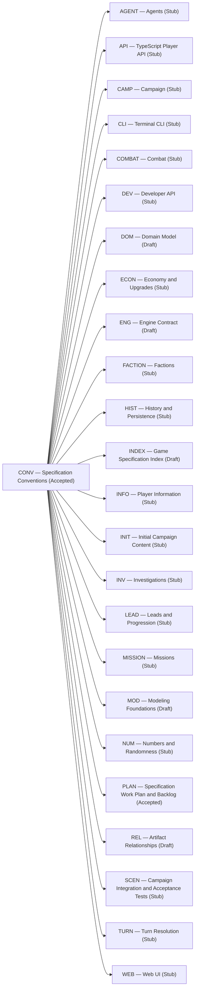
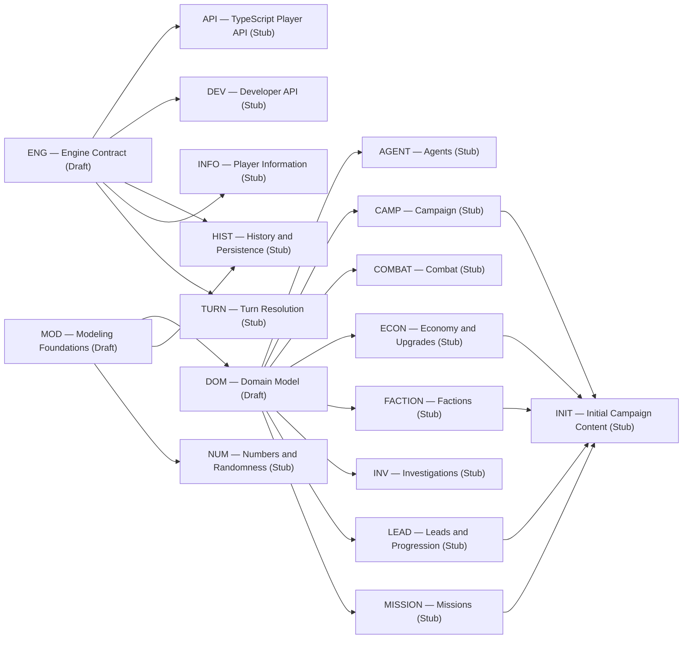
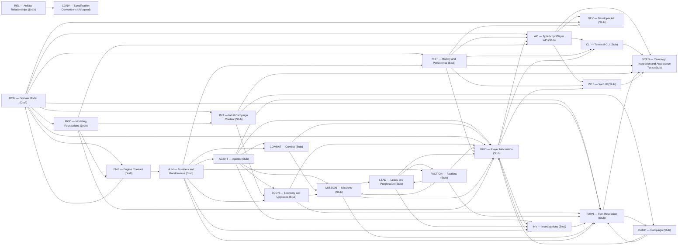

# Specification Relationships

> **Generated — do not edit.** Run `npm run docs:generate` after changing registered specifications.

Arrows run from Dependency to Dependent. The section heading supplies the relationship kind, and the arrow is read in the passive direction described under that heading. These views contain declared relationships only and do not infer relationships from citations, paths, review order, or transitive reachability.

[Back to the derived specification catalog](README.md)

## Follows

A → B means A is followed by B.

## Refines

A → B means A is refined by B.

## Uses

A → B means A is used by B.

## Implements

A → B means A is implemented by B.

No implements relationships are declared.

## Verifies

A → B means A is verified by B.

No verifies relationships are declared.
