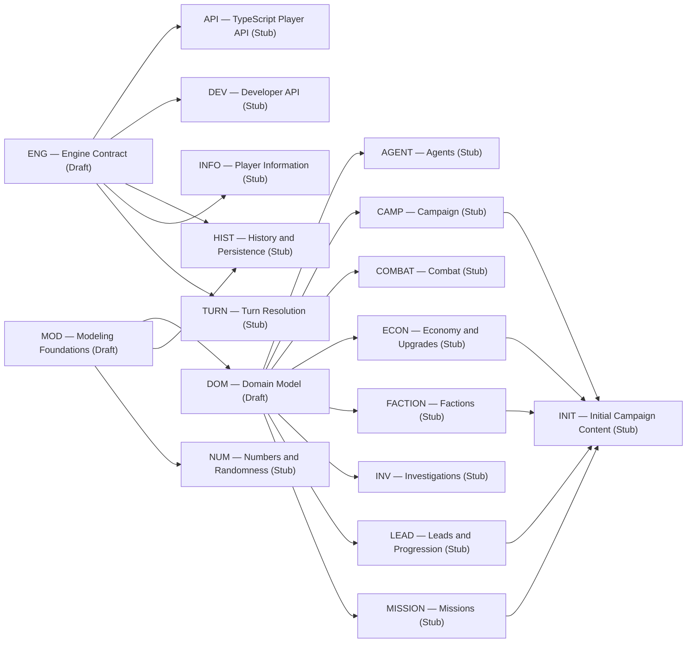

# Refines Relationships

> **Generated — do not edit.** Run `npm run docs:generate` after changing registered specifications.

A → B means A is refined by B.

[Back to the relationship graph index](../relationships.md)

[Back to the derived specification catalog](../README.md)

