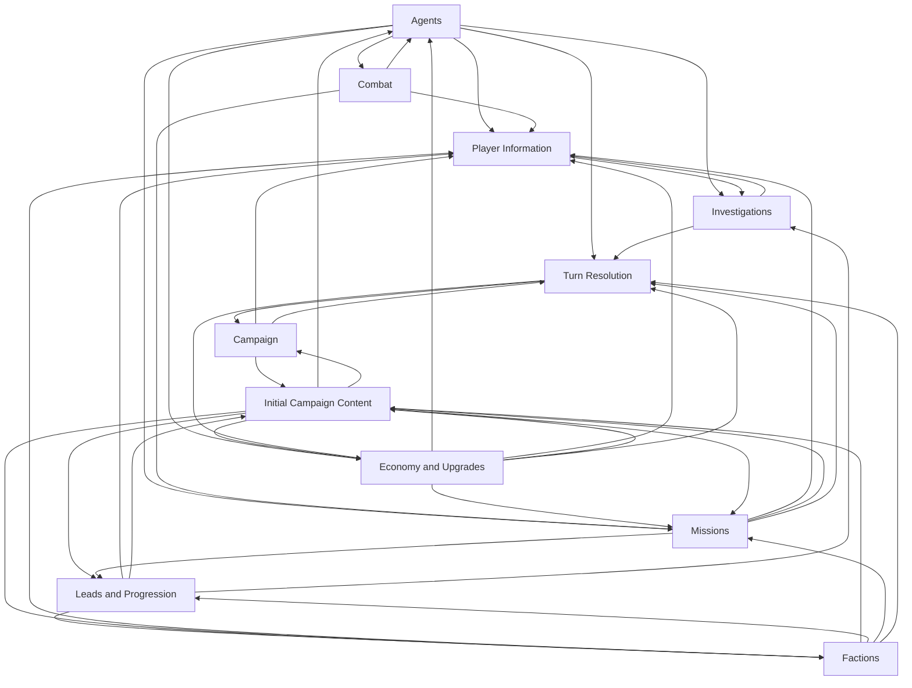

# Specification relationship cycles

This informative register records every remaining cyclic component after the uses/refines review. It is outside the
registered specification corpus and introduces no relationships or gameplay requirements. The owning contracts and
their mirrored inventories remain authoritative. Removal approaches below are future design work, not approved
changes to gameplay or the review sequence.

## Coverage and maintenance

The review combines all explicit uses and refines relationships and finds groups in which every document can reach
every other document by following dependency-to-dependent arrows. Such a group is a strongly connected component.
Listing every internal edge covers longer cycles as well as reciprocal pairs without enumerating every possible loop.
The review also includes implicit follows relationships in a separate pass to identify mixed governance cycles.

The complete result is one game component with 11 documents and 41 internal uses edges, and one governance component
with two documents and two internal edges of different kinds. Neither the refines graph nor the follows graph alone
contains a cycle. Modeling Foundations, Domain Model, and Engine Contract occur in no cyclic component: Domain uses
Foundations, and Engine uses both. The remaining documents do not belong to cycles.

When a relationship changes, recompute these components from the registered inventories, check the supporting prose,
and update the diagrams, tables, counts, and removal criteria together. Include all internal edges, including edges
that close longer paths rather than a two-document loop. Remove a component from this register when it is acyclic.
The [relationship rules](specs/governance/artifact-relationships.md#relationship-graphs) require this maintenance;
deterministic spec lint alone does not establish the semantic justification or completeness of this report.

## Game component: coupled mechanics, content, timing, and observations

All 11 documents in this component are Stub. The justifications describe declared ownership and intended contract
detail, not completed rules. Exact formulas, values, timing, and reveal decisions remain unresolved. Each input has a
distinct owner, so the dependencies express cooperation between contracts rather than definitions that explain only
each other. Reassess these provisional justifications as the stubs become concrete.

Every arrow below means **supplier is used by consumer**. All arrows are uses. The table that follows lists the complete
41-edge inventory and supplies linked evidence for the meaning of each edge.

The consumer links identify the prose declaring reliance; supplier links identify the owning contracts. Each row
is one direct uses relationship, written actively to avoid reversing the arrow convention.

| Consumer uses                                                                           | Supplier                                                                                            | Independently supplied meaning                                 |
| --------------------------------------------------------------------------------------- | --------------------------------------------------------------------------------------------------- | -------------------------------------------------------------- |
| [Agents](specs/mechanics/agents.md#concepts-and-contract)                               | [Combat](specs/mechanics/combat.md#combat-calculations)                                             | Battle-earned experience applied to personnel growth           |
| [Agents](specs/mechanics/agents.md#concepts-and-contract)                               | [Economy and Upgrades](specs/mechanics/economy-and-upgrades.md#upgrade-effects)                     | Economic effects and capability changes applied to personnel   |
| [Agents](specs/mechanics/agents.md#concepts-and-contract)                               | [Initial Campaign Content](specs/content/initial-campaign.md#starting-configuration-and-parameters) | Balance values for agent rules                                 |
| [Campaign](specs/mechanics/campaign.md#concepts-and-contract)                           | [Initial Campaign Content](specs/content/initial-campaign.md#starting-configuration-and-parameters) | Concrete starting state and catalog inputs                     |
| [Campaign](specs/mechanics/campaign.md#concepts-and-contract)                           | [Turn Resolution](specs/foundation/turn-resolution.md#phase-schedule)                               | When campaign predicates read state and are evaluated          |
| [Combat](specs/mechanics/combat.md#concepts-and-contract)                               | [Agents](specs/mechanics/agents.md#attributes-and-effectiveness)                                    | Combatant attributes and capabilities                          |
| [Economy and Upgrades](specs/mechanics/economy-and-upgrades.md#concepts-and-contract)   | [Agents](specs/mechanics/agents.md#requirements)                                                    | Personnel state and capabilities used by economic calculations |
| [Economy and Upgrades](specs/mechanics/economy-and-upgrades.md#concepts-and-contract)   | [Initial Campaign Content](specs/content/initial-campaign.md#starting-configuration-and-parameters) | Prices and upgrade increments                                  |
| [Economy and Upgrades](specs/mechanics/economy-and-upgrades.md#income-and-costs)        | [Turn Resolution](specs/foundation/turn-resolution.md#phase-schedule)                               | Evaluation snapshots and income/cost timing                    |
| [Factions](specs/mechanics/factions.md#concepts-and-contract)                           | [Initial Campaign Content](specs/content/initial-campaign.md#content-catalogs)                      | Operation catalogs and numeric values                          |
| [Factions](specs/mechanics/factions.md#concepts-and-contract)                           | [Leads and Progression](specs/mechanics/leads-and-progression.md#completion-and-unlock-effects)     | Earned unlock effects and prerequisites                        |
| [Player Information](specs/interfaces/player-information.md#concepts-and-contract)      | [Agents](specs/mechanics/agents.md#requirements)                                                    | Personnel facts and derived capabilities to expose             |
| [Player Information](specs/interfaces/player-information.md#concepts-and-contract)      | [Campaign](specs/mechanics/campaign.md#requirements)                                                | Campaign progression and outcome facts to expose               |
| [Player Information](specs/interfaces/player-information.md#concepts-and-contract)      | [Combat](specs/mechanics/combat.md#termination-and-results)                                         | Battle results used in player reports                          |
| [Player Information](specs/interfaces/player-information.md#concepts-and-contract)      | [Economy and Upgrades](specs/mechanics/economy-and-upgrades.md#requirements)                        | Resource and capability results to expose                      |
| [Player Information](specs/interfaces/player-information.md#concepts-and-contract)      | [Factions](specs/mechanics/factions.md#requirements)                                                | Faction state and operation facts to expose                    |
| [Player Information](specs/interfaces/player-information.md#concepts-and-contract)      | [Investigations](specs/mechanics/investigations.md#player-uncertainty)                              | Estimate mathematics and its conditioning information          |
| [Player Information](specs/interfaces/player-information.md#concepts-and-contract)      | [Leads and Progression](specs/mechanics/leads-and-progression.md#prerequisites-and-lifecycle)       | Availability and progression results to expose                 |
| [Player Information](specs/interfaces/player-information.md#concepts-and-contract)      | [Missions](specs/mechanics/missions.md#requirements)                                                | Mission lifecycle and outcome facts to expose                  |
| [Initial Campaign Content](specs/content/initial-campaign.md#concepts-and-contract)     | [Campaign](specs/mechanics/campaign.md#initialization)                                              | Required meaning and coverage of initial state                 |
| [Initial Campaign Content](specs/content/initial-campaign.md#concepts-and-contract)     | [Economy and Upgrades](specs/mechanics/economy-and-upgrades.md#requirements)                        | Meaning of prices, increments, and formula parameters          |
| [Initial Campaign Content](specs/content/initial-campaign.md#concepts-and-contract)     | [Factions](specs/mechanics/factions.md#operation-generation)                                        | Operation catalog requirements                                 |
| [Initial Campaign Content](specs/content/initial-campaign.md#concepts-and-contract)     | [Leads and Progression](specs/mechanics/leads-and-progression.md#requirements)                      | Prerequisite and effect semantics for the lead graph           |
| [Initial Campaign Content](specs/content/initial-campaign.md#concepts-and-contract)     | [Missions](specs/mechanics/missions.md#requirements)                                                | Mission catalog requirements and value meanings                |
| [Investigations](specs/mechanics/investigations.md#concepts-and-contract)               | [Agents](specs/mechanics/agents.md#attributes-and-effectiveness)                                    | Team contribution inputs                                       |
| [Investigations](specs/mechanics/investigations.md#concepts-and-contract)               | [Player Information](specs/interfaces/player-information.md#observation-schemas-and-visibility)     | Exposed field shapes and reveal conditions                     |
| [Investigations](specs/mechanics/investigations.md#concepts-and-contract)               | [Leads and Progression](specs/mechanics/leads-and-progression.md#requirements)                      | Lead availability and completion effects                       |
| [Leads and Progression](specs/mechanics/leads-and-progression.md#concepts-and-contract) | [Factions](specs/mechanics/factions.md#suppression-and-defeat)                                      | Faction state and defeat facts                                 |
| [Leads and Progression](specs/mechanics/leads-and-progression.md#concepts-and-contract) | [Initial Campaign Content](specs/content/initial-campaign.md#content-catalogs)                      | Concrete lead graph and effect entries                         |
| [Leads and Progression](specs/mechanics/leads-and-progression.md#concepts-and-contract) | [Missions](specs/mechanics/missions.md#requirements)                                                | Mission lifecycle and outcomes used by progression predicates  |
| [Missions](specs/mechanics/missions.md#concepts-and-contract)                           | [Agents](specs/mechanics/agents.md#assignments-and-transit)                                         | Participant eligibility and assignment behavior                |
| [Missions](specs/mechanics/missions.md#concepts-and-contract)                           | [Combat](specs/mechanics/combat.md#termination-and-results)                                         | Battle results converted into campaign consequences            |
| [Missions](specs/mechanics/missions.md#concepts-and-contract)                           | [Economy and Upgrades](specs/mechanics/economy-and-upgrades.md#requirements)                        | Capacity and resource-effect semantics                         |
| [Missions](specs/mechanics/missions.md#concepts-and-contract)                           | [Factions](specs/mechanics/factions.md#requirements)                                                | Operation provenance and suppression semantics                 |
| [Missions](specs/mechanics/missions.md#concepts-and-contract)                           | [Initial Campaign Content](specs/content/initial-campaign.md#content-catalogs)                      | Concrete mission entries and values                            |
| [Turn Resolution](specs/foundation/turn-resolution.md#concepts-and-contract)            | [Agents](specs/mechanics/agents.md#requirements)                                                    | Personnel transitions and effects to schedule                  |
| [Turn Resolution](specs/foundation/turn-resolution.md#concepts-and-contract)            | [Campaign](specs/mechanics/campaign.md#panic-and-endings)                                           | Campaign predicates to evaluate                                |
| [Turn Resolution](specs/foundation/turn-resolution.md#concepts-and-contract)            | [Economy and Upgrades](specs/mechanics/economy-and-upgrades.md#income-and-costs)                    | Income/cost effects to schedule                                |
| [Turn Resolution](specs/foundation/turn-resolution.md#concepts-and-contract)            | [Factions](specs/mechanics/factions.md#requirements)                                                | Faction transitions and effects to schedule                    |
| [Turn Resolution](specs/foundation/turn-resolution.md#concepts-and-contract)            | [Investigations](specs/mechanics/investigations.md#requirements)                                    | Investigation transitions and effects to schedule              |
| [Turn Resolution](specs/foundation/turn-resolution.md#concepts-and-contract)            | [Missions](specs/mechanics/missions.md#requirements)                                                | Mission transitions and effects to schedule                    |

### Why retain this component now, and how to remove it

The complete set of prospective separations for this component is below. Each preserves the distinction between
supplied meanings; none chooses the still-missing gameplay rules.

| Coupling                                         | Reason for current retention                                                                                                                  | Future separation and exit criterion                                                                                                                                                                                                                                                                   |
| ------------------------------------------------ | --------------------------------------------------------------------------------------------------------------------------------------------- | ------------------------------------------------------------------------------------------------------------------------------------------------------------------------------------------------------------------------------------------------------------------------------------------------------ |
| Mechanics and content                            | Mechanics owns parameter meaning; content owns concrete values. Both directions are currently needed to author a playable campaign.           | Separate shared content TypeScript types and parameter contracts from their concrete catalogs. Mechanics consumes typed inputs; content supplies entries satisfying those contracts; composition selects catalogs. Exit when these subjects no longer require mechanics-to-catalog-to-mechanics paths. |
| Turn timing and subsystem effects                | Turn Resolution schedules subsystem behavior; Campaign and Economy need its evaluation timing.                                                | Define explicit phase inputs and effect outputs, making subsystem contracts independent of the scheduler's phase decisions. Exit when Campaign and Economy no longer depend on Turn Resolution and longer return paths are gone.                                                                       |
| Personnel, combat, and economic effects          | Agents owns capability/state transitions; Combat supplies earned experience and Economy supplies capability effects.                          | Separate shared personnel inputs and effect descriptions from the contracts that calculate or apply them. Exit when Agents, Combat, and Economy can be read without reciprocal behavioral dependencies.                                                                                                |
| Faction and lead progression                     | Factions supplies state/defeat facts; Leads supplies unlock effects and prerequisites. Missions contributes outcome facts along longer paths. | Separate progression facts and effect descriptions from predicates and effect application. Exit when faction and mission facts can be consumed without those producers relying back on the progression evaluator.                                                                                      |
| Investigation mathematics and player information | Investigations supplies estimates; Player Information supplies field shapes and reveal conditions used by the current estimate contract.      | Define estimates over explicit information inputs in Investigations, then let Player Information map permitted observations to those inputs and expose the results. Exit when Investigations no longer depends on Player Information.                                                                  |

The component is resolved only when recomputation finds no multi-document cyclic component among these documents.
Removing individual reciprocal pairs is insufficient if longer cycles survive. As each separation is implemented,
update this register with the remaining components and evidence rather than marking the entire group resolved early.

## Governance component: relationship language and document conventions

This is the complete internal-edge inventory:

| Dependency → Dependent                             | Kind             | Independently supplied meaning and evidence                                                                                                                                                                         |
| -------------------------------------------------- | ---------------- | ------------------------------------------------------------------------------------------------------------------------------------------------------------------------------------------------------------------- |
| Specification Conventions → Artifact Relationships | Implicit follows | [Conventions](specs/governance/spec-conventions.md#implicit-relationships) supplies document structure, lifecycle, and writing rules for every other registered specification.                                      |
| Artifact Relationships → Specification Conventions | Uses             | [Artifact Relationships](specs/governance/artifact-relationships.md#concepts-and-contract) supplies relationship meanings used by the [conventions](specs/governance/spec-conventions.md#relationship-inventories). |

The meanings are independently stated: writing rules govern a document that defines the relationship vocabulary.
The relationship definition does not need a missing definition supplied only by the writing rule. REL remains Draft;
CONV's Accepted status does not accept REL or complete its review.

A future removal could consolidate the relationship language and inventory rules into Specification Conventions and
retire the separate REL contract with explicit requirement migration. That would require a separately reviewed
governance change. The exit criterion is no multi-document component containing CONV and REL after including implicit
follows edges, with all definitions and requirement references preserved. Until then this mixed cycle stays documented.
