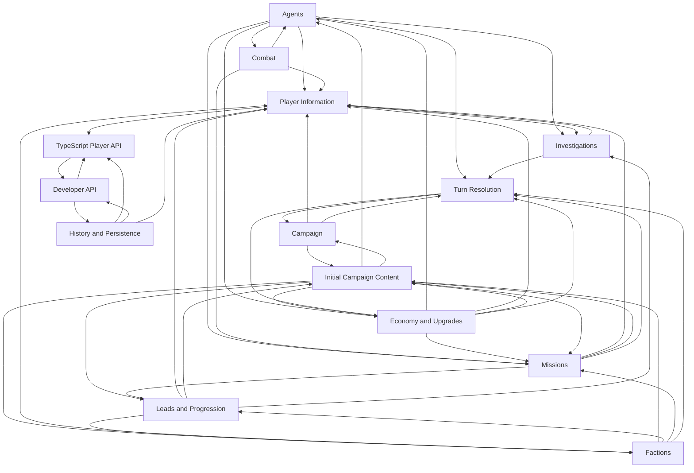

# Specification relationship cycles

This informative register records every remaining cyclic component after the uses/refines review. It is outside the
registered specification corpus and introduces no relationships or gameplay requirements. The owning contracts and
their mirrored inventories remain authoritative. Removal approaches below are future design work, not approved
changes to gameplay or the review sequence.

## Coverage and maintenance

The review combines all explicit uses and refines relationships and finds groups in which every document can reach
every other document by following dependency-to-dependent arrows. Such a group is a strongly connected component.
Listing every internal edge covers longer cycles as well as reciprocal pairs without enumerating every possible loop.
The review also includes implicit follows relationships in a separate pass to identify mixed governance cycles.

The complete result is one game component with 14 documents and 48 internal uses edges, and one governance component
with two documents and two internal edges of different Relationship kinds. Neither the refines graph nor the follows graph alone
contains a cycle. Modeling Foundations, Domain Model, and Engine Contract occur in no cyclic component: Domain uses
Foundations, and Engine uses both. The remaining documents do not belong to cycles.

When a relationship changes, recompute these components from the registered inventories, check the supporting prose,
and update the diagrams, tables, counts, and removal criteria together. Include all internal edges, including edges
that close longer paths rather than a two-document loop. Remove a component from this register when it is acyclic.
The [Relationship graphs](specs/governance/artifact-relationships.md#relationship-graphs) require this maintenance;
deterministic specification lint alone does not establish the semantic justification or completeness of this report.

## Game component: coupled mechanics, Game Data Records (GDRs), timing, state access, and restoration

The justifications describe declared ownership and intended contract detail. Exact formulas, values, timing, and reveal decisions remain unresolved. Each input has a
distinct owner, so the dependencies express cooperation between contracts rather than definitions that explain only
each other. Reassess these justifications as the contracts become concrete.

Every arrow below means **supplier is used by consumer**. All arrows are uses. The table that follows lists the complete
48-edge inventory and supplies linked evidence for the meaning of each edge.

```mermaid
flowchart TD
  AGENT[Agents]
  API[TypeScript Player API]
  CAMP[Campaign]
  COMBAT[Combat]
  DEV[Developer API]
  ECON[Economy and Upgrades]
  FACTION[Factions]
  HIST[History and Persistence]
  INFO[Player Information]
  INIT[Initial Campaign Content]
  INVSTG[Investigations]
  LEAD[Leads and Progression]
  MISSION[Missions]
  TURN[Turn Resolution]
  AGENT --> COMBAT & ECON & INFO & INVSTG & MISSION & TURN
  API --> DEV
  CAMP --> INFO & INIT & TURN
  COMBAT --> AGENT & INFO & MISSION
  DEV --> API & HIST
  ECON --> AGENT & INFO & INIT & MISSION & TURN
  FACTION --> INFO & INIT & LEAD & MISSION & TURN
  HIST --> API & DEV & INFO
  INFO --> API & INVSTG
  INIT --> AGENT & CAMP & ECON & FACTION & LEAD & MISSION
  INVSTG --> INFO & TURN
  LEAD --> FACTION & INFO & INIT & INVSTG
  MISSION --> INFO & INIT & LEAD & TURN
  TURN --> CAMP & ECON
```

The consumer links identify the prose declaring reliance; supplier links identify the owning contracts. Each row
is one direct uses relationship, written actively to avoid reversing the arrow convention.

| Consumer uses                                                                                                    | Supplier                                                                                                                                                           | Independently supplied meaning                                           |
| ---------------------------------------------------------------------------------------------------------------- | ------------------------------------------------------------------------------------------------------------------------------------------------------------------ | ------------------------------------------------------------------------ |
| Agents — [Concepts and contract](specs/mechanics/agents.md#concepts-and-contract)                                | Combat — [Combat calculations](specs/mechanics/combat.md#combat-calculations)                                                                                      | Battle-earned experience applied to personnel growth                     |
| Agents — [Concepts and contract](specs/mechanics/agents.md#concepts-and-contract)                                | Economy and Upgrades — [Upgrade effects](specs/mechanics/economy-and-upgrades.md#upgrade-effects)                                                                  | Economic effects and capability changes applied to personnel             |
| Agents — [Concepts and contract](specs/mechanics/agents.md#concepts-and-contract)                                | Initial Campaign Content — [Starting configuration and parameters](specs/content/initial-campaign.md#starting-configuration-and-parameters)                        | Balance values for agent rules                                           |
| Campaign — [Concepts and contract](specs/mechanics/campaign.md#concepts-and-contract)                            | Initial Campaign Content — [Starting configuration and parameters](specs/content/initial-campaign.md#starting-configuration-and-parameters)                        | Concrete starting state and catalog inputs                               |
| Campaign — [Concepts and contract](specs/mechanics/campaign.md#concepts-and-contract)                            | Turn Resolution — [Phase schedule](specs/foundation/turn-resolution.md#phase-schedule)                                                                             | When campaign predicates read state and are evaluated                    |
| Combat — [Concepts and contract](specs/mechanics/combat.md#concepts-and-contract)                                | Agents — [Attributes and effectiveness](specs/mechanics/agents.md#attributes-and-effectiveness)                                                                    | Combatant attributes and capabilities                                    |
| Economy and Upgrades — [Concepts and contract](specs/mechanics/economy-and-upgrades.md#concepts-and-contract)    | Agents — [Requirements](specs/mechanics/agents.md#requirements)                                                                                                    | Personnel state and capabilities used by economic calculations           |
| Economy and Upgrades — [Concepts and contract](specs/mechanics/economy-and-upgrades.md#concepts-and-contract)    | Initial Campaign Content — [Starting configuration and parameters](specs/content/initial-campaign.md#starting-configuration-and-parameters)                        | Prices and upgrade increments                                            |
| Economy and Upgrades — [Income and costs](specs/mechanics/economy-and-upgrades.md#income-and-costs)              | Turn Resolution — [Phase schedule](specs/foundation/turn-resolution.md#phase-schedule)                                                                             | Evaluation snapshots and income/cost timing                              |
| Factions — [Concepts and contract](specs/mechanics/factions.md#concepts-and-contract)                            | Initial Campaign Content — [GDR catalogs](specs/content/initial-campaign.md#gdr-catalogs)                                                                          | Operation catalogs and numeric values                                    |
| Factions — [Concepts and contract](specs/mechanics/factions.md#concepts-and-contract)                            | Leads and Progression — [Completion and unlock effects](specs/mechanics/leads-and-progression.md#completion-and-unlock-effects)                                    | Earned unlock effects and prerequisites                                  |
| Player Information — [Concepts and contract](specs/interfaces/player-information.md#concepts-and-contract)       | Agents — [Requirements](specs/mechanics/agents.md#requirements)                                                                                                    | Personnel facts and derived capabilities to expose                       |
| Player Information — [Concepts and contract](specs/interfaces/player-information.md#concepts-and-contract)       | Campaign — [Requirements](specs/mechanics/campaign.md#requirements)                                                                                                | Campaign progression and outcome facts to expose                         |
| Player Information — [Concepts and contract](specs/interfaces/player-information.md#concepts-and-contract)       | Combat — [Termination and results](specs/mechanics/combat.md#termination-and-results)                                                                              | Battle results used in player reports                                    |
| Player Information — [Concepts and contract](specs/interfaces/player-information.md#concepts-and-contract)       | Economy and Upgrades — [Requirements](specs/mechanics/economy-and-upgrades.md#requirements)                                                                        | Resource and capability results to expose                                |
| Player Information — [Concepts and contract](specs/interfaces/player-information.md#concepts-and-contract)       | Factions — [Requirements](specs/mechanics/factions.md#requirements)                                                                                                | Faction state and operation facts to expose                              |
| Player Information — [Concepts and contract](specs/interfaces/player-information.md#concepts-and-contract)       | Investigations — [Player uncertainty](specs/mechanics/investigations.md#player-uncertainty)                                                                        | Estimate mathematics and its conditioning information                    |
| Player Information — [Concepts and contract](specs/interfaces/player-information.md#concepts-and-contract)       | Leads and Progression — [Prerequisites and lifecycle](specs/mechanics/leads-and-progression.md#prerequisites-and-lifecycle)                                        | Availability and progression results to expose                           |
| Player Information — [Concepts and contract](specs/interfaces/player-information.md#concepts-and-contract)       | Missions — [Requirements](specs/mechanics/missions.md#requirements)                                                                                                | Mission lifecycle and outcome facts to expose                            |
| Initial Campaign Content — [Concepts and contract](specs/content/initial-campaign.md#concepts-and-contract)      | Campaign — [Initialization](specs/mechanics/campaign.md#initialization)                                                                                            | Required meaning and coverage of initial state                           |
| Initial Campaign Content — [Concepts and contract](specs/content/initial-campaign.md#concepts-and-contract)      | Economy and Upgrades — [Requirements](specs/mechanics/economy-and-upgrades.md#requirements)                                                                        | Meaning of prices, increments, and formula parameters                    |
| Initial Campaign Content — [Concepts and contract](specs/content/initial-campaign.md#concepts-and-contract)      | Factions — [Faction operation occurrence generation](specs/mechanics/factions.md#faction-operation-occurrence-generation)                                          | Operation catalog requirements                                           |
| Initial Campaign Content — [Concepts and contract](specs/content/initial-campaign.md#concepts-and-contract)      | Leads and Progression — [Requirements](specs/mechanics/leads-and-progression.md#requirements)                                                                      | Prerequisite and effect semantics for the lead graph                     |
| Initial Campaign Content — [Concepts and contract](specs/content/initial-campaign.md#concepts-and-contract)      | Missions — [Requirements](specs/mechanics/missions.md#requirements)                                                                                                | Mission catalog requirements and value meanings                          |
| Investigations — [Concepts and contract](specs/mechanics/investigations.md#concepts-and-contract)                | Agents — [Attributes and effectiveness](specs/mechanics/agents.md#attributes-and-effectiveness)                                                                    | Team contribution inputs                                                 |
| Investigations — [Concepts and contract](specs/mechanics/investigations.md#concepts-and-contract)                | Player Information — [Player-visible information schemas and visibility](specs/interfaces/player-information.md#player-visible-information-schemas-and-visibility) | Exposed field shapes and reveal conditions                               |
| Investigations — [Concepts and contract](specs/mechanics/investigations.md#concepts-and-contract)                | Leads and Progression — [Requirements](specs/mechanics/leads-and-progression.md#requirements)                                                                      | Lead availability and completion effects                                 |
| Leads and Progression — [Concepts and contract](specs/mechanics/leads-and-progression.md#concepts-and-contract)  | Factions — [Suppression and defeat](specs/mechanics/factions.md#suppression-and-defeat)                                                                            | Faction state and defeat facts                                           |
| Leads and Progression — [Concepts and contract](specs/mechanics/leads-and-progression.md#concepts-and-contract)  | Initial Campaign Content — [GDR catalogs](specs/content/initial-campaign.md#gdr-catalogs)                                                                          | Concrete lead graph and effect GDRs                                      |
| Leads and Progression — [Concepts and contract](specs/mechanics/leads-and-progression.md#concepts-and-contract)  | Missions — [Requirements](specs/mechanics/missions.md#requirements)                                                                                                | Mission lifecycle and outcomes used by progression predicates            |
| Missions — [Concepts and contract](specs/mechanics/missions.md#concepts-and-contract)                            | Agents — [Current assignments and transit](specs/mechanics/agents.md#current-assignments-and-transit)                                                              | Participant eligibility and Current assignment behavior                  |
| Missions — [Concepts and contract](specs/mechanics/missions.md#concepts-and-contract)                            | Combat — [Termination and results](specs/mechanics/combat.md#termination-and-results)                                                                              | Battle results converted into campaign consequences                      |
| Missions — [Concepts and contract](specs/mechanics/missions.md#concepts-and-contract)                            | Economy and Upgrades — [Requirements](specs/mechanics/economy-and-upgrades.md#requirements)                                                                        | Capacity and resource-effect semantics                                   |
| Missions — [Concepts and contract](specs/mechanics/missions.md#concepts-and-contract)                            | Factions — [Requirements](specs/mechanics/factions.md#requirements)                                                                                                | Operation provenance and suppression semantics                           |
| Missions — [Concepts and contract](specs/mechanics/missions.md#concepts-and-contract)                            | Initial Campaign Content — [GDR catalogs](specs/content/initial-campaign.md#gdr-catalogs)                                                                          | Concrete mission GDRs and values                                         |
| Turn Resolution — [Concepts and contract](specs/foundation/turn-resolution.md#concepts-and-contract)             | Agents — [Requirements](specs/mechanics/agents.md#requirements)                                                                                                    | Personnel transitions and effects to schedule                            |
| Turn Resolution — [Concepts and contract](specs/foundation/turn-resolution.md#concepts-and-contract)             | Campaign — [Panic and endings](specs/mechanics/campaign.md#panic-and-endings)                                                                                      | Campaign predicates to evaluate                                          |
| Turn Resolution — [Concepts and contract](specs/foundation/turn-resolution.md#concepts-and-contract)             | Economy and Upgrades — [Income and costs](specs/mechanics/economy-and-upgrades.md#income-and-costs)                                                                | Income/cost effects to schedule                                          |
| Turn Resolution — [Concepts and contract](specs/foundation/turn-resolution.md#concepts-and-contract)             | Factions — [Requirements](specs/mechanics/factions.md#requirements)                                                                                                | Faction transitions and effects to schedule                              |
| Turn Resolution — [Concepts and contract](specs/foundation/turn-resolution.md#concepts-and-contract)             | Investigations — [Requirements](specs/mechanics/investigations.md#requirements)                                                                                    | Investigation transitions and effects to schedule                        |
| Turn Resolution — [Concepts and contract](specs/foundation/turn-resolution.md#concepts-and-contract)             | Missions — [Requirements](specs/mechanics/missions.md#requirements)                                                                                                | Mission transitions and effects to schedule                              |
| TypeScript Player API — [Concepts and contract](specs/interfaces/typescript-api.md#concepts-and-contract)        | Developer API — [Inspection contract](specs/interfaces/developer-api.md#inspection-contract)                                                                       | Full Campaign state query fields and Dev mode transition behavior        |
| TypeScript Player API — [Concepts and contract](specs/interfaces/typescript-api.md#concepts-and-contract)        | History and Persistence — [Session](specs/foundation/history-and-persistence.md#session)                                                                           | Current campaign restoration and persistence semantics                   |
| TypeScript Player API — [Concepts and contract](specs/interfaces/typescript-api.md#concepts-and-contract)        | Player Information — [Boundary consistency](specs/interfaces/player-information.md#boundary-consistency)                                                           | Ordinary Player action API views and permitted field visibility          |
| Developer API — [Concepts and contract](specs/interfaces/developer-api.md#concepts-and-contract)                 | History and Persistence — [Session](specs/foundation/history-and-persistence.md#session)                                                                           | Restoration semantics for inspected Campaign state                       |
| Developer API — [Concepts and contract](specs/interfaces/developer-api.md#concepts-and-contract)                 | TypeScript Player API — [Functions and types](specs/interfaces/typescript-api.md#functions-and-types)                                                              | Callable Dev mode controls and full-state query surface                  |
| History and Persistence — [Session-owned state](specs/foundation/history-and-persistence.md#session-owned-state) | Developer API — [Isolation and history](specs/interfaces/developer-api.md#isolation-and-history)                                                                   | Policy for Dev mode retention during reset, load, and history navigation |
| Player Information — [Concepts and contract](specs/interfaces/player-information.md#concepts-and-contract)       | History and Persistence — [Session](specs/foundation/history-and-persistence.md#session)                                                                           | Retained and restored facts available to ordinary player reports         |

### Why retain this component now, and how to remove it

The complete set of prospective separations for this component is below. Each preserves the distinction between
supplied meanings; none chooses the still-missing gameplay rules.

| Coupling                                         | Reason for current retention                                                                                                                                       | Future separation and exit criterion                                                                                                                                                                                                                                                              |
| ------------------------------------------------ | ------------------------------------------------------------------------------------------------------------------------------------------------------------------ | ------------------------------------------------------------------------------------------------------------------------------------------------------------------------------------------------------------------------------------------------------------------------------------------------- |
| Mechanics and Content specifications             | Mechanics owns parameter meaning; Content specifications own concrete values. Both directions are currently needed to author a playable campaign.                  | Separate shared GDR Types and parameter contracts from their concrete catalogs. Mechanics consumes typed inputs; Content specifications supply GDRs satisfying those contracts; composition selects catalogs. Exit when these subjects no longer require mechanics-to-catalog-to-mechanics paths. |
| Turn timing and subsystem effects                | Turn Resolution schedules subsystem behavior; Campaign and Economy need its evaluation timing.                                                                     | Define explicit phase inputs and effect outputs, making subsystem contracts independent of the scheduler's phase decisions. Exit when Campaign and Economy no longer depend on Turn Resolution and longer return paths are gone.                                                                  |
| Personnel, combat, and economic effects          | Agents owns capability/state transitions; Combat supplies earned experience and Economy supplies capability effects.                                               | Separate shared personnel inputs and effect descriptions from the contracts that calculate or apply them. Exit when Agents, Combat, and Economy can be read without reciprocal behavioral dependencies.                                                                                           |
| Faction and lead progression                     | Factions supplies state/defeat facts; Leads supplies unlock effects and prerequisites. Missions contributes outcome facts along longer paths.                      | Separate progression facts and effect descriptions from predicates and effect application. Exit when faction and mission facts can be consumed without those producers relying back on the progression evaluator.                                                                                 |
| Investigation mathematics and player information | Investigations supplies estimates; Player Information supplies field shapes and reveal conditions used by the current estimate contract.                           | Define estimates over explicit information inputs in Investigations, then let Player Information map permitted Player-visible information to those inputs and expose the results. Exit when Investigations no longer depends on Player Information.                                               |
| State access, API signatures, and restoration    | Developer API owns full-state inspection and Dev mode policy; TypeScript Player API owns callable signatures; History and Persistence owns restoration procedures. | Separate shared state-view contracts and access-mode lifecycle policy from their callable adapters and storage procedures. Exit when these independently owned contracts remove the reciprocal API/inspection and restoration/policy dependencies and their longer return paths.                  |

The component is resolved only when recomputation finds no multi-document cyclic component among these documents.
Removing individual reciprocal pairs is insufficient if longer cycles survive. As each separation is implemented,
update this register with the remaining components and evidence rather than marking the entire group resolved early.

## Governance component: relationship language and document conventions

```mermaid
flowchart LR
  CONV[Specification Conventions] -->|implicit follows| REL[Artifact Relationships]
  REL -->|uses| CONV
```

This is the complete internal-edge inventory:

| Dependency → Dependent                             | Kind             | Independently supplied meaning and evidence                                                                                                                                                                                                                            |
| -------------------------------------------------- | ---------------- | ---------------------------------------------------------------------------------------------------------------------------------------------------------------------------------------------------------------------------------------------------------------------- |
| Specification Conventions → Artifact Relationships | Implicit follows | Conventions — [Implicit relationships](specs/governance/spec-conventions.md#implicit-relationships) supplies document structure, lifecycle, and writing rules for every other registered specification.                                                                |
| Artifact Relationships → Specification Conventions | Uses             | Artifact Relationships — [Concepts and contract](specs/governance/artifact-relationships.md#concepts-and-contract) supplies relationship meanings used by the conventions — [Relationship inventories](specs/governance/spec-conventions.md#relationship-inventories). |

The meanings are independently stated: writing rules govern a document that defines the relationship vocabulary.
The relationship definition does not need a missing definition supplied only by the writing rule.

A future removal could consolidate the relationship language and inventory rules into Specification Conventions and
retire the separate REL contract with explicit requirement migration. That would require a separately reviewed
governance change. The exit criterion is no multi-document component containing CONV and REL after including implicit
follows edges, with all definitions and requirement references preserved. Until then this mixed cycle stays documented.
