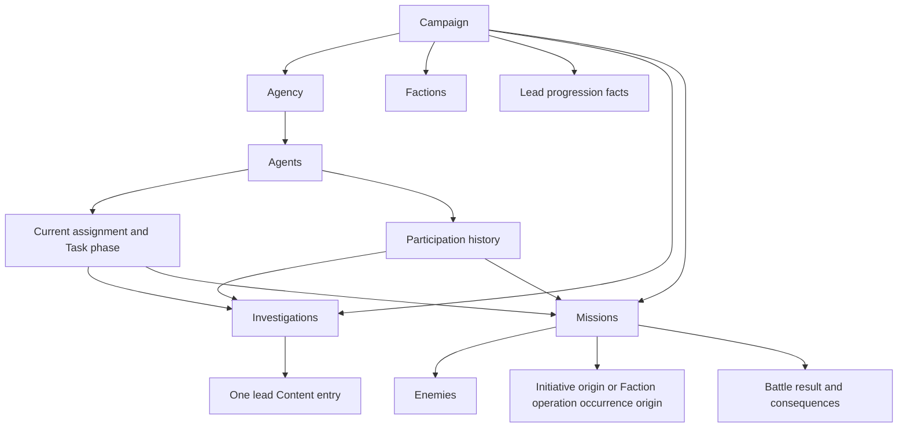

# Domain Model

| Metadata    | Value                                                                               |
| ----------- | ----------------------------------------------------------------------------------- |
| Spec ID     | DOM                                                                                 |
| Family      | Foundation                                                                          |
| Status      | Draft                                                                               |
| Scope       | Game concepts, their properties and relationships, and structural domain invariants |
| Conventions | [Specification conventions](../governance/spec-conventions.md)                      |
| Review      | Batch 1; proposed rules awaiting user review                                        |

# Purpose and boundaries

Define what exists in the game and how those concepts relate. A campaign contains one player-controlled agency that
allocates agents, pursues leads, undertakes missions, and opposes factions.

**Draft proposal:** the numbered requirements are proposed contracts, not accepted rules. Conceptual records may be
embedded, separately stored, or reconstructed provided their identity and meaning are preserved. This document does
not prescribe classes, database tables, a UI framework, or source-file layout.

[Modeling Foundations](modeling-foundations.md) owns the underpinning vocabulary and identity/reference conventions.
[Engine Contract](engine-contract.md) owns runtime guarantees. This document owns the game concepts and structural
relationships; mechanics own formulas and detailed transitions. Accepting this model alone does not make those mechanics
implementable. Numeric representation, RNG algorithms, phase order, Content entry values, API/report schemas, and save encoding
remain in their owning specifications.

# Relationships

- Uses [Modeling Foundations](./modeling-foundations.md)
- Used by [Developer API](../interfaces/developer-api.md)
- Used by [Engine Contract](./engine-contract.md)
- Used by [History and Persistence](./history-and-persistence.md)
- Used by [Initial Campaign Content](../content/initial-campaign.md)
- Used by [Player Information](../interfaces/player-information.md)
- Used by [Turn Resolution](./turn-resolution.md)
- Used by [TypeScript Player API](../interfaces/typescript-api.md)
- Refined by [Agents](../mechanics/agents.md)
- Refined by [Campaign](../mechanics/campaign.md)
- Refined by [Combat](../mechanics/combat.md)
- Refined by [Economy and Upgrades](../mechanics/economy-and-upgrades.md)
- Refined by [Factions](../mechanics/factions.md)
- Refined by [Investigations](../mechanics/investigations.md)
- Refined by [Leads and Progression](../mechanics/leads-and-progression.md)
- Refined by [Missions](../mechanics/missions.md)

# Glossary

| Term                         | Definition                                                                                                                                                                        |
| ---------------------------- | --------------------------------------------------------------------------------------------------------------------------------------------------------------------------------- |
| Combatant                    | Reusable structure described by a Type for combat-related Agent and Enemy state, describing skill, health, exhaustion, and weapon capability; it is not a Campaign instance Type. |
| Agency                       | The player-controlled Campaign instance Type whose Campaign instance owns resources, upgrades, and the roster within a campaign.                                                  |
| Agent                        | A Campaign instance Type whose Campaign instances have identity, attributes, Current assignments, and Participation history.                                                      |
| Lead                         | A Content entry representing a Lead to pursue and describing its progression rules.                                                                                               |
| Lead progression             | Campaign state keyed by lead Content entry, recording completions and earned facts.                                                                                               |
| Investigation                | A Campaign instance Type whose Campaign instances each represent an Investigation of one Lead.                                                                                    |
| Mission                      | A Campaign instance Type whose Campaign instances refer to mission Content entries and have their own origin, participants, and result.                                           |
| Enemy                        | A Campaign instance Type whose Campaign instances are each owned by one mission and refer to enemy Content entries.                                                               |
| Battle result                | Retained combat facts owned by a resolved mission and used to determine campaign consequences.                                                                                    |
| Faction                      | A Campaign instance Type whose Campaign instances refer to faction Content entries and record their activity and progression.                                                     |
| Faction operation occurrence | The origin of one Response mission, identified by that mission rather than a separate Campaign instance.                                                                          |
| Participation history        | Immutable records linking agents to investigations and missions in which they previously participated.                                                                            |
| Current assignment           | An agent's current orders, with activity references and a destination when travelling.                                                                                            |
| Task phase                   | The distinction between At assignment and In transit, including travel timing facts.                                                                                              |
| Report                       | Historical facts and explanations linked to commands or turns and Campaign instances in the timeline.                                                                             |

This document uses [MODEL-001](modeling-foundations.md#model-001--campaign-instance-composition), [MODEL-002](modeling-foundations.md#model-002--identity), [MODEL-003](modeling-foundations.md#model-003--references), [MODEL-004](modeling-foundations.md#model-004--historical-fact-preservation), [MODEL-005](modeling-foundations.md#model-005--value-classification), and [MODEL-006](modeling-foundations.md#model-006--campaign-instance-construction) to describe game concepts. It applies the modeling vocabulary and
constraints; it does not add detail to the modeling language itself.

Campaign and the other generic modeling terms are owned by the [Modeling Foundations glossary](modeling-foundations.md#glossary).
This document describes the concrete Campaign Type and its game-specific composition; it does not redefine Campaign.

# Concepts and contract

These are game concepts and relationships, not a serialized schema or a required storage hierarchy. A concept can
include hidden facts; belonging to the game domain does not imply that every property is visible to the player.
Player Information owns exact visibility. Generic modeling vocabulary belongs to
[Modeling Foundations](modeling-foundations.md#glossary).

## Modeling dimensions

Concept names in the first table identify Campaign instance Types unless the table explicitly assigns another modeling
role. A particular Campaign instance is a Campaign instance of its declared Type. Use the
[Modeling Foundations glossary](modeling-foundations.md#glossary) for the generic terms. These classifications do not
prescribe implementation classes or storage records. Content entries are immutable, typed game data rather
than separately identified Campaign instances.

## Types, multiplicity, and lifecycle

The following table enumerates the complete concept classifications declared by this draft.

| Concept                                                                                                       | Modeling role and multiplicity                                                                                                                                                                                                                                                    | Construction and historical transition / owner                                                                                                                                                                                                                                                                                                                                                   |
| ------------------------------------------------------------------------------------------------------------- | --------------------------------------------------------------------------------------------------------------------------------------------------------------------------------------------------------------------------------------------------------------------------------- | ------------------------------------------------------------------------------------------------------------------------------------------------------------------------------------------------------------------------------------------------------------------------------------------------------------------------------------------------------------------------------------------------ |
| Campaign; Agency                                                                                              | Campaign instance Types. Exactly one Agency Campaign instance per Campaign instance ([DOM-001](#dom-001--campaign-boundary)); each has its own Instance ID and archetype.                                                                                                         | Campaign initialization and ongoing/won/lost transitions belong to [Campaign](../mechanics/campaign.md); detailed construction and historical retention rules remain unresolved there and in [History and Persistence](history-and-persistence.md).                                                                                                                                              |
| Agent                                                                                                         | Campaign instance Type. Multiple Campaign instances can belong to a campaign; roster limits belong to [Economy and Upgrades](../mechanics/economy-and-upgrades.md).                                                                                                               | Initial roster and recruitment details belong to [Initial Campaign Content](../content/initial-campaign.md) and Economy and Upgrades. Serving, Killed, and Dismissed are distinct states; Killed/Dismissed Campaign instances retain final attributes and career without Current assignments ([DOM-005](#dom-005--agent-lifecycle)). [Agents](../mechanics/agents.md) owns detailed transitions. |
| Investigation                                                                                                 | Campaign instance Type. At most one Active Campaign instance per lead Content entry per campaign; repeated Investigations of a Lead have distinct Campaign instances ([DOM-009](#dom-009--leads-and-investigations)/[DOM-017](#dom-017--campaign-instance-identity-scope)).       | Starting an Investigation constructs a Campaign instance; restarting after abandonment constructs another. Completed/Abandoned Campaign instances retain identity and Participation history without a current team. [Investigations](../mechanics/investigations.md) owns eligibility and transition details.                                                                                    |
| Mission                                                                                                       | Campaign instance Type. A campaign can contain multiple Campaign instances with distinct identities; each Faction operation occurrence has exactly one Response mission ([DOM-011](#dom-011--mission-kind-and-provenance)/[DOM-017](#dom-017--campaign-instance-identity-scope)). | Initiative construction retains its investigation or scenario source; Response construction retains its Faction operation occurrence origin. Exact construction timing, lifecycle, reattempt, and historical-transition rules remain with [Missions](../mechanics/missions.md).                                                                                                                  |
| Enemy                                                                                                         | Campaign instance Type. Each Campaign instance belongs to exactly one mission; multiple Campaign instances may share an enemy Content entry ([DOM-012](#dom-012--combat-and-consequences)).                                                                                       | Construction and combat transitions belong to Missions and [Combat](../mechanics/combat.md); exact timing and historical retention details remain unresolved with those owners and History and Persistence.                                                                                                                                                                                      |
| Faction                                                                                                       | Campaign instance Type. Campaign instances refer to faction Content entries; the allowed count per Content entry is unresolved.                                                                                                                                                   | Initial setup belongs to Initial Campaign Content; activity, suppression, defeat, and lifecycle details belong to [Factions](../mechanics/factions.md). Historical-transition details remain unresolved.                                                                                                                                                                                         |
| Combatant                                                                                                     | Reusable Type-described structure for combat-related Agent and Enemy state; it is not a Campaign instance Type and has no Campaign instances.                                                                                                                                     | Combat operates on the participating Agent and Enemy Campaign instances ([DOM-012](#dom-012--combat-and-consequences)).                                                                                                                                                                                                                                                                          |
| Archetypes for the seven declared Campaign instance types; lead, weapon, upgrade, and balance Content entries | Typed Content entries, not Campaign instances. Sharing a Content entry does not constrain Campaign instance multiplicity.                                                                                                                                                         | Supplied by the current game build; fields and values belong to Initial Campaign Content. Individual weapon inventory Campaign instances are outside this model; upgrade acquisitions belong to the Agency Campaign instance.                                                                                                                                                                    |

Every Campaign instance of Type Campaign, Agency, Agent, Investigation, Mission, Enemy, or Faction has an Archetype,
MutableState, and ImmutableState containing its Instance ID under
[MODEL-001](modeling-foundations.md#model-001--campaign-instance-composition).
All seven types share the explicit Instance ID scope in [DOM-017](#dom-017--campaign-instance-identity-scope), including the
Campaign instance of Type Campaign itself. Singleton status does not exempt Campaign or Agency from an Instance ID or an archetype.

Combatant supplies reusable Type-described structure, not a separate Campaign instance. A Faction operation occurrence's
provenance is fixed Campaign instance data in its Response mission's ImmutableState, not a separate Campaign instance
([DOM-011](#dom-011--mission-kind-and-provenance)). Nested values and historical records need not be Campaign instances.

The creation owners named above specify Campaign instance constructor inputs, dependencies, Types of returned Campaign instances, and initialization
of all three components under [MODEL-006](modeling-foundations.md#model-006--campaign-instance-construction).
Production Campaign instance constructor details remain unresolved with those owners; [Initial Campaign Content](../content/initial-campaign.md)
owns the archetype catalogs for all seven types. Required archetypes do not settle their fields or balance values.
Types describe structure; gameplay validity and runtime constraints remain explicit contracts.

The Campaign instance of Type Campaign is the top-level ownership root. Gameplay functions do not accept or access
that Campaign instance, and contained Campaign instances do not refer back to it
([MODEL-007](modeling-foundations.md#model-007--gameplay-dependency-direction)). A Campaign instance constructor returns
the constructed Campaign instance; the caller attaches it to the appropriate collection. For example, the caller adds
the Enemy returned by `constructEnemy` to a Mission's enemies collection. Campaign membership follows containment.

## Mutability, authority, and gameplay relevance

The following table states the required modeling classifications; example values are explicitly marked.

| Values                                                                            | Mutability during gameplay                                                                                                                                                     | Authority and gameplay relevance                                                                                                                                                                                                         |
| --------------------------------------------------------------------------------- | ------------------------------------------------------------------------------------------------------------------------------------------------------------------------------ | ---------------------------------------------------------------------------------------------------------------------------------------------------------------------------------------------------------------------------------------- |
| Content entries, including archetypes                                             | Immutable during gameplay ([MODEL-001](modeling-foundations.md#model-001--campaign-instance-composition)).                                                                     | Types describe structure; Content entries supply Authoritative values used by rules. Content entries are not campaign history.                                                                                                           |
| ImmutableState, including Instance IDs                                            | Fixed at construction, including nested data; stable for the lifetime of the Campaign instance within its timeline ([MODEL-002](modeling-foundations.md#model-002--identity)). | Identity recorded as an Authoritative value; historical references remain resolvable ([MODEL-003](modeling-foundations.md#model-003--references)).                                                                                       |
| Retained origin references                                                        | Stored in ImmutableState; preserve the creation source required by [DOM-011](#dom-011--mission-kind-and-provenance).                                                           | Provenance recorded as Authoritative values used by rules and historical explanations.                                                                                                                                                   |
| MutableState; for example, money, orders, and health                              | Mutable under the owning mechanics; fixed Campaign instance facts belong in ImmutableState.                                                                                    | Authoritative values used to resolve current gameplay. See [Modeling Foundations](modeling-foundations.md#authoritative-values-and-derived-values) for the existing classification.                                                      |
| Derived values; for example, effective skill, availability, and completion counts | Calculated from Authoritative values and the current rules and Content entries.                                                                                                | Derived values under the Modeling Foundations glossary. Gameplay relevance depends on the owning rule or report.                                                                                                                         |
| Completed investigations, mission wins, and earned unlocks                        | Retained outcomes must not be overwritten by current calculations ([MODEL-004](modeling-foundations.md#model-004--historical-fact-preservation)).                              | Historical Authoritative values can still affect current progression; [Leads and Progression](../mechanics/leads-and-progression.md) owns predicates and effects ([DOM-010](#dom-010--progression-facts)).                               |
| Final attributes of Killed/Dismissed agents and Participation history             | Retained historical values; undo may restore earlier state ([DOM-005](#dom-005--agent-lifecycle)/[DOM-007](#dom-007--current-versus-historical-teams)).                        | Historical records treated as Authoritative values. These records do not constitute Current assignments or team membership.                                                                                                              |
| Original inputs or values retained only to explain a past result                  | Preserve the historical basis ([MODEL-004](modeling-foundations.md#model-004--historical-fact-preservation)).                                                                  | Used for historical explanation; retaining such values does not make them current combat inputs. Retention details belong to History and Persistence and report visibility to [Player Information](../interfaces/player-information.md). |

Examples of Authoritative values versus Derived values (not a complete state inventory):

| Authoritative value    | Derived value          |
| ---------------------- | ---------------------- |
| Upgrade acquisitions   | Effective capacity     |
| Agent orders           | Readiness              |
| Investigation progress | Completion probability |

Becoming historical is a lifecycle transition, not a requirement to destroy an object or choose a storage representation.
Historical status and current gameplay relevance are independent; each owning mechanic must state whether it consults retained history.

## Campaign and agency

A campaign uses the rules and Content entries supplied by the current game build. It contains one agency, the current turn,
panic and campaign outcome, progression facts, agents, factions, investigations, and missions.

The agency owns money, recurring funding, upgrade acquisitions/capabilities, and its roster. A player controls the agency;
switching between human and AI control does not create another agency. Both campaign and agency have their own Instance IDs in
ImmutableState and required archetypes, even though there is exactly one agency per campaign.
Engine continuation bookkeeping belongs to [Engine Contract](engine-contract.md#concepts-and-contract).

## Agent

An Agent Campaign instance has an Instance ID. Its identity persists through Current assignments and combat.

| Aspect                           | Meaning and relationships                                                                                                                                     |
| -------------------------------- | ------------------------------------------------------------------------------------------------------------------------------------------------------------- |
| Lifecycle                        | Serving, Killed, or Dismissed; distinct from the agent's job                                                                                                  |
| Attributes                       | Career, skill, health, exhaustion, and equipped weapon values                                                                                                 |
| Current assignment               | The agent's current orders, including the destination while travelling; an investigation or mission Current assignment references that activity               |
| Task phase                       | At assignment or In transit, with the timing facts needed to describe travel                                                                                  |
| Career and Participation history | Retained facts about the agent's past; Participation history link the agent to prior investigations and missions without assigning or reserving the agent now |

A Current assignment is a current relationship, not merely a calculation. Career summaries may be calculated from retained
facts. Being an aspect of Agent does not determine whether information is an Authoritative value or a Derived value.

The [Participation history definition](#glossary) governs Participation history. The agent's Participation history and an activity's past
participants describe the same relationship from opposite sides; this model does not require duplicate stored records.
Current teams follow Current assignments ([DOM-007](#dom-007--current-versus-historical-teams)). Agents owns detailed eligibility, transitions, transit, development,
exhaustion, and recovery rules.

## Lead and investigation

| Concept               | Identity and meaning                                                                                                                                                                    |
| --------------------- | --------------------------------------------------------------------------------------------------------------------------------------------------------------------------------------- |
| Lead                  | A Content entry describing difficulty, repeatability, prerequisites, effects, and an optional explicit faction reference                                                                |
| Lead progression      | Campaign state keyed by lead Content entry: completions and earned facts; discovery and availability are Derived values                                                                 |
| Investigation         | A Campaign instance for investigation of a given Lead; it has progress, hidden difficulty, lifecycle, timing facts, and a current team                                                  |
| Participation history | Links to agents who participated in the Investigation, using the Participation history meaning defined under Agent; terminal Investigations retain these links and have no current team |

Restarting an abandoned investigation creates another Investigation. Leads and Progression owns discovery and unlock effects;
Investigations owns progress, probability, uncertainty, team changes, and abandonment details.

Lead is a referenced Content entry, distinct from the InvestigationArchetype that supplies an Investigation's Archetype component.
The Lead reference belongs to the Investigation's ImmutableState; current team references belong to MutableState.
Different Investigations at the same Lead may use different InvestigationArchetypes where the owning rules permit them,
while the constraint of at most one Active Investigation per Lead still applies across archetypes. Production archetype fields, selection, and
allowed combinations remain open. The [modeling example](./modeling-foundations.md#archetypes-and-other-referenced-content-entries)
illustrates this separation without selecting investigation kinds as gameplay features.

## Mission and combat

| Concept                       | Identity and meaning                                                                                                                                                                           |
| ----------------------------- | ---------------------------------------------------------------------------------------------------------------------------------------------------------------------------------------------- |
| Mission Content entry         | A Content entry describing encounter configuration and Content entry references                                                                                                                |
| Mission                       | A Campaign instance referring to one mission Content entry, with Initiative/Response kind, origin, optional target faction, deadline facts, lifecycle/outcome, enemies, deployment, and result |
| Current and past participants | Current deployment follows agent Current assignments; Participation history history uses the relationship defined under Agent                                                                  |
| Enemy Content entry           | A Content entry describing an archetype and combat configuration                                                                                                                               |
| Enemy                         | A Campaign instance owned by one mission, with a Content entry reference and its own combat attributes/results                                                                                 |
| Battle result                 | Facts owned by the resolved mission: participants, outcome, combat facts, and measures needed for mission consequences                                                                         |

The [Combatant structure](#glossary) does not introduce a third Campaign instance alongside agents and enemies. Combat
changes the participating identities and produces a Battle result.
Battle results are distinct from campaign consequences, so failed battles can still yield damage-related benefits.
Combat owns resolution; Missions owns deployment, deadlines, rewards, and partial success.

## Faction and Faction operation occurrences

A faction Content entry supplies descriptive identity and configuration references. A faction is a Campaign instance referring
to that Content entry, with activity, Faction operation occurrence clocks, suppression, and defeat/progression facts.

A Faction operation occurrence is the origin of one Response mission: its initiating faction, severity/type, and creation
facts are embedded in that mission. The containing mission's Instance ID identifies the Faction operation occurrence. It is not a separate scheduled
Campaign instance in this proposal. Factions owns escalation, Faction operation occurrence generation, suppression, and defeat mechanics.

## Weapons and upgrades

Weapon Content entries describe damage configuration. Equipped values and campaign modifications belong to the combatant;
this scope does not track individual inventory items. Upgrade Content entries supply shared upgrade data; acquisitions and
amount/level belong to the agency. Economy and Upgrades owns acquisition costs, capacity accounting, and upgrade effects.

## Reports

A report links historical facts and explanations to commands/turns and Campaign instances in the timeline. Player Information owns
visible fields; History and Persistence owns timeline storage. Reports can explain retained Battle results without replacing
historical values with current calculations.

## Relationship overview

Arrows show relationships, not inheritance or storage layout.

# Requirements

## Campaign boundary

### DOM-001 — Campaign boundary

A Campaign instance of Type Campaign must have exactly one player-controlled agency. Every other
Campaign instance in that campaign must belong to that Campaign instance of Type Campaign. AI memory, UI selections, browser
state, and CLI preferences are not Campaign state.
Multiplayer agencies and cross-campaign trading are outside this model.

### DOM-017 — Campaign instance identity scope

Campaign, Agency, Agent, Investigation, Mission, Enemy, and Faction must each have an Instance ID in ImmutableState.
Instance IDs must be unique across all seven Types within one campaign's Committed state, including the Campaign instance of Type Campaign itself. Repeated mission and investigation Campaign instances must have
identities distinct from earlier Campaign instances in the same timeline. Modeling Foundations owns the general identity and
explicit-reference semantics ([MODEL-002](modeling-foundations.md#model-002--identity)); this requirement owns which Campaign instances share that identity scope.

## Agents, Current assignments, and Participation history

### DOM-005 — Agent lifecycle

An agent's lifecycle must distinguish Serving, Killed, and Dismissed. A Serving agent must
have exactly one Current assignment and Task phase. Killed/Dismissed agents must have neither; their final attributes and career
remain historical facts. Death and dismissal are not jobs. Undo can restore an earlier lifecycle.

### DOM-006 — Orders and Task phase

Serving-agent Current assignments must distinguish Standby, Contracting, Training,
Investigation with a reference, Mission with a reference, and Recovery. Task phase must distinguish At assignment from
In transit. Transit retains destination orders and timing facts required by Agents; it is not a second simultaneous job.

At assignment does not itself imply readiness. Agents will define which transitions/phase combinations are allowed,
which tasks require transit, and travel duration. This specification does not select a one-turn or two-turn transit rule.

### DOM-007 — Current versus historical teams

Current investigation/mission membership must agree with Current assignments.
An agent assigned to investigation I belongs to its current team even while travelling; contribution eligibility is an
Agents/Investigations rule. An agent cannot be assigned to multiple investigations/missions at once.

If both agent-side and team-side links are stored, they must agree in Committed state. Agents recorded in Participation history are not
current team members: a concluded mission can retain an agent's Participation history after that agent is assigned elsewhere.

### DOM-008 — Attribute bounds

For agents and enemies, maximum health must be positive; current health must be between
zero and maximum health inclusive; skill and exhaustion must be nonnegative. Serving agents must have positive health,
Killed agents zero health, and Dismissed agents positive health. Full health on dismissal is not a structural requirement.
Dismissal eligibility, exhaustion caps, rounding, and recovery formulas belong to later mechanics.

## Leads, Investigations, and opponents

### DOM-009 — Leads and Investigations

An investigation must retain its reference to one lead Content entry in ImmutableState and distinguish Active, Completed,
and Abandoned lifecycle states. At most one Active investigation may exist for a lead in a campaign. Active Investigations
must have at least one currently assigned agent in Committed state; terminal Investigations must have no current team.

Terminal Investigations retain identity and Participation history. Restarting after abandonment creates another Investigation;
prior progress is historical, not resumable. LEAD/INVSTG own eligibility and numerical progress-loss rules.

### DOM-010 — Progression facts

Wins, completed investigations, and earned unlocks must be explicit Authoritative values in Campaign state with
source references where applicable. Completion counts classified as Derived values must agree with supporting records. Faction defeat and
lead affiliation must not depend on specially spelled identifiers. Their predicates and effects belong to mechanics owners.

### DOM-011 — Mission kind and provenance

Mission ImmutableState must retain mission kind and provenance. Missions must explicitly distinguish Initiative (agency objective) and Response
(intervention against a Faction operation occurrence). Initiative missions must retain their creation source; for example, an investigation
or scenario setup. Response missions must retain a Faction operation occurrence origin identifying its initiating faction.

For the initial model, each Faction operation occurrence creates exactly one Response mission; provenance is embedded there
rather than managed as a separately scheduled Campaign instance. Two Response missions from the same faction represent distinct
Campaign instances. Faction operation occurrences spanning multiple missions or lacking a Response mission are outside this proposal. Target
faction and initiating faction are explicit references, not inferences from a mission's name.

### DOM-012 — Combat and consequences

An enemy Campaign instance must belong to exactly one mission. Reusing its Content entry must
not reuse its identity or mutable health. Agent combat changes must affect the same identity that returns to the agency.
Battle results and campaign consequences must be distinguished so failed battles can yield damage-related benefits.
The model must retain the facts required by the eventual partial-success formula without selecting that formula here.

## Evidence basis and proposed changes

[Game Design Brief](../../game-design-brief.md) supplies the intended campaign concepts and strategic constraints.
Inspected game-ts revision: f1835a29af3678b4b7a4d17017b0ad737c3ec81a. The cited model/validation files were unmodified in
the source working tree.

| Basis                                       | Source and interpretation                                                                                                                                                                                                                                                                        |
| ------------------------------------------- | ------------------------------------------------------------------------------------------------------------------------------------------------------------------------------------------------------------------------------------------------------------------------------------------------ |
| Inherited concept / proposed simplification | [Agent model](https://github.com/konrad-jamrozik/game-ts/blob/f1835a29af3678b4b7a4d17017b0ad737c3ec81a/web/src/lib/model/agentModel.ts) separates orders and state. [DOM-005](#dom-005--agent-lifecycle)/[DOM-006](#dom-006--orders-and-task-phase) separates lifecycle from both.               |
| Inherited concept                           | [Lead model](https://github.com/konrad-jamrozik/game-ts/blob/f1835a29af3678b4b7a4d17017b0ad737c3ec81a/web/src/lib/model/leadModel.ts) distinguishes Content entries and Investigations.                                                                                                          |
| Proposed clarification                      | [Mission model](https://github.com/konrad-jamrozik/game-ts/blob/f1835a29af3678b4b7a4d17017b0ad737c3ec81a/web/src/lib/model/missionModel.ts) stores Faction operation occurrence severity on missions. [DOM-011](#dom-011--mission-kind-and-provenance) explicitly names mission kind and origin. |
| Proposed scope choice                       | Weapon Content entries and combatant-owned values suffice initially; individual inventory, trading, and transfers are not introduced.                                                                                                                                                            |

# Edge cases and failure behavior

| Case                                                            | Result / owner                                                                                                                                        |
| --------------------------------------------------------------- | ----------------------------------------------------------------------------------------------------------------------------------------------------- |
| Agent travels toward an investigation                           | Remains assigned; arrival/progress timing belongs to AGENT/INVSTG                                                                                     |
| Last investigator removed                                       | No Active Investigation in Committed state with an empty team; numerical effects belong to INVSTG                                                     |
| Investigation concludes while members travel                    | Remove current links to the terminal Investigation before publication; replacement orders/transit belong to AGENT/INVSTG                              |
| Concluded mission retains an agent in its Participation history | Does not reserve Current assignment; [MODEL-003](modeling-foundations.md#model-003--references); [DOM-007](#dom-007--current-versus-historical-teams) |
| Empty roster or no missions/investigations                      | Structurally valid; CAMP owns initialization and defeat conditions                                                                                    |
| Faction defeated with outstanding missions/leads                | Preserve references; FACTION/LEAD/MISSION own resulting availability/outcomes                                                                         |

# Acceptance examples

These are structural fixtures, not playable scenarios or API signatures. Symbolic identifiers are labels, not a chosen identifier format.
Numbers below are exact test-only integers, not campaign balance. All other rule-owned scalar values are assumed valid
for purposes of these structural checks. Runtime validation behavior is tested by Engine Contract.

## A. Valid relationships

Given the Content entries C supplied by the current game build and rules R, turn 3, and:

- Campaign c1 and its single agency ag1, with all seven declared Campaign instance types sharing the Instance ID scope.
- Current-build archetypes C1 (Campaign), G1 (Agency), A1 (Agent), I1 (Investigation), M1 (Mission),
  F1 (Faction), and E1 (Enemy), plus non-archetype Content entries L1 (lead) and W1 (weapon).
  These are explicit test Content entries with the names shown, unique Content entry IDs within their expected types, and no other
  required fields in this fixture; rule-owned production defaults remain deferred.
- Faction f1 referring to F1.
- Serving agent a1 assigned to investigation i1, In transit.
- Serving agent a2 assigned to mission m1, At assignment.
- Active investigation i1 referring to L1, current team {a1}.
- Initiative mission m1 referring to M1, originating from scenario setup, targeting f1, current team {a2}.
- Enemy e1 owned by m1 and referring to E1.
- Each agent and enemy Campaign instance has skill 100, health/max-health 10/10, exhaustion 0, and equipped values referring to W1.
- Other collections empty.

Each Campaign instance has the following complete conceptual component allocation for this fixture. Archetypes are shared
immutable Content entries; all Instance IDs and immutable references are in ImmutableState. MutableState fields below can evolve
under their owning mechanics; their concrete transitions remain deferred. The health bounds and other test values
above still apply.

| Campaign instance | Archetype | ImmutableState                                                                | MutableState                                                                                    |
| ----------------- | --------- | ----------------------------------------------------------------------------- | ----------------------------------------------------------------------------------------------- |
| c1                | C1        | Instance ID c1                                                                | Turn 3; campaign collections and progression facts                                              |
| ag1               | G1        | Instance ID ag1                                                               | Resources, upgrades, roster {a1, a2}                                                            |
| a1, a2            | A1        | Respective Instance ID; agency ag1                                            | Lifecycle, Current assignments, Task phase, combat attributes, career and Participation history |
| i1                | I1        | Instance ID i1; lead L1                                                       | Active lifecycle, progress, current team {a1}, Participation history                            |
| m1                | M1        | Instance ID m1; Initiative kind; scenario-setup provenance; target faction f1 | Current team {a2}, enemies {e1}, resolution status and retained Battle results                  |
| e1                | E1        | Instance ID e1; mission m1                                                    | Combat attributes                                                                               |
| f1                | F1        | Instance ID f1                                                                | Activity and progression                                                                        |

Campaign collections contain agency ag1, agents a1/a2, investigation i1, mission m1, and faction f1; e1 is reached through
m1. Required references resolve in c1. Resource scalars are zero and other collections empty unless specified above.
Immutable affiliation and target references are assumptions of this fixture, not new production lifecycle rules.
Growing Participation history or Battle result collections does not permit rewriting retained historical elements.

These relationships satisfy [DOM-001](#dom-001--campaign-boundary), [DOM-005](#dom-005--agent-lifecycle), [DOM-006](#dom-006--orders-and-task-phase), [DOM-007](#dom-007--current-versus-historical-teams), [DOM-008](#dom-008--attribute-bounds), and [DOM-009](#dom-009--leads-and-investigations), [DOM-011](#dom-011--mission-kind-and-provenance), [DOM-012](#dom-012--combat-and-consequences), [DOM-017](#dom-017--campaign-instance-identity-scope), and [MODEL-001](modeling-foundations.md#model-001--campaign-instance-composition), [MODEL-002](modeling-foundations.md#model-002--identity), and [MODEL-003](modeling-foundations.md#model-003--references).
Team membership does not assert that a1 makes progress while travelling. Full mechanics validation requires the later
owning specifications.

## B. Invalid variants

Each row independently changes fixture A and describes a structurally invalid state.

| Change                                                                           | Violation                                                                                                       |
| -------------------------------------------------------------------------------- | --------------------------------------------------------------------------------------------------------------- |
| Omit a component from c1 or ag1                                                  | [MODEL-001](modeling-foundations.md#model-001--campaign-instance-composition)                                   |
| Omit c1's or ag1's Instance ID                                                   | [MODEL-002](modeling-foundations.md#model-002--identity); [DOM-017](#dom-017--campaign-instance-identity-scope) |
| Give ag1 Instance ID c1, or e1 Instance ID ag1                                   | [DOM-017](#dom-017--campaign-instance-identity-scope)                                                           |
| Resolve e1's archetype as M1 instead of E1                                       | [MODEL-003](modeling-foundations.md#model-003--references)                                                      |
| Mutate A1 or m1's retained provenance                                            | [MODEL-001](modeling-foundations.md#model-001--campaign-instance-composition)                                   |
| Add a second player agency                                                       | [DOM-001](#dom-001--campaign-boundary)                                                                          |
| Mark a1 Killed while keeping its Current assignment/Task phase                   | [DOM-005](#dom-005--agent-lifecycle)                                                                            |
| Give a1 both Training and Investigation Current assignments                      | [DOM-005](#dom-005--agent-lifecycle)/[DOM-006](#dom-006--orders-and-task-phase)                                 |
| List a1 in m1's current team while assigned to i1                                | [DOM-007](#dom-007--current-versus-historical-teams)                                                            |
| Set health to 11 with maximum health 10, or set a Serving agent's health to zero | [DOM-008](#dom-008--attribute-bounds)                                                                           |
| Add another Active Investigation for L1, or leave i1 Active with no members      | [DOM-009](#dom-009--leads-and-investigations)                                                                   |
| Mark m1 Response without Faction operation occurrence provenance                 | [DOM-011](#dom-011--mission-kind-and-provenance)                                                                |
| Assign e1 a second owning mission                                                | [DOM-012](#dom-012--combat-and-consequences)                                                                    |
| Give e1 the same Instance ID as a1                                               | [DOM-017](#dom-017--campaign-instance-identity-scope); [MODEL-002](modeling-foundations.md#model-002--identity) |

## C. Completion and later Participation history

Given i1 concludes and m1 resolves under their owning rules, a structurally valid resulting state has:

- i1 Completed, with no current team, and a1 retained in its Participation history.
- m1 with a retained Battle result and a2 in its Participation history, but no Current assignment from a2.
- a1 and a2 Serving with one new valid Current assignment and Task phase each.
- Explicit progression facts for i1's completion and any win of m1.

This satisfies [MODEL-003](modeling-foundations.md#model-003--references); [DOM-005](#dom-005--agent-lifecycle)/[DOM-007](#dom-007--current-versus-historical-teams)/[DOM-009](#dom-009--leads-and-investigations)/[DOM-010](#dom-010--progression-facts)/[DOM-012](#dom-012--combat-and-consequences). Assigning a1 to another investigation does not rewrite i1's Participation history. If i1
were Abandoned instead, restarting creates a new identity and does not resume i1's progress ([MODEL-002](modeling-foundations.md#model-002--identity); [DOM-009](#dom-009--leads-and-investigations)).
This fixture does not choose the replacement orders or turn timing.

# Open decisions

These have explicit proposed answers, not hidden implementation defaults. Review can accept them or request changes.

| Review decision                                                   | Proposed answer                                                                                                                                                                  | Affected specifications |
| ----------------------------------------------------------------- | -------------------------------------------------------------------------------------------------------------------------------------------------------------------------------- | ----------------------- |
| Separate terminal lifecycle from tasks?                           | Serving/Killed/Dismissed plus Current assignment and Task phase; death/dismissal are not jobs ([DOM-005](#dom-005--agent-lifecycle)/[DOM-006](#dom-006--orders-and-task-phase)). | AGENT, API, HIST        |
| Unique Instance IDs across all seven Campaign instance Types?     | Yes; [DOM-017](#dom-017--campaign-instance-identity-scope) declares the shared scope using [MODEL-002](modeling-foundations.md#model-002--identity).                             | NUMRNG, HIST, API       |
| Independent Campaign instances for Faction operation occurrences? | Initially embed each Faction operation occurrence in its single Response mission ([DOM-011](#dom-011--mission-kind-and-provenance)).                                             | FACTION, MISSION, INFO  |
| Individually tracked equipment/inventory?                         | No; Content entries plus combatant-owned values for initial scope.                                                                                                               | AGENT, ECON, COMBAT     |
| Full health on dismissal as a structural invariant?               | No; require positive health and let AGENT/ECON determine eligibility ([DOM-008](#dom-008--attribute-bounds)).                                                                    | AGENT, ECON             |

Formulas, transitions, reveal conditions, and signatures assigned to other specifications remain scheduled work outside
this contract. They must be specified before their features are implemented, but do not require invented answers in
this model.
