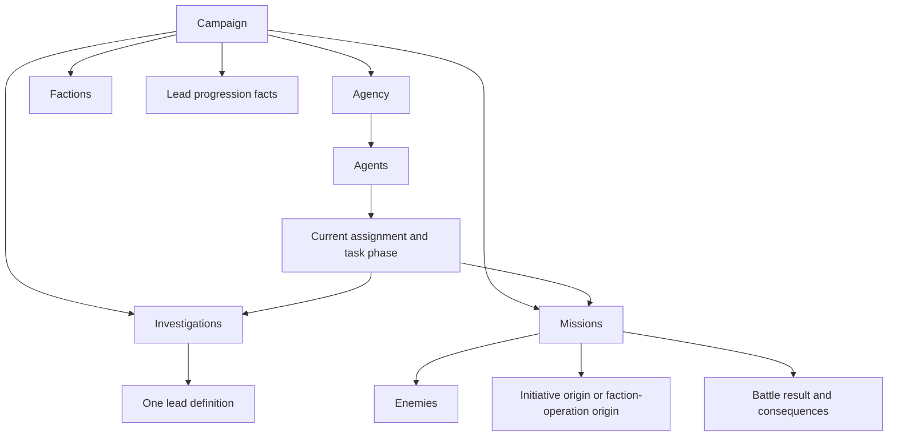

# Domain Model

| Metadata    | Value                                                                                |
| ----------- | ------------------------------------------------------------------------------------ |
| Spec ID     | DOM                                                                                  |
| Status      | Draft                                                                                |
| Scope       | Shared concepts, identity, relationships, state ownership, and structural invariants |
| Conventions | [Specification conventions](../spec-conventions.md)                                  |
| Review      | Batch 1; proposed rules awaiting user review                                         |

## 1. Purpose and boundaries

Define the conceptual model that mechanics and interfaces share. A campaign contains one player-controlled agency that
allocates agents, pursues leads, undertakes missions, and opposes factions.

**Draft proposal:** the numbered requirements below are proposed contracts, not accepted rules. This document does not
prescribe TypeScript class hierarchies, database tables, a UI framework, or source-file layout. A conceptual record can be
embedded, separately stored, or reconstructed provided its identity and meaning are preserved.

This spec owns entity boundaries, reference semantics, structural relationships, and the separation of authoritative
facts, calculations, and player observations. It also outlines the player API capabilities needed by the model.

Numeric representation, RNG algorithm, mechanics formulas, full transition tables, turn phase order, content values,
public function signatures, report schemas, and save encoding belong to later specs. Accepting this model alone does
not make those mechanics implementable.

## 2. Dependencies and terminology

### Authority and downstream ownership

- **Normative:** [Specification conventions](../spec-conventions.md) governs this document.
- **Design input:** [Design stem](../../game-design-stem.md) supplies the required concepts, strategic tensions, interface
  boundary, determinism, and undo/redo.
- **Process:** [Work plan](../work-plan.md) limits this review to Domain Model.

The following downstream contracts are currently stubs. They do not supply unstated rules to this draft:

| Owner                                                                                              | Details to be specified there                                                       |
| -------------------------------------------------------------------------------------------------- | ----------------------------------------------------------------------------------- |
| [Numbers and Randomness](numbers-and-randomness.md)                                                | Representation, rounding, ID generation, and random draws                           |
| [History and Persistence](history-and-persistence.md)                                              | Timeline storage, restoration, serialization, and compatibility                     |
| [Agents](../mechanics/agents.md)                                                                   | Attribute formulas, eligibility, transitions, transit timing, fatigue, and recovery |
| [Economy and Upgrades](../mechanics/economy-and-upgrades.md)                                       | Costs, income, purchases, capacity accounting, and upgrade application              |
| [Leads and Progression](../mechanics/leads-and-progression.md)                                     | Prerequisites, discovery, availability, and unlock effects                          |
| [Investigations](../mechanics/investigations.md)                                                   | Progress, probability, uncertainty, team changes, and abandonment                   |
| [Combat](../mechanics/combat.md)                                                                   | Combat calculations, resolution, experience, and battle result details              |
| [Missions](../mechanics/missions.md)                                                               | Deployment, deadlines, rewards, and partial success                                 |
| [Factions](../mechanics/factions.md)                                                               | Escalation, operations, suppression, and defeat                                     |
| [Campaign](../mechanics/campaign.md), [Turn Resolution](turn-resolution.md)                        | Initialization, outcomes, and effect ordering                                       |
| [Initial Campaign Content](../content/initial-campaign.md)                                         | Definitions and balance values                                                      |
| [Player Information](../interfaces/player-information.md)                                          | Observation/report fields, reveal conditions, and permitted estimates               |
| [TypeScript API](../interfaces/typescript-api.md), [Developer API](../interfaces/developer-api.md) | Callable contracts and separation of player/dev access                              |

### Terms

| Term                     | Meaning                                                                                          |
| ------------------------ | ------------------------------------------------------------------------------------------------ |
| Definition               | Immutable content describing a reusable game concept, such as a lead, mission, faction, enemy, weapon, or upgrade |
| Instance                 | An occurrence or individual with its own identity and evolving campaign facts                    |
| Authoritative fact       | Information needed to resolve play or preserve history, rather than merely a current calculation |
| Derived value            | A deterministic calculation from authoritative facts and the current rules/content               |
| Player observation       | Information deliberately exposed by the engine to an ordinary player                             |
| Committed state          | Complete state before or after an accepted command, not intermediate battle/turn processing      |
| Current assignment       | An agent's orders, including the destination while travelling                                    |
| Historical agent participation | An agent's past involvement in an investigation or mission that does not assign or reserve that agent now |
| Session                  | Owner of current campaign state, history navigation, and any controller state that must follow that history, such as persistent AI strategy memory |

## 3. Concepts and contract

### Definitions, campaign, and agency

A campaign uses the rules and content provided by the current game build. It contains the agency, current turn, panic and
campaign outcome, progression facts, agents, factions, investigations, missions, and deterministic bookkeeping. Earlier
rules, content, and incompatible saved campaigns need not remain supported.

The agency owns money, recurring funding, upgrade acquisitions/capabilities, and its roster. A player controls the agency;
switching between human and AI control does not create another agency.

Definitions are shared within the current content catalog. Campaign instances refer to them. A purchase or injury changes
campaign facts, not the immutable definition used by other instances.

### Conceptual records

These are conceptual responsibilities, not a complete serialized schema.

| Concept                               | Identity/ownership                                  | Principal facts and relationships                                                                                             |
| ------------------------------------- | --------------------------------------------------- | ----------------------------------------------------------------------------------------------------------------------------- |
| Agency                                | One per campaign; no separate agency ID required    | Money, funding, acquired upgrades/capabilities, roster                                                                        |
| Agent                                 | Campaign entity ID                                  | Lifecycle, career, skill, health, exhaustion, equipped weapon values, orders and task phase while serving                     |
| Lead definition                       | Content ID                                          | Difficulty parameter, repeatability, prerequisites, effects, optional explicit faction reference                              |
| Lead progression                      | Campaign facts keyed by lead definition             | Completions and earned facts; discovery/availability is derived rather than stored in a mutable copy of the definition        |
| Investigation                         | Campaign entity ID; one lead definition             | Progress, hidden difficulty, lifecycle, timing facts, current team, historical agent participation                            |
| Mission definition                    | Content ID                                          | Encounter configuration and content references                                                                                |
| Mission                               | Campaign entity ID; one mission definition          | Initiative/Response kind, provenance, optional target faction, deadline facts, lifecycle/outcome, enemies, deployment, result |
| Faction definition                    | Content ID                                          | Descriptive identity and configuration references                                                                             |
| Faction                               | Campaign entity ID; one faction definition          | Activity, operation clocks, suppression, defeat/progression facts                                                             |
| Faction operation occurrence          | Provenance embedded in one Response mission         | Initiating faction, severity/type, creation facts; the containing mission ID identifies the occurrence                        |
| Enemy definition                      | Content ID                                          | Archetype and combat configuration                                                                                            |
| Enemy                                 | Campaign entity ID; owned by one mission            | Definition reference and its own combat attributes/results                                                                    |
| Weapon definition and equipped values | Content ID plus combatant-owned values              | Damage configuration and campaign modifications; no individually tracked inventory item in this scope                         |
| Upgrade definition and acquisitions   | Content ID plus agency-owned facts                  | Upgrade acquired and amount/level; effects belong to Economy and Upgrades                                                     |
| Battle result                         | Owned by the resolved mission                       | Participants, outcome, combat facts, and measures needed for mission consequences                                             |
| Report                                | Linked to command/turn and entities in the timeline | Historical facts and explanations; visible fields belong to Player Information                                                |

**Actor/combatant** is the shared role of agents and enemies: skill, health, exhaustion, and weapon capability. It is not a
third entity copied alongside them. Combat changes the participating identities and produces a battle result.

Arrows show relationships, not inheritance or storage layout.

### Authoritative versus derived state

| Authoritative facts to preserve                                    | Derived values                                                      |
| ------------------------------------------------------------------ | ------------------------------------------------------------------- |
| Turn, RNG state, ID-generation state                               | Labels and presentation formatting                                  |
| Money, funding, upgrade acquisitions                               | Effective capacities and upgrade effects                            |
| Agent attributes, health/fatigue, orders, transit timing facts     | Effective skill, readiness, eligibility, current combat rating      |
| Investigation progress and sampled hidden difficulty               | Team contribution, true completion probability, permitted estimates |
| Investigation completions, mission wins, earned unlock facts       | Discovery, availability, progression summaries                      |
| Faction activity, clocks, suppression, defeat facts                | Visible faction summaries and opportunities                         |
| Mission origin, deadline facts, deployment, outcome, battle result | Current deployment usage and available transport                    |
| Historical inputs/values needed to explain past results            | Charts and aggregates over retained history                         |

A historical value is not necessarily a current derived value. Initial mission strength cannot be reconstructed from
post-battle enemy health alone. Preserve the original inputs or historical value when a rule/report needs it. This does
not require retaining every intermediate calculation or every possible chart.

## 4. Requirements

### Campaign scope and identity

**DOM-001 — Campaign boundary.** A campaign must have exactly one player-controlled agency. Mutable gameplay instances
must belong to that campaign. AI memory, UI selections, browser state, and CLI preferences are not campaign facts.
Multiplayer agencies and cross-campaign trading are outside this model.

**DOM-002 — Definition boundary.** Campaigns must resolve definition references against the current content catalog.
Ordinary gameplay must not mutate definitions. Multiple instances can share a definition without sharing mutable state.

**DOM-003 — Identity.** Entity IDs must be unique across agents, factions, investigations, missions, and enemies in one
committed campaign state and stable during each entity's lifetime. Content references must identify their kind and ID.
Relationships must use explicit references; rules must not parse display names or ID text to discover relationships.

Repeated missions/investigations must have distinct IDs from earlier occurrences. IDs are timeline-scoped: undo restores
the previous ID-generation state, and a discarded future is not another live campaign. NUM owns generation; API owns
stale client-handle behavior.

**DOM-004 — References.** All committed-state references must resolve to the required kind in the same campaign or current
content catalog. Historical references to terminal/archived subjects must remain resolvable. Storage can be compacted
provided required facts remain available; this spec does not mandate full snapshots forever.

### Agents, assignments, and participation

**DOM-005 — Agent lifecycle.** An agent's lifecycle must distinguish Serving, Killed, and Dismissed. A Serving agent must
have exactly one assignment and task phase. Killed/Dismissed agents must have neither; their final attributes and career
remain historical facts. Death and dismissal are not jobs. Undo can restore an earlier lifecycle.

**DOM-006 — Orders and task phase.** Serving-agent assignments must distinguish Standby, Contracting, Training,
Investigation with a reference, Mission with a reference, and Recovery. Task phase must distinguish At assignment from
In transit. Transit retains destination orders and timing facts required by Agents; it is not a second simultaneous job.

At assignment does not itself imply readiness. Agents will define which transitions/phase combinations are allowed,
which tasks require transit, and travel duration. This spec does not select a one-turn or two-turn transit rule.

**DOM-007 — Current versus historical teams.** Current investigation/mission membership must agree with assignments.
An agent assigned to investigation I belongs to its current team even while travelling; contribution eligibility is an
Agents/Investigations rule. An agent cannot be assigned to multiple investigations/missions at once.

If both agent-side and team-side links are stored, they must agree in committed state. Historical participants are not
current team members: a concluded mission can retain an agent's participation after that agent is assigned elsewhere.

**DOM-008 — Attribute bounds.** For agents and enemies, maximum health must be positive; current health must be between
zero and maximum health inclusive; skill and exhaustion must be nonnegative. Serving agents must have positive health,
Killed agents zero health, and Dismissed agents positive health. Full health on dismissal is not a structural requirement.
Dismissal eligibility, fatigue caps, rounding, and recovery formulas belong to later mechanics.

### Opportunities and opponents

**DOM-009 — Lead versus attempt.** An investigation must refer to one lead definition and distinguish Active, Completed,
and Abandoned lifecycle states. At most one Active investigation may exist for a lead in a campaign. Active attempts
must have at least one currently assigned agent in committed state; terminal attempts must have no current team.

Terminal attempts retain identity and historical agent participation. Restarting after abandonment creates another attempt;
prior progress is historical, not resumable. LEAD/INV own eligibility and numerical progress-loss rules.

**DOM-010 — Progression facts.** Wins, completed investigations, and earned unlocks must be explicit campaign facts with
source references where applicable. Derived completion counts must agree with supporting records. Faction defeat and
lead affiliation must not depend on specially spelled IDs. Their predicates and effects belong to mechanics owners.

**DOM-011 — Mission kind and provenance.** Missions must explicitly distinguish Initiative (agency objective) and Response
(intervention against a faction operation). Initiative missions must retain their creation source, such as an investigation
or scenario setup. Response missions must retain an operation origin identifying its initiating faction.

For the initial model, each operation occurrence creates exactly one Response mission; provenance is embedded there
rather than managed as a separately scheduled entity. Two Response missions from the same faction represent distinct
occurrences. Operations spanning multiple missions or lacking a Response mission are outside this proposal. Target
faction and initiating faction are explicit references, not inferences from a mission's name.

**DOM-012 — Combat and consequences.** An enemy instance must belong to exactly one mission. Reusing its definition must
not reuse its identity or mutable health. Agent combat changes must affect the same identity that returns to the agency.
Battle results and campaign consequences must be distinguished so failed battles can yield damage-related benefits.
The model must retain the facts required by the eventual partial-success formula without selecting that formula here.

### Engine and clients

**DOM-013 — Derived consistency.** Derived values must be reproducible from authoritative facts and the current rules/content
without consuming gameplay randomness or mutating state. Caches must be updated or invalidated when inputs change,
including after undo/redo. Required historical values must not be overwritten with current calculations.

**DOM-014 — Continuation state.** Campaign facts and the rules/content supplied by the current game build must contain
everything required to resolve a given future command sequence: sampled hidden values, RNG state, ID-generation state,
and gameplay facts. Outcomes must not depend on a previous UI render or particular AI implementation. This does not
require AI to choose identical commands after every restart.

**DOM-015 — Information boundary.** Ordinary human and AI callers must receive the same permitted information for equal
state and queries. They must not receive writable campaign references, hidden investigation difficulty, RNG state, or
unrevealed content merely because they use TypeScript directly. Discovery, errors, and reports obey the same boundary.
The engine supplies permitted decision-support calculations; normal play must not require dev access.

A separate dev capability exposes full authoritative state. This is an API contract, not cryptographic concealment from
the owner of a browser runtime. INFO/API/DEV own exact fields, reveal conditions, estimates, and dev enablement.

**DOM-016 — Committed-state integrity.** These invariants must hold before and after successful commands, turn advancement,
and history restoration. Intermediate battle/turn states must not be exposed as committed observations. Invalid player
requests must leave campaign facts, RNG/ID state, reports, and history unchanged. Broken internal references/invariants
must be reported as engine/data defects rather than silently repaired into different gameplay outcomes.

### Preliminary API capabilities

**Informative outline:** the player interface needs campaign creation/resumption, visible-state and relationship queries,
action discovery/explanations, structured management commands, Advance turn, results/reports, and undo/redo. Session
save/load supports continuation without adding an ordinary full-state inspection function. Dev inspection is separate.

This is not a finalized function list, wire schema, or error vocabulary. It constrains later API/INFO drafts while keeping
Domain Model the standalone review deliverable.

### Source basis and proposed changes

Inspected game-ts revision: f1835a29af3678b4b7a4d17017b0ad737c3ec81a. The cited model/validation files were unmodified in
the source working tree.

| Basis                                       | Source and interpretation                                                                                                                                                                                                                              |
| ------------------------------------------- | ------------------------------------------------------------------------------------------------------------------------------------------------------------------------------------------------------------------------------------------------------ |
| Inherited concept / proposed simplification | [Agent model](https://github.com/konrad-jamrozik/game-ts/blob/f1835a29af3678b4b7a4d17017b0ad737c3ec81a/web/src/lib/model/agentModel.ts) separates orders and state. DOM-005/006 separates lifecycle from both.                                         |
| Inherited concept                           | [Lead model](https://github.com/konrad-jamrozik/game-ts/blob/f1835a29af3678b4b7a4d17017b0ad737c3ec81a/web/src/lib/model/leadModel.ts) distinguishes definitions and attempts.                                                                          |
| Proposed clarification                      | [Mission model](https://github.com/konrad-jamrozik/game-ts/blob/f1835a29af3678b4b7a4d17017b0ad737c3ec81a/web/src/lib/model/missionModel.ts) stores operation severity on missions. DOM-011 explicitly names mission kind and origin.                   |
| Proposed change                             | [Invariant validation](https://github.com/konrad-jamrozik/game-ts/blob/f1835a29af3678b4b7a4d17017b0ad737c3ec81a/web/src/lib/model_utils/validateGameStateInvariants.ts) derives some relationships from IDs. DOM-003/010 requires explicit references. |
| v5 requirement                              | [Campaign model](https://github.com/konrad-jamrozik/game-ts/blob/f1835a29af3678b4b7a4d17017b0ad737c3ec81a/web/src/lib/model/gameStateModel.ts) lacks RNG state. The stem requires reproducible continuation and separate player/dev access.            |
| Proposed scope choice                       | Weapon definitions and combatant-owned values suffice initially; individual inventory, trading, and transfers are not introduced.                                                                                                                      |

## 5. Edge cases and failure behavior

| Case                                                         | Result / owner                                                                                                  |
| ------------------------------------------------------------ | --------------------------------------------------------------------------------------------------------------- |
| Duplicate entity ID, missing reference, or wrong target kind | Invalid state under DOM-003/004/016; never infer a replacement by name                                          |
| Query/command names an unknown or hidden ID                  | Respect visibility and non-mutation; exact public error belongs to INFO/API                                     |
| Agent travels toward an investigation                        | Remains assigned; arrival/progress timing belongs to AGENT/INV                                                  |
| Last investigator removed                                    | No committed Active attempt with an empty team; numerical effects belong to INV                                 |
| Investigation concludes while members travel                 | Remove current links to the terminal attempt before publication; replacement orders/transit belong to AGENT/INV |
| Concluded mission lists an agent as a historical participant | Does not reserve current assignment; DOM-004/007                                                                |
| Empty roster or no missions/investigations                   | Structurally valid; CAMP owns initialization and defeat conditions                                              |
| Faction defeated with outstanding missions/leads             | Preserve references; FACTION/LEAD/MISSION own resulting availability/outcomes                                   |
| Undo removes an entity created later                         | Restore earlier references consistently; no dangling future-only links                                          |
| Current strength differs from battle-start strength          | Retain the historical basis required by the result/report; DOM-013                                              |

## 6. Acceptance examples

These are structural fixtures, not playable scenarios or API signatures. Symbolic IDs are labels, not a chosen ID format.
Numbers below are exact test-only integers, not campaign balance. RNG state G and ID state N are opaque; structural checks
consume no draws. All other rule-owned scalar values are assumed valid for purposes of these structural checks.

### A. Valid relationships

Given the current content catalog C and rules R, turn 3, RNG state G, ID state N, and:

- One agency and content definitions L1 (lead), M1 (mission), F1 (faction), E1 (enemy), W1 (weapon).
- Faction f1 referring to F1.
- Serving agent a1 assigned to investigation i1, In transit.
- Serving agent a2 assigned to mission m1, At assignment.
- Active investigation i1 referring to L1, current team {a1}.
- Initiative mission m1 referring to M1, originating from scenario setup, targeting f1, current team {a2}.
- Enemy e1 owned by m1 and referring to E1.
- Each actor has skill 100, health/max-health 10/10, exhaustion 0, and equipped values referring to W1.
- Other collections empty.

These relationships satisfy DOM-001 through DOM-009, DOM-011, and DOM-012. Team membership does not assert that a1 makes
progress while travelling. Structural validation leaves all facts, G, and N unchanged (DOM-013/016). Full mechanics
validation requires the later owning specs.

### B. Invalid variants

Each row independently changes fixture A. Reject the structural variant; if attempted through a player command, preserve
the original committed state (DOM-016).

| Change                                                                           | Violation   |
| -------------------------------------------------------------------------------- | ----------- |
| Add a second player agency                                                       | DOM-001     |
| Give e1 the same ID as a1                                                        | DOM-003     |
| Point a1's investigation reference at nonexistent i9 or mission m1               | DOM-004     |
| Mark a1 Killed while keeping its assignment/task phase                           | DOM-005     |
| Give a1 both Training and Investigation assignments                              | DOM-005/006 |
| List a1 in m1's current team while assigned to i1                                | DOM-007     |
| Set health to 11 with maximum health 10, or set a Serving agent's health to zero | DOM-008     |
| Add another Active attempt for L1, or leave i1 Active with no members            | DOM-009     |
| Mark m1 Response without faction-operation provenance                            | DOM-011     |
| Assign e1 a second owning mission                                                | DOM-012     |

### C. Completion and later participation

Given i1 concludes and m1 resolves under their owning rules, a structurally valid resulting state has:

- i1 Completed, with no current team, and a1 retained as a historical agent participant.
- m1 with a retained result and a2 as a historical agent participant, but no current assignment from a2.
- a1 and a2 Serving with one new valid assignment and task phase each.
- Explicit progression facts for i1's completion and any win of m1.

This satisfies DOM-004/005/007/009/010/012. Assigning a1 to another investigation does not rewrite i1's history. If i1
were Abandoned instead, restarting creates a new identity and does not resume i1's progress (DOM-003/009).
This fixture does not choose the replacement orders or turn timing.

### D. Definitions, history, and calculations

Given two mission instances referring to M1, each containing distinct enemies referring to E1:

- Damage to one enemy changes that instance, not E1 or the other enemy (DOM-002/012).
- Current strength can change while the report's historical starting basis remains preserved (DOM-013).
- Removing a terminated agent from the active roster does not break historical references (DOM-004).
- Undo restores prior facts and corresponding derived values, without future-only references or stale readiness values
  (DOM-013/014/016).

### E. Player and controller boundary

Given hidden investigation difficulty H:

- Equal human/AI queries receive equal permitted observations without H or RNG state.
- Separate dev inspection can obtain H.
- Mutating a returned player view cannot mutate the campaign.
- Repeated queries leave G, N, progress, reports, and history unchanged.
- Switching human/AI control does not replace the agency or alter gameplay facts.
- An invalid command leaves campaign facts, G, N, reports, and history unchanged.

These cover DOM-001 and DOM-013 through DOM-016. Exact field names and returned errors await INFO/API/DEV.

## 7. Open decisions

These have explicit proposed answers, not hidden implementation defaults. Review can accept them or request changes.

| Review decision                                     | Proposed answer                                                                                      | Affected specs         |
| --------------------------------------------------- | ---------------------------------------------------------------------------------------------------- | ---------------------- |
| Separate terminal lifecycle from tasks?             | Serving/Killed/Dismissed plus assignment and task phase; death/dismissal are not jobs (DOM-005/006). | AGENT, API, HIST       |
| Independent faction-operation entities?             | Initially embed each occurrence in its single Response mission (DOM-011).                            | FACTION, MISSION, INFO |
| Individually tracked equipment/inventory?           | No; definitions plus combatant-owned values for initial scope.                                       | AGENT, ECON, COMBAT    |
| Unique IDs across all five campaign entity kinds?   | Yes; separately identify content references by kind and ID (DOM-003).                                | NUM, HIST, API         |
| Full health on dismissal as a structural invariant? | No; require positive health and let AGENT/ECON determine eligibility (DOM-008).                      | AGENT, ECON            |

Formulas, transitions, reveal conditions, and signatures listed in section 2 remain scheduled work outside this contract.
They must be specified before their features are implemented, but do not require invented answers in this model.
