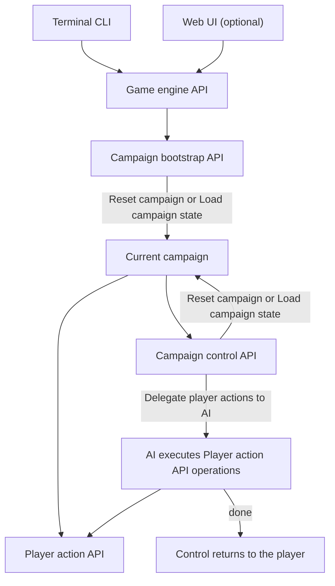

# Engine Contract

| Metadata    | Value                                                          |
| ----------- | -------------------------------------------------------------- |
| Spec ID     | ENG                                                            |
| Family      | Foundation                                                     |
| Status      | Draft                                                          |
| Conventions | [Specification conventions](../governance/spec-conventions.md) |

# Purpose and boundaries

Define the engine's API hierarchy and the guarantees it provides when running the game, exposing information, and restoring history.

This document owns observable execution guarantees, not a UI framework, internal architecture, exact API signatures, turn phase order,
RNG algorithm, save encoding, or subsystem mechanics.

- Uses [Domain Model](./domain-model.md) for the Campaign state structures and identities to which execution guarantees apply.
- Uses [Modeling Foundations](./modeling-foundations.md) for Game build, Campaign state, Committed state, and Authoritative value terminology in execution guarantees.
- Refined by [Developer API](../interfaces/developer-api.md), which specifies Dev mode, full Campaign state inspection, and optional debugging operations.
- Refined by [History and Persistence](./history-and-persistence.md), which specifies the reversible session, replay, and save/load guarantees.
- Refined by [Numbers and Randomness](./numbers-and-randomness.md), which specifies the numeric and random behavior required for reproducible execution.
- Refined by [Player Information](../interfaces/player-information.md), which specifies the complete player knowledge contract and hidden-state boundary.
- Refined by [Turn Resolution](./turn-resolution.md), which specifies the precise phase order and snapshot rules for executing a turn.
- Refined by [TypeScript Player API](../interfaces/typescript-api.md), which specifies the exact TypeScript player command, report, and error signatures.

# Relationships

- Uses [Domain Model](./domain-model.md)
- Uses [Modeling Foundations](./modeling-foundations.md)
- Refined by [Developer API](../interfaces/developer-api.md)
- Refined by [History and Persistence](./history-and-persistence.md)
- Refined by [Numbers and Randomness](./numbers-and-randomness.md)
- Refined by [Player Information](../interfaces/player-information.md)
- Refined by [Turn Resolution](./turn-resolution.md)
- Refined by [TypeScript Player API](../interfaces/typescript-api.md)

# Glossary

| Term                   | Definition                                                                                                                                                                          |
| ---------------------- | ----------------------------------------------------------------------------------------------------------------------------------------------------------------------------------- |
| Campaign bootstrap API | The entry-point API that exposes Reset campaign and Load campaign state to select the Campaign to play.                                                                             |
| Current campaign       | The Campaign selected for play by the most recent successful Reset campaign or Load campaign state command; both subsequent API groups operate on it.                               |
| Player action API      | The API for gameplay actions within the Current campaign and queries of its Campaign state, with the available state view governed by Dev mode.                                     |
| Campaign control API   | The API for managing the Current campaign, advancing and reverting turns, saving and loading state, resetting, changing Dev mode, and delegating Player action API execution to AI. |
| Dev mode               | An explicitly enabled interface access mode in which the Player action API provides access to full Campaign state in addition to Player-visible information.                        |

# Concepts and contract

## API hierarchy

The game engine exposes an API. Terminal CLI is an adapter over that API for convenient access. Additional interfaces
may also adapt the API; for example, Web UI can provide a richer presentation for human players. Gameplay behavior
remains in the engine.

The Campaign bootstrap API is the entry point. After it selects a Current campaign, the player has access to the
Player action API and Campaign control API. The latter also exposes the bootstrap commands for replacing the
Current campaign. These are conceptual API groups; TypeScript Player API owns their exact callable signatures.

The engine must satisfy [Modeling Foundations](modeling-foundations.md) and
[Domain Model](domain-model.md) during Campaign creation, gameplay, and state restoration.
The requirements below add execution and interface guarantees to those contracts.

# Requirements

## Campaign bootstrap and selection

Campaign bootstrap API must expose Reset campaign (create a new Campaign using the current Game build) and
Load campaign state (restore a saved Committed state). Each successful command replaces the Current campaign;
both subsequent API groups operate on it. The same commands in Campaign control API have the same behavior.

## Campaign control commands

The Campaign control API must expose all eight commands in this required inventory:

| Command                       | High-level behavior                                                                         |
| ----------------------------- | ------------------------------------------------------------------------------------------- |
| Advance turn                  | Runs turn advancement for the Current campaign and produces its next Committed state.       |
| Revert turn                   | Restores an earlier Committed state at a turn boundary of the Current campaign.             |
| Save campaign state           | Saves the Current campaign's Committed state for subsequent loading.                        |
| Enable dev mode               | Enables Dev mode and full Campaign state access through the Player action API.              |
| Disable dev mode              | Disables Dev mode and returns Player action API state access to Player-visible information. |
| Delegate player actions to AI | Hands execution of Player action API operations to AI until it signals completion.          |
| Load campaign state           | Restores a saved Committed state and selects its Campaign as the Current campaign.          |
| Reset campaign                | Starts a new Campaign and selects it as the Current campaign.                               |

Turn Resolution owns advancement timing; History and Persistence owns the exact Revert turn boundary and save/load
procedures. TypeScript Player API owns command inputs, outputs, and errors.

## Delegating player actions to AI

AI delegation must allow any sequence of Player action API operations on the Current campaign, subject to the
same command rules and Dev mode as player execution. AI signals "done" to return control to the overall player;
Campaign control API remains under that player's control. AI strategy belongs to the controller;
TypeScript Player API owns the completion signal representation.

## Derived value consistency

Queries and Derived value calculations must neither mutate Campaign state nor consume gameplay randomness.
Caches must be updated or invalidated when their inputs change, including after restoration.

## Continuation state

Equal Campaign state, the same Game build, and the same gameplay commands must produce equal results, including
after undo/redo or save/load. Campaign state must retain all inputs needed by the Rules, including relevant
History, RNG state, and Instance ID generation state; restoration must restore those inputs.
Execution must not depend on earlier UI renders or AI memory. AI need not choose the same commands after a restart.

## Information boundary

Dev mode must be disabled by default. Player-facing interfaces expose only Player-visible information while
it is disabled; enabling it additionally exposes full Campaign state through Player action API.
Disabling it restores the ordinary boundary for subsequent queries and results.

All inspection is read-only: player-facing interfaces permit Campaign state mutation only through gameplay
commands. State-changing session operations, including creation and restoration, must also use explicit commands.

## Committed state integrity

Invalid player requests must leave Campaign state, RNG and Instance ID generation state, reports, and history
unchanged. Intermediate processing states must not be exposed as committed Player-visible information.
Broken internal references or invariants must be reported as engine/data defects rather than silently repaired
into different gameplay outcomes.

## Game build compatibility

Backward compatibility and save migration across Game builds are not required. A Game build may replace its
data and executable implementation and reject or discard incompatible saves. History and Persistence owns
save validation and incompatible-save handling; successful restoration must satisfy this contract.

## Gameplay dependency direction

Gameplay functions, including Campaign instance constructors, must receive only necessary inputs and
dependencies, without direct or indirect access to the top-level Campaign instance. Contained Campaign
instances must not refer back to that root. These restrictions exclude campaign creation, save/load,
and external engine interfaces.

# Edge cases and failure behavior

Invalid requests and internal defects follow [Committed state integrity](#committed-state-integrity);
hidden identifiers and error details must respect [Information boundary](#information-boundary).
Exact public errors and restoration procedures belong to TypeScript Player API and History and Persistence.

# Acceptance examples

These scenarios exercise the additional guarantees; exact signatures and Revert turn targets require their
owning specifications.

- **Selection and control:** Load saved state S of Campaign A through bootstrap; both API groups then act on A.
  Save S, Advance turn, Revert turn to an eligible earlier boundary, and Load S through Campaign control API.
  Reset campaign selects a new Campaign B for both groups
  ([Campaign bootstrap and selection](#campaign-bootstrap-and-selection), [Campaign control commands](#campaign-control-commands)).
- **Visibility and delegation:** With Dev mode disabled, a query hides investigation difficulty H.
  Enable dev mode reveals H through Player action API without changing state; Disable dev mode hides H in
  subsequent results. Changing a returned view cannot change engine state. Delegated AI runs valid actions
  and signals "done", returning control to the player
  ([Information boundary](#information-boundary), [Delegating player actions to AI](#delegating-player-actions-to-ai)).
- **Queries and replay:** Querying state S repeatedly leaves state and randomness unchanged. Execute commands C,
  restore S, then execute C again with the same Game build: results and allocated Instance IDs match.
  Derived value caches reflect restored inputs rather than the discarded future
  ([Derived value consistency](#derived-value-consistency), [Continuation state](#continuation-state)).
- **Failures:** A rejected command leaves state, RNG, Instance ID generation, reports, and history unchanged.
  A broken internal reference reports a defect; no intermediate processing state appears as Committed state
  ([Committed state integrity](#committed-state-integrity)).
- **Build changes:** A save referencing a GDR removed by a later Game build may be rejected without migration
  ([Game build compatibility](#game-build-compatibility)).
- **Dependencies:** A gameplay Campaign instance constructor receives the inputs it needs, with no dependency
  that leads to the root Campaign instance; its constructed instance has no back-reference to that root
  ([Gameplay dependency direction](#gameplay-dependency-direction)).
