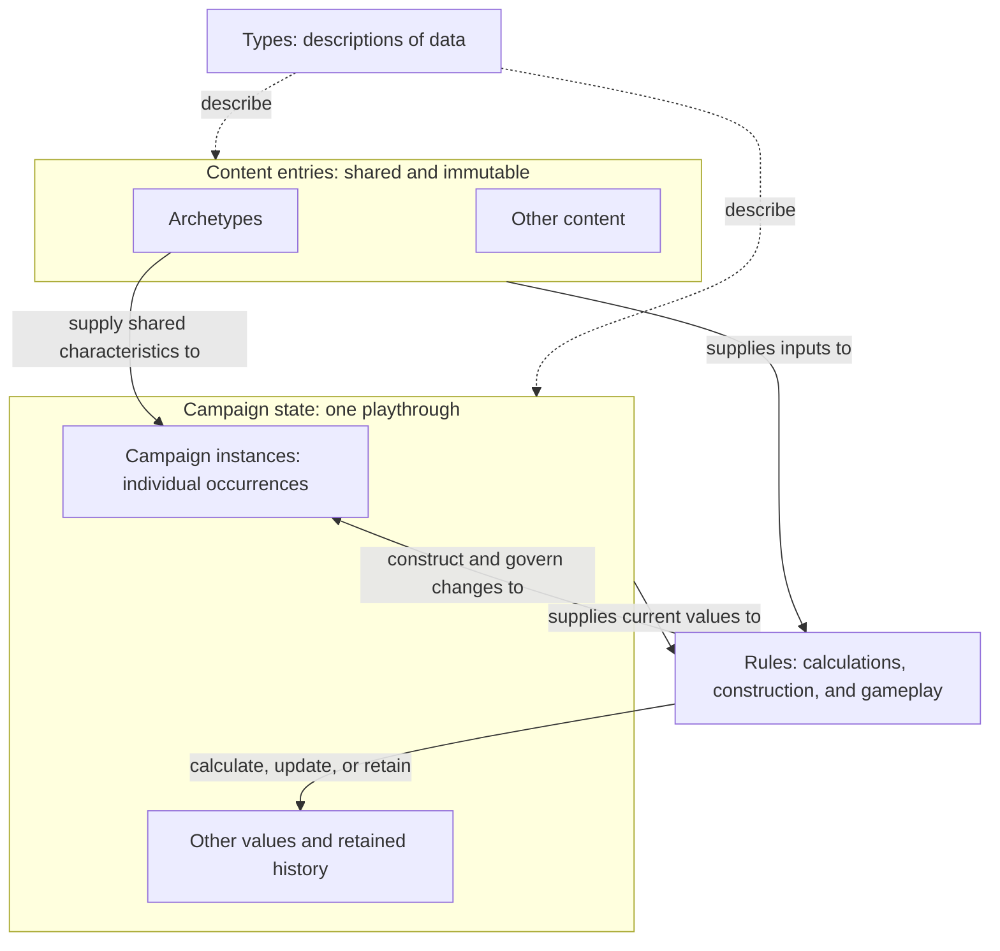
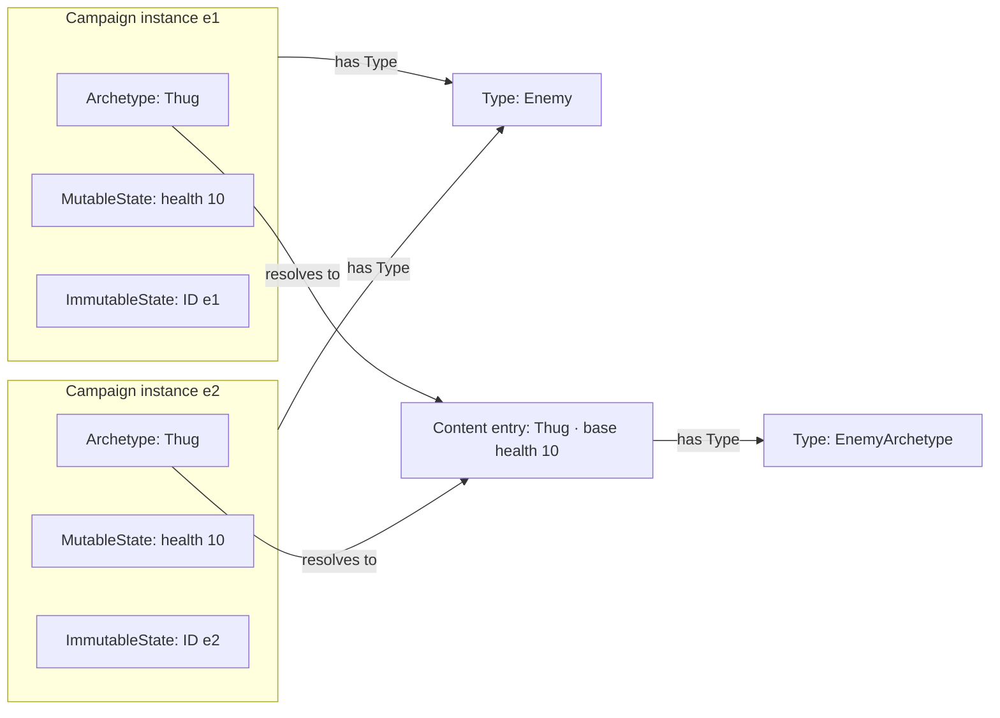
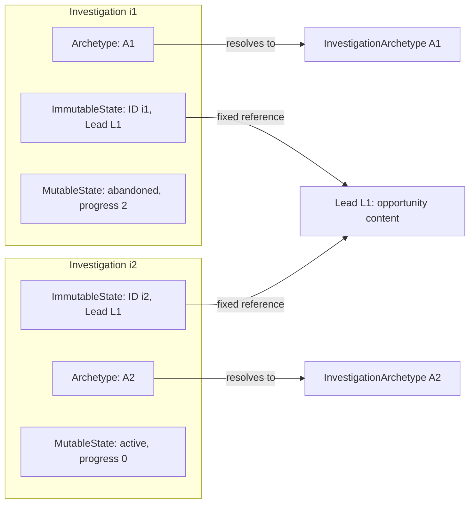

# Modeling Foundations

| Metadata    | Value                                                                                                                          |
| ----------- | ------------------------------------------------------------------------------------------------------------------------------ |
| Spec ID     | MODEL                                                                                                                          |
| Family      | Foundation                                                                                                                     |
| Status      | Draft                                                                                                                          |
| Scope       | Types, campaigns, content entries, instance construction and composition, identity and references, and historical preservation |
| Conventions | [Specification conventions](../governance/spec-conventions.md)                                                                 |
| Review      | Batch 1; proposed rules awaiting user review                                                                                   |

# Purpose and boundaries

A campaign is a particular playthrough with its own evolving state and retained history. Immutable content entries
supply shared game data. Rules use that content directly or construct campaign instances whose state changes as play
proceeds. Types describe the structure of this data; construction establishes initial values, and gameplay rules
govern subsequent changes.

This document defines that modeling vocabulary and its contracts. It explains how shared content, individual
occurrences, and historical facts fit together without prescribing storage layout or a programming language.
Its examples are self-contained illustrations, not production game definitions or balance decisions.

**Draft proposal:** the requirements remain proposed contracts. Concrete game structures and gameplay rules are
specified by documents that use these foundations. This document does not select ID-generation algorithms,
serialization, implementation classes, validation libraries, or cache implementations.

# Relationships

- Used by [Domain Model](./domain-model.md)
- Used by [Engine Contract](./engine-contract.md)
- Used by [History and Persistence](./history-and-persistence.md)
- Used by [Initial Campaign Content](../content/initial-campaign.md)
- Used by [Numbers and Randomness](./numbers-and-randomness.md)
- Used by [Player Information](../interfaces/player-information.md)
- Used by [TypeScript Player API](../interfaces/typescript-api.md)

# Glossary

Terms are ordered from general descriptions and campaign context through content and individual occurrences to
rules, value classification, and history.

| Term                          | Definition                                                                                                                                                                                                  |
| ----------------------------- | ----------------------------------------------------------------------------------------------------------------------------------------------------------------------------------------------------------- |
| Type                          | A named description of data structure and permitted values, including the Types of its constituent properties, collections, and references.                                                                 |
| Campaign                      | A particular playthrough with its own evolving state and retained history.                                                                                                                                  |
| Campaign state                | Data describing one Campaign; for example, its campaign instances, resources, and retained history.                                                                                                         |
| Content entry                 | Concrete game data supplied by a game build, conforming to a declared Type and immutable during gameplay.                                                                                                   |
| Archetype                     | A content entry describing shared characteristics and construction defaults for a category of campaign instances.                                                                                           |
| Campaign instance             | A particular occurrence within a campaign of a declared Type, composed of an Archetype, MutableState, and ImmutableState.                                                                                   |
| MutableState                  | Occurrence-specific data whose properties are permitted to evolve under their declared gameplay rules.                                                                                                      |
| ImmutableState                | Occurrence-specific data established during construction and preserved for the occurrence's lifetime, always including its Instance ID.                                                                     |
| Instance ID                   | An identifier for a campaign instance, unique within a declared identity scope and stable during its lifetime under [MODEL-002](#model-002--identity).                                                      |
| Rule                          | A declared statement governing a calculation or valid game behavior; for example, a formula or constraint. Further forms and any formal representation remain undecided.                                    |
| Campaign instance constructor | A Rule that declares its inputs and dependencies, identifies its result Type, and establishes a new campaign instance's initial state. It need not be a language-level constructor or public API operation. |
| Authoritative value           | A value treated as established truth rather than recomputed from other values.                                                                                                                              |
| Derived value                 | A value calculated deterministically from authoritative values and the current rules and content entries.                                                                                                   |
| Historical                    | Describes retained past state or events; does not by itself imply that gameplay rules cannot consult them.                                                                                                  |
| Became historical             | A lifecycle transition that retains a campaign instance as history rather than deleting required facts or references.                                                                                       |
| Committed state               | Complete state before or after an accepted command, not intermediate processing.                                                                                                                            |
| Player observation            | Information deliberately exposed by the engine to an ordinary player.                                                                                                                                       |

# Concepts and contract

## From content to a running campaign

A campaign separates shared game data from the facts of one playthrough. Content entries supply the shared data and
remain unchanged during play. Campaign state records what is happening in that playthrough and what must be remembered
about its past. Two campaigns can use the same content while developing different state.

Rules connect the two. A calculation can read content together with current campaign values. A constructor can use
content to create an individual campaign instance. Later rules can change that instance's mutable properties while
preserving its identity and fixed facts. Not every use of content creates an instance, and not every campaign value
needs independent identity.

Types describe the data on both sides of this distinction. A Type describes what a value contains; a content entry
provides concrete shared values; a campaign instance represents one occurrence. An Archetype is the content entry
supplying an instance's shared characteristics. The following sections build up these relationships from direct
content use to instances with multiple content references.

## Types describe model data

A Type names a data description rather than a particular value. It can describe a simple value, a collection, or a
structured set of properties. Each property has a declared Type, and a reference identifies the Type of data it
expects to resolve. Types describe content entries and campaign instances as well as their constituent values;
having a Type does not itself give a value independent identity.

For readers familiar with TypeScript, its `type` declarations offer an intuition for naming and composing data
descriptions. Here, Type is an independently defined modeling concept; these contracts do not use TypeScript syntax
or rely on its type system.

Structure, initialization, and ongoing validity answer different questions. A health property can be an integer;
a constructor can initialize it from shared content; gameplay rules can constrain its later range. Matching the
structure alone does not establish campaign membership, resolve references, or prove that initialization was valid.
Likewise, matching fields do not make an entry valid for every reference: references name the expected Type.

## Using content directly

Consider an illustrative upkeep calculation for agents serving in a campaign. Its complete local setup is:

| Element             | Modeling role       | Meaning in this example                                                     |
| ------------------- | ------------------- | --------------------------------------------------------------------------- |
| UpkeepRate          | Type                | Describes a nonnegative integer amount of money per serving agent per turn. |
| Standard upkeep     | Content entry       | Has Type UpkeepRate and value 2 money per serving agent per turn.           |
| Serving-agent count | Authoritative value | Campaign value, currently 3.                                                |
| Upkeep calculation  | Rule                | Upkeep for one turn equals the rate multiplied by the serving-agent count.  |
| Total upkeep        | Derived value       | 2 × 3 = 6 money for this turn.                                              |

The rule reads the entry directly. Applying the upkeep charge changes campaign money without constructing an upkeep
campaign instance. The rate remains 2 when the serving-agent count changes. The formula and its input content are
distinct: a Rule is not automatically a content entry or an object stored in campaign state.

Content can also supply an initial value. For example, an initial-capacity entry of 4 can initialize a campaign's
mutable capacity to 4. If an upgrade later changes capacity to 5, reading capacity returns 5; it does not copy 4 from
content again. This is initialization, whereas upkeep is an ongoing calculation. Neither illustrative value selects
a production balance parameter.

## Constructing instances from shared content

An Archetype supplies shared characteristics for particular occurrences. Consider an illustrative Enemy Type and a
Thug content entry of EnemyArchetype whose base health is 10. Creating two enemies from Thug produces two occurrences
of Enemy, not two new Types and not two mutable copies of Thug.

Every campaign instance has exactly three conceptual components. The complete composition of the first enemy in
this example is:

| Component      | Purpose                                                     | Enemy e1 at construction                           |
| -------------- | ----------------------------------------------------------- | -------------------------------------------------- |
| Archetype      | Shared immutable characteristics and construction defaults. | Thug, an EnemyArchetype entry with base health 10. |
| MutableState   | Occurrence-specific properties permitted to change.         | Current health 10.                                 |
| ImmutableState | Occurrence-specific facts fixed at construction.            | Instance ID e1.                                    |

The example's constructor takes the destination campaign and an EnemyArchetype entry and returns an Enemy. Its
dependencies are current-build content resolution and the campaign's identity-allocation state; it uses no randomness.
It allocates a fresh ID in a scope shared by all instances in this example campaign, fixes the archetype, initializes
current health to base health, and registers the occurrence in campaign state. No particular allocation algorithm is
implied. Multiple constructors can produce the same Type, provided each declares its inputs, dependencies, and
initialization rules ([MODEL-006](#model-006--campaign-instance-construction)).

For this example, base health is a positive integer and current health must remain an integer between zero and base
health, inclusive. Construction starts e1 and e2 at 10. Damage changes e1's health to 7; e2's health and Thug's base
health remain 10. Both identities remain unchanged. Starting an enemy at 7 would satisfy the ongoing range but violate
this constructor's initialization rule; starting it at 11 would violate both.

The components describe meaning, not storage. They can be embedded or resolved through references. Sharing an
archetype does not require inheritance or copies of content, and it must not cause occurrences to share mutable state.
Gameplay cannot replace an occurrence's archetype or modify its ImmutableState, including owned nested data
([MODEL-001](#model-001--campaign-instance-composition)). MutableState properties must be permitted to change under
their rules; they need not change in every playthrough or remain changeable after a terminal lifecycle transition.

## Identity and references

The Instance ID distinguishes an occurrence from others sharing its Type or archetype. It belongs in ImmutableState:
it must remain stable, and shared Thug content cannot supply a distinct identity for every enemy. In the example's
campaign-wide scope, e2 cannot reuse e1's ID. Other specifications must declare their own scopes explicitly
([MODEL-002](#model-002--identity)).

References identify particular content entries or campaign instances and their expected Types. Thug has a content
identity as an EnemyArchetype entry; e1 has an Instance ID as an Enemy occurrence. A reference to a missing entry is
invalid, as is resolving an EnemyArchetype reference to content of another Type merely because some fields match.
References must resolve explicitly; display names and the spelling of IDs do not encode relationships
([MODEL-003](#model-003--references)).

For example, consider a variant in which the Enemy constructor also receives a Mission instance m1 representing a task
and fixes a reference to it in e1's ImmutableState at construction. Mission follows the same three-component contract
and can have a mutable collection of participating enemies. Its membership can change while e1's fixed mission
reference continues to resolve to m1. Fixing the reference does not freeze m1's
MutableState; following a reference does not transfer ownership of the referenced occurrence's data.

Conversely, a relationship whose members may change belongs in MutableState. Mutability follows the meaning of the
relationship, not whether it is represented by an ID. Ordinary nested values and retained records do not become
campaign instances simply because they are stored, immutable, or associated with an identifier.

## Archetypes and other referenced content

An instance can refer to content for a purpose other than supplying its Archetype. Consider an illustrative opportunity
called a Lead and an Investigation representing one attempt to pursue it. The complete comparison needed here is:

| Example concept        | Modeling role                                                                          | Question it answers                                          |
| ---------------------- | -------------------------------------------------------------------------------------- | ------------------------------------------------------------ |
| Lead                   | Content entry describing an opportunity.                                               | What is being investigated?                                  |
| InvestigationArchetype | Content entry supplying shared characteristics and construction defaults for attempts. | What shared description does this attempt use?               |
| Investigation          | Campaign instance with its own identity and attempt state.                             | Which particular attempt is this, and how has it progressed? |

Suppose Lead L1 is referenced by attempt i1, constructed with InvestigationArchetype A1. Its ImmutableState fixes its
ID and Lead reference; its MutableState contains lifecycle initialized to active and progress initialized to 0. The archetype remains the separate shared
component. Adding the Lead reference does not create a fourth component or make L1 the attempt's archetype.

For this example, i1 reaches progress 2 and is abandoned. A new attempt i2 at L1 starts at progress 0 with its own ID.
Use archetype A2 for i2 to show that the opportunity and the attempt's archetype are independent relationships. These
are symbolic entries without selected production fields or mechanics. The example assumes both combinations are
permitted; it does not define eligibility or concurrency rules.

Both attempts can share L1 without sharing progress. Retargeting i1 to another Lead or replacing A1 after construction
would violate its fixed facts. Using L1 as its archetype would fail the expected InvestigationArchetype reference,
regardless of whether some fields match.

If i2 later completes, campaign state can retain a completion record associated with L1 and i2. L1 remains unchanged;
the record belongs to the campaign. The number of completions for L1 can then be derived from those records. Content
can thus identify the subject of an activity and key campaign facts without becoming mutable itself.

### Content roles in context

The following table recaps the complete set of five explanatory content roles used in this document. These roles
can overlap; they are not a closed taxonomy of content Types or five required implementation interfaces.

| Role                   | Data flow demonstrated above                                                                      |
| ---------------------- | ------------------------------------------------------------------------------------------------- |
| Calculation parameter  | The upkeep Rule reads the upkeep rate.                                                            |
| Initialization source  | The initial-capacity entry supplies a starting value that subsequently evolves in campaign state. |
| Archetype              | Thug supplies shared enemy characteristics and a default for initial health.                      |
| Referenced content     | An investigation's fixed Lead reference identifies its opportunity separately from its archetype. |
| Key for campaign facts | Completion records are associated with the Lead's typed content identity.                         |

“Template” can explain content's initialization role; it is not another formal category or a synonym for every content
entry. “Definition” remains ordinary prose. A Rule and the data it reads remain distinct, and these roles do not
require Rule objects or a Ruleset Type.

## Authoritative versus derived state

A value is authoritative when it is treated as established truth; it is derived when calculated from authoritative
values and current rules and content. This classification is separate from mutability. Shared base health and a
recorded Instance ID can be authoritative even though neither changes during gameplay.

In the enemy example, declare each enemy's current health authoritative and their total current health derived.
Initially the total is 20. After e1 takes damage, it is 17. Caching the total does not make it authoritative, and hiding
either the individual health or the total from the player does not change the classification
([MODEL-005](#model-005--value-classification)).

Similarly, the recorded completion of i2 is an authoritative historical fact. The completion count for L1 is derived:
it is 1 after i2 completes, and i1's abandonment does not add a completion. Facts associated with content belong to
the campaign rather than being edits to that content.

## Historical values and restoration

A past value cannot always be recovered from its current replacement. For example, a report that needs e1's original
health must retain that value of 10 or the original inputs needed to reconstruct it. Current health of 7 is not a
replacement for that historical fact. This obligation applies only when a rule or report needs the historical basis
([MODEL-004](#model-004--historical-fact-preservation)).

Becoming historical does not erase identity or required relationships. A retained reference to e1 must still resolve
after it becomes historical. Storage can be compacted only if required facts and references remain available.
An evolving collection can contain immutable historical records: adding a completion record does not permit rewriting
an earlier record.

Lookup and restoration recover an existing occurrence rather than construct a new one. Undoing damage restores e1's
health to 10; redoing it restores 7, with the same identity and immutable facts. Undoing an occurrence's creation
removes it and its references from that timeline; redo restores the same occurrence and fixed facts. An occurrence
belonging only to a discarded future is not another live instance in the retained timeline. These distinctions preserve
identity without selecting a restoration procedure.

# Requirements

## MODEL-001 — Campaign instance composition

Every campaign instance must have exactly three conceptual components: an Archetype, MutableState, and ImmutableState,
with structures described by its declared Type. Every content entry must match its declared Type.
Gameplay must not modify content entries, replace an occurrence's archetype, or modify its ImmutableState, including
nested data. MutableState properties must be permitted to change under their declared gameplay rules. Instances sharing
an archetype must have independent occurrence-specific components; they must not thereby share mutable state.
Fixed occurrence-specific references must belong to ImmutableState. For a reference held there, immutability fixes
the referenced content entry or campaign instance, not a referenced campaign instance's MutableState.
Nested value data owned by ImmutableState remains immutable; following a reference does not transfer ownership.
Structural compatibility alone does not establish a valid campaign occurrence or satisfy runtime invariants.

## MODEL-002 — Identity

Every campaign instance must have an Instance ID in ImmutableState. Each consuming specification must declare its
identity scopes. IDs must be unique within their declared scope and stable for each occurrence's lifetime.
Content references must identify the expected content Type and content ID.
Relationships must use explicit references; rules must not parse display names or ID text to discover relationships.
This specifies reference meaning, not a serialized discriminator field.

Distinct occurrences within an identity scope must have distinct IDs in the same timeline. IDs are timeline-scoped:
a discarded future is not another live campaign. Lookup and history restoration must preserve the identity of the
occurrence restored rather than allocate a new identity. This convention does not choose an ID-generation algorithm
or restoration procedure.

## MODEL-003 — References

All committed-state campaign instance references must resolve to an instance of the expected Type in the
same campaign; content references must resolve to an entry of the expected Type supplied by the current
game build. References to historical campaign instances, including terminal lifecycle states, must remain resolvable.
Storage can be compacted provided required facts remain available; this specification does not mandate full snapshots
forever. Structural compatibility alone is insufficient to prove reference validity.

## MODEL-004 — Historical fact preservation

Preserve the original inputs or historical value when a rule/report needs
it. Required historical values must not be overwritten with current calculations. This does not require retaining
every intermediate calculation or every possible chart.

## MODEL-005 — Value classification

Each specification using these concepts must declare which of its values are
authoritative and which are derived, using the glossary definitions. Caching a current calculation must not change its
classification as derived. Classification must be independent of player visibility: either kind of value may be hidden
from the player. Retaining a past calculation as a historical fact is governed by [MODEL-004](#model-004--historical-fact-preservation).

## MODEL-006 — Campaign instance construction

Each campaign instance constructor must declare its input parameters
and dependencies and identify its result Type. Every new occurrence must initialize all three required
components, receive a fresh Instance ID within its declared scope, and satisfy its declared structure and all applicable
committed-state invariants. Dependencies must include any content selection, ID-allocation state, or randomness used.
A constructor contract must distinguish initialization rules from structural constraints and gameplay invariants that
continue to apply after creation. Concrete constructor behavior belongs in the gameplay specification responsible for
that creation operation; consuming specifications identify those owners.

# Edge cases and failure behavior

| Case                                                                       | Result / owner                                                                                                                                  |
| -------------------------------------------------------------------------- | ----------------------------------------------------------------------------------------------------------------------------------------------- |
| Missing component, incorrect structure, or mutation of immutable data      | Invalid data or state under [MODEL-001](#model-001--campaign-instance-composition).                                                             |
| Constructor omits an input, dependency, result Type, or initial-state rule | Incomplete constructor contract under [MODEL-006](#model-006--campaign-instance-construction).                                                  |
| Duplicate Instance ID, missing reference, or wrong expected Type           | Invalid state under [MODEL-002](#model-002--identity)/[MODEL-003](#model-003--references); never infer a replacement by name.                   |
| Campaign instance is historical, including terminal lifecycle states       | Required historical references still resolve under [MODEL-003](#model-003--references); storage may be compacted without losing required facts. |
| A later occurrence belongs only to a discarded future                      | IDs are timeline-scoped under [MODEL-002](#model-002--identity); committed references must resolve under [MODEL-003](#model-003--references).   |
| A current value differs from the retained original value                   | Retain the historical basis required by the result/report under [MODEL-004](#model-004--historical-fact-preservation).                          |

# Open decisions

[MODEL-001](#model-001--campaign-instance-composition), [MODEL-002](#model-002--identity), [MODEL-003](#model-003--references), [MODEL-004](#model-004--historical-fact-preservation), [MODEL-005](#model-005--value-classification), and [MODEL-006](#model-006--campaign-instance-construction) remain proposed rules awaiting review.
Consuming specifications own their concrete game Types, identity scopes, constructor behavior, and gameplay rules.
The illustrations here do not settle those decisions or select production content fields and allowed combinations.

Further Rule forms and any formal representation remain undecided. The five content roles are explanatory, not a
new implementation taxonomy.
