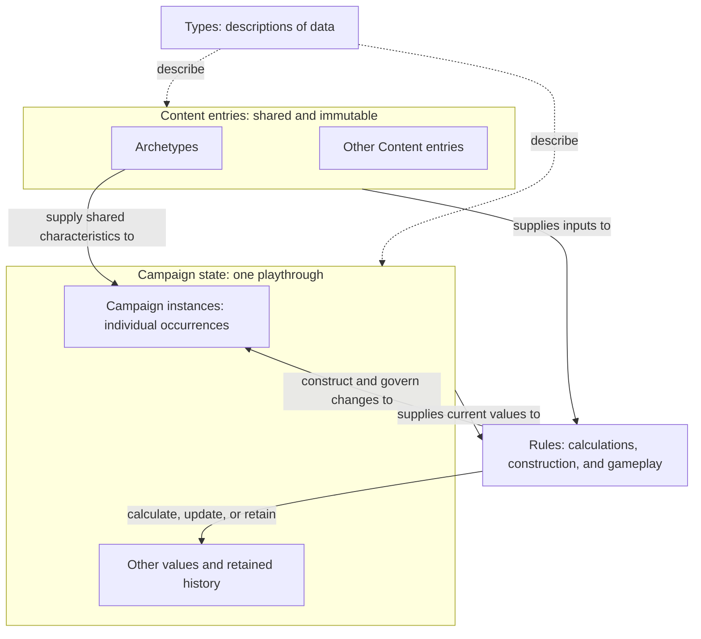
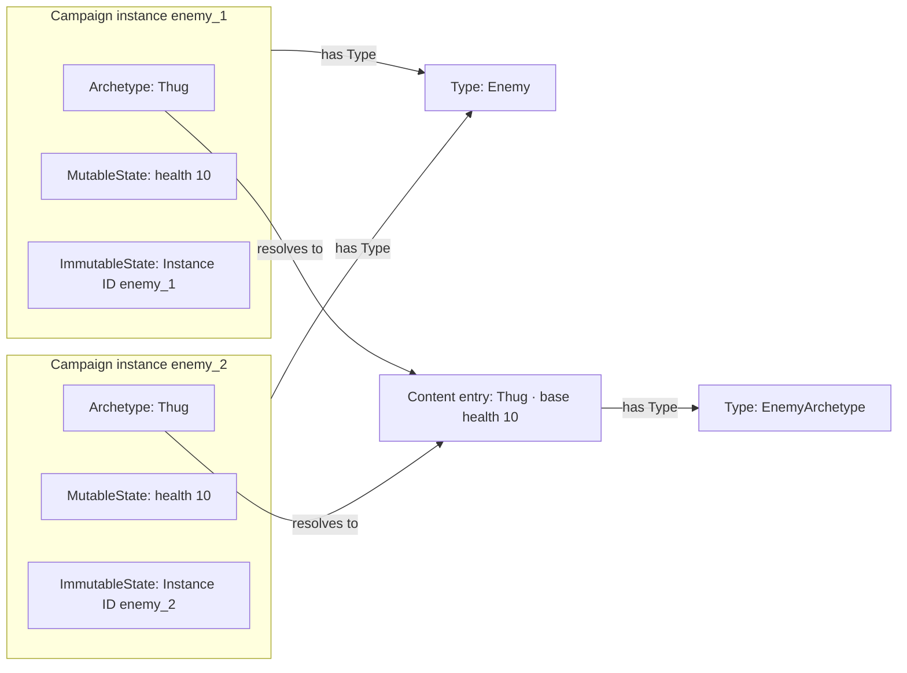
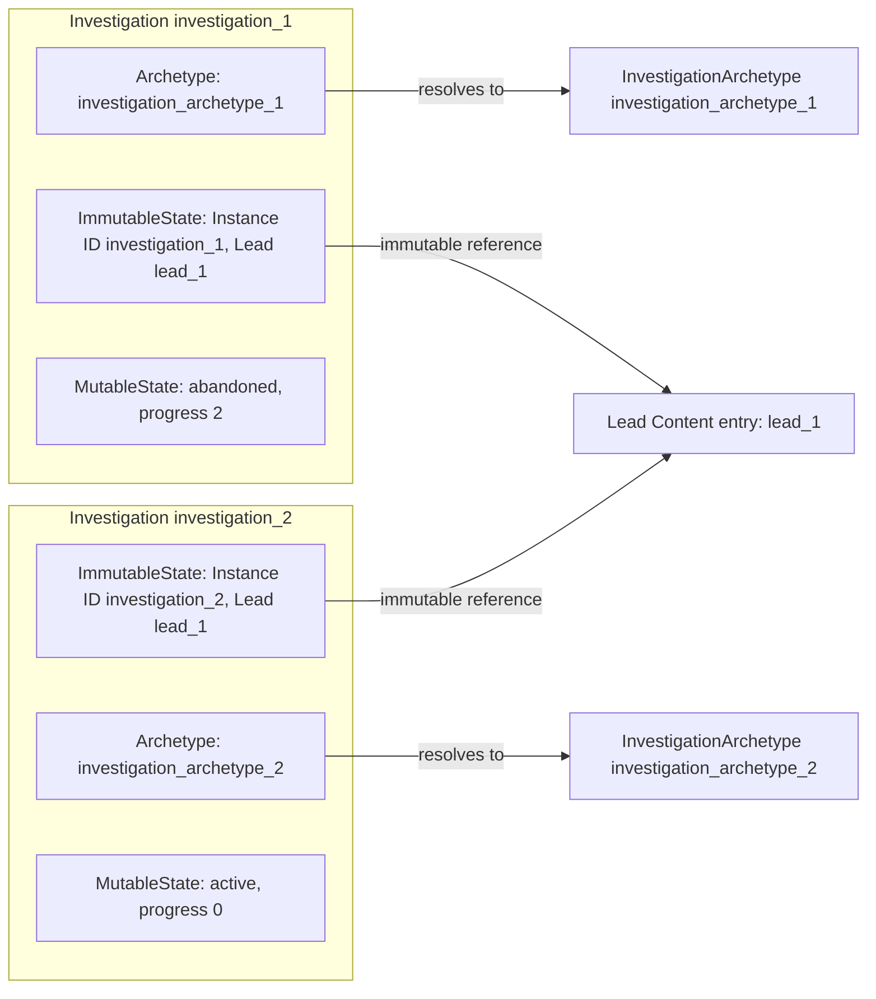

# Modeling Foundations

| Metadata    | Value                                                                                                                                                                  |
| ----------- | ---------------------------------------------------------------------------------------------------------------------------------------------------------------------- |
| Spec ID     | MODEL                                                                                                                                                                  |
| Family      | Foundation                                                                                                                                                             |
| Status      | Draft                                                                                                                                                                  |
| Scope       | Types, campaigns, Content entries, Campaign instance construction and composition, identity and references, gameplay dependency direction, and historical preservation |
| Conventions | [Specification conventions](../governance/spec-conventions.md)                                                                                                         |
| Review      | Batch 1; proposed rules awaiting user review                                                                                                                           |

# Purpose and boundaries

A campaign is a particular playthrough with its own evolving Campaign state and retained history. Immutable Content entries
supply shared game data. Rules use those Content entries directly or construct Campaign instances whose MutableState changes as play
proceeds. Types describe the structure of this data; construction establishes initial values, and gameplay rules
govern subsequent changes.

This document defines that modeling vocabulary and its contracts. It explains how shared Content entries, individual
Campaign instances, and historical facts fit together without prescribing storage layout or a programming language.
Its examples are self-contained illustrations, not production game definitions or balance decisions.

**Draft proposal:** the requirements remain proposed contracts. Concrete game structures and gameplay rules are
specified by documents that use these foundations. This document does not select Instance ID generation algorithms,
serialization, implementation classes, validation libraries, or cache implementations.

# Relationships

- Used by [Domain Model](./domain-model.md)
- Used by [Engine Contract](./engine-contract.md)
- Used by [History and Persistence](./history-and-persistence.md)
- Used by [Initial Campaign Content](../content/initial-campaign.md)
- Used by [Numbers and Randomness](./numbers-and-randomness.md)
- Used by [Player Information](../interfaces/player-information.md)
- Used by [TypeScript Player API](../interfaces/typescript-api.md)

# Glossary

Terms are ordered from general descriptions and campaign context through Content entries and individual Campaign instances to
rules, value classification, and history.

| Term                          | Definition                                                                                                                                                                                                                                  |
| ----------------------------- | ------------------------------------------------------------------------------------------------------------------------------------------------------------------------------------------------------------------------------------------- |
| Type                          | A named description of data structure and permitted values, including the Types of its constituent properties, collections, and references.                                                                                                 |
| Campaign                      | A particular playthrough with its own evolving Campaign state and retained history.                                                                                                                                                         |
| Campaign state                | Data describing one Campaign; for example, its Campaign instances, resources, and retained history.                                                                                                                                         |
| Content entry                 | Concrete game data supplied by a game build, conforming to a declared Type and immutable during gameplay.                                                                                                                                   |
| Archetype                     | A Content entry describing shared characteristics and construction defaults for a category of Campaign instances.                                                                                                                           |
| Campaign instance             | A particular occurrence within a campaign of a declared Type, composed of an Archetype, MutableState, and ImmutableState.                                                                                                                   |
| MutableState                  | Campaign instance-specific data whose properties are permitted to evolve under their declared gameplay rules.                                                                                                                               |
| ImmutableState                | Campaign instance-specific data established during construction and preserved for the Campaign instance's lifetime, always including its Instance ID.                                                                                       |
| Instance ID                   | An identifier for a Campaign instance, unique within a declared identity scope and stable during its lifetime under [MODEL-002](#model-002--identity).                                                                                      |
| Rule                          | A declared statement governing a calculation or valid game behavior; for example, a formula or constraint. Further forms and any formal representation remain undecided.                                                                    |
| Campaign instance constructor | A Rule that declares its inputs and dependencies, identifies the Type of the returned Campaign instance, and establishes a new Campaign instance's initial components. It need not be a language-level constructor or public API operation. |
| Authoritative value           | A value treated as established truth rather than recomputed from other values.                                                                                                                                                              |
| Derived value                 | A value calculated deterministically from Authoritative values and the current rules and Content entries.                                                                                                                                   |
| Historical                    | Describes retained past data or events; does not by itself imply that gameplay rules cannot consult them.                                                                                                                                   |
| Became historical             | A lifecycle transition that retains a Campaign instance as history rather than deleting required facts or references.                                                                                                                       |
| Committed state               | Complete Campaign state before or after an accepted command, not intermediate processing.                                                                                                                                                   |
| Player observation            | Information deliberately exposed by the engine to an ordinary player.                                                                                                                                                                       |

# Concepts and contract

## From Content entries to a running campaign

A campaign separates shared game data from the facts of one playthrough. Content entries supply the shared data and
remain unchanged during play. Campaign state records what is happening in that playthrough and what must be remembered
about its past. Two campaigns can use the same Content entries while developing different Campaign state.

Rules connect the two. A calculation can read Content entries together with current campaign values. A Campaign instance constructor can use
Content entries to create an individual Campaign instance. Later rules can change that Campaign instance's mutable properties while
preserving its identity and fixed facts. Not every use of Content entries creates a Campaign instance, and not every campaign value
needs independent identity.

Gameplay runs within one campaign, represented by one top-level Campaign instance. That Campaign instance owns the
contained Campaign instances. Gameplay functions operate on the specific inputs they need; they do not receive or
depend on the top-level Campaign instance. Containment establishes campaign membership without requiring a reverse
reference to the top-level Campaign instance ([MODEL-007](#model-007--gameplay-dependency-direction)).

Types describe the data on both sides of this distinction. A Type describes what a value contains; a Content entry
provides concrete shared values; a Campaign instance represents one particular occurrence. An Archetype is the Content entry
supplying a Campaign instance's shared characteristics. The following sections build up these relationships from direct
Content entry use to Campaign instances with multiple Content entry references.



## Types describe model data

A Type names a data description rather than a particular value. It can describe a simple value, a collection, or a
structured set of properties. Each property has a declared Type, and a reference identifies the Type of data it
expects to resolve. Types describe Content entries and Campaign instances as well as their constituent values;
having a Type does not itself give a value independent identity.

For readers familiar with TypeScript, its `type` declarations offer an intuition for naming and composing data
descriptions. Here, Type is an independently defined modeling concept; these contracts do not use TypeScript syntax
or rely on its type system.

Structure, initialization, and ongoing validity answer different questions. A health property can be an integer;
a Campaign instance constructor can initialize it from shared Content entries; gameplay rules can constrain its later range. Matching the
structure alone does not establish campaign membership, resolve references, or prove that initialization was valid.
Likewise, matching fields do not make a Content entry valid for every reference: references name the expected Type.

## Using Content entries directly

Consider an illustrative upkeep calculation for agents serving in a campaign. Its complete local setup is:

| Element             | Modeling role       | Meaning in this example                                                     |
| ------------------- | ------------------- | --------------------------------------------------------------------------- |
| UpkeepRate          | Type                | Describes a nonnegative integer amount of money per serving agent per turn. |
| Standard upkeep     | Content entry       | Has Type UpkeepRate and value 2 money per serving agent per turn.           |
| Serving-agent count | Authoritative value | Value in Campaign state, currently 3.                                       |
| Upkeep calculation  | Rule                | Upkeep for one turn equals the rate multiplied by the serving-agent count.  |
| Total upkeep        | Derived value       | 2 × 3 = 6 money for this turn.                                              |

The rule reads the Content entry directly. Applying the upkeep charge changes campaign money without constructing an upkeep
Campaign instance. The rate remains 2 when the serving-agent count changes. The formula and its input Content entry are
distinct: a Rule is not automatically a Content entry or an object stored in Campaign state.

Content entries can also supply an initial value. For example, an initial-capacity Content entry of 4 can initialize a campaign's
mutable capacity to 4. If an upgrade later changes capacity to 5, reading capacity returns 5; it does not copy 4 from
the Content entry again. This is initialization, whereas upkeep is an ongoing calculation. Neither illustrative value selects
a production balance parameter.

## Constructing Campaign instances from shared Content entries

An Archetype supplies shared characteristics for particular Campaign instances. Consider an illustrative Enemy Type and a
Thug Content entry of EnemyArchetype whose base health is 10. Creating two enemies from Thug produces two Campaign instances
of Enemy, not two new Types and not two mutable copies of Thug. Their Instance IDs are `enemy_1` and `enemy_2`;
both Campaign instances have Type Enemy. The numbered names identify Campaign instances, not Types.

Every Campaign instance has exactly three conceptual components. The complete composition of the first enemy in
this example is:

| Component      | Purpose                                                     | Enemy enemy_1 at construction                              |
| -------------- | ----------------------------------------------------------- | ---------------------------------------------------------- |
| Archetype      | Shared immutable characteristics and construction defaults. | Thug, an EnemyArchetype Content entry with base health 10. |
| MutableState   | Campaign instance-specific properties permitted to change.  | Current health 10.                                         |
| ImmutableState | Campaign instance-specific facts fixed at construction.     | Instance ID enemy_1.                                       |



The illustrative Campaign instance constructor `constructEnemy(archetype, instanceId)` receives an EnemyArchetype
Content entry and a fresh Instance ID and returns an Enemy. It fixes Archetype to the supplied Content entry, records
the supplied Instance ID in ImmutableState, and initializes current health in MutableState to the Content entry's base
health. All inputs are supplied directly; `constructEnemy` uses no randomness, performs no Content entry lookup, and
does not allocate an Instance ID or access the top-level Campaign instance.

The caller supplies an Instance ID that is fresh within this example's campaign-wide scope and attaches the returned
Enemy to the owning Mission. In the following language-independent pseudocode, `mission` denotes a Mission already
contained in the top-level Campaign instance, and `thug` denotes the Thug Content entry:

```text
enemy = constructEnemy(thug, freshInstanceId)
append enemy to mission.enemies
```

The caller changes the Mission's collection; `constructEnemy` only constructs and returns the Enemy. Before the
enclosing operation publishes Committed state, the caller must establish ownership and any required relationships.
The Instance ID allocation mechanism remains unspecified. Multiple Campaign instance constructors can return Campaign instances of the
same Type, provided each declares its inputs, dependencies, and initialization rules
([MODEL-006](#model-006--campaign-instance-construction)). Passing the top-level Campaign instance to `constructEnemy`
instead of supplying the required inputs would violate [MODEL-007](#model-007--gameplay-dependency-direction).

For this example, base health is a positive integer and current health must remain an integer between zero and base
health, inclusive. Construction starts enemy_1 and enemy_2 at 10. Damage changes enemy_1's health to 7; enemy_2's health and Thug's base
health remain 10. Both identities remain unchanged. Starting an enemy at 7 would satisfy the ongoing range but violate
the initialization rule of `constructEnemy`; starting it at 11 would violate both.

The components describe meaning, not storage. They can be embedded or resolved through references. Sharing an
archetype does not require inheritance or copies of Content entries, and it must not cause Campaign instances to share MutableState.
Gameplay cannot replace a Campaign instance's archetype or modify its ImmutableState, including owned nested data
([MODEL-001](#model-001--campaign-instance-composition)). MutableState properties must be permitted to change under
their rules; they need not change in every playthrough or remain changeable after a terminal lifecycle transition.

## Identity and references

The Instance ID distinguishes a Campaign instance from other Campaign instances within its declared identity scope. It belongs in ImmutableState:
it must remain stable, and the shared Thug Content entry cannot supply a distinct identity for every enemy. In the example's
campaign-wide scope, enemy_2 cannot reuse enemy_1's Instance ID. Other specifications must declare their own scopes explicitly
([MODEL-002](#model-002--identity)).

References identify particular Content entries or Campaign instances and their expected Types. Thug has a Content entry
identity as an EnemyArchetype Content entry; enemy_1 has an Instance ID as an Enemy Campaign instance. A reference to a missing Content entry is
invalid, as is resolving an EnemyArchetype reference to Content entries of another Type merely because some fields match.
References must resolve explicitly; display names and the spelling of identifiers do not encode relationships
([MODEL-003](#model-003--references)).

For a reference stored in a Campaign instance, its placement depends on whether the reference itself can change.
An immutable reference belongs in ImmutableState: construction establishes its target, and gameplay cannot replace or clear
that reference. A mutable reference belongs in MutableState: gameplay rules may replace its target or clear the
reference when permitted. This classification is independent of whether the referenced data can change.

For example, an Investigation's immutable Lead reference belongs in the Investigation's ImmutableState. An illustrative
Agent's reference to the Mission to which the Agent is currently deployed belongs in the Agent's MutableState if
gameplay permits deployment changes. Changing that reference changes which Mission the Agent references; it does not
modify either Mission. This example establishes no deployment eligibility or timing rules.

For example, consider a variant `constructEnemy(archetype, instanceId, missionReference)` whose additional input is a
typed reference to a Mission mission_1 representing a task. The Campaign instance constructor initializes that immutable reference in enemy_1's
ImmutableState at construction. Mission follows the same three-component contract
and can have a mutable collection of participating enemies. Its membership can change while enemy_1's immutable Mission
reference continues to resolve to mission_1. The immutable reference does not make immutable mission_1's
MutableState; following a reference does not transfer ownership of the referenced Campaign instance's data.

Lead is an immutable Content entry in these examples. Its immutability follows from being a Content entry, not from
the Investigation's reference being immutable. Mutable campaign facts associated with a Lead belong in Campaign state,
as illustrated by the completion records in the next section; changing those facts does not replace the Lead reference.

Mutability of a reference does not depend on whether it is represented by an identifier. Ordinary nested values and retained records do not become
Campaign instances simply because they are stored, immutable, or associated with an identifier.

## Archetypes and other referenced Content entries

A Campaign instance can refer to Content entries for a purpose other than supplying its Archetype. Consider an illustrative Lead and an Investigation of that Lead. The complete comparison needed here is:

| Example concept        | Modeling role                                                                                                                                              | Question it answers                                                               |
| ---------------------- | ---------------------------------------------------------------------------------------------------------------------------------------------------------- | --------------------------------------------------------------------------------- |
| Lead                   | Content entry representing a Lead to pursue.                                                                                                               | Which Lead can be pursued?                                                        |
| Investigation          | Campaign instance for investigation of a given Lead, with its own Instance ID, progress in MutableState, and a immutable Lead reference in ImmutableState. | Which Investigation concerns that Lead, and how has it progressed?                |
| InvestigationArchetype | Content entry used as an Investigation's Archetype, supplying shared characteristics and construction defaults independently of the referenced Lead.       | What shared characteristics and construction defaults does the Investigation use? |

Suppose Lead lead_1 is referenced by Investigation investigation_1, constructed with InvestigationArchetype investigation_archetype_1. Its ImmutableState contains its
Instance ID and immutable Lead reference; its MutableState contains lifecycle initialized to active and progress initialized to 0. The archetype remains the separate shared
component. Adding the Lead reference does not create a fourth component or make lead_1 the Investigation's archetype.

For this example, investigation_1 reaches progress 2 and is abandoned. A new Investigation investigation_2 at lead_1 starts at progress 0 with its own Instance ID.
Use archetype investigation_archetype_2 for investigation_2 to show that the Investigation's Lead reference and Archetype are independent relationships. These
are symbolic Content entries without selected production fields or mechanics. The example assumes both combinations are
permitted; it does not define eligibility or concurrency rules.



Both Investigations can share lead_1 without sharing progress. Retargeting investigation_1 to another Lead or replacing investigation_archetype_1 after construction
would violate its fixed facts. Using lead_1 as its archetype would fail the expected InvestigationArchetype reference,
regardless of whether some fields match.

If investigation_2 later completes, Campaign state can retain a completion record associated with lead_1 and investigation_2. lead_1 remains unchanged;
the record belongs to the campaign. The number of completions for lead_1 can then be derived from those records. Content entries
can thus identify the subject of an activity and key campaign facts without becoming mutable itself.

### Content entry roles in context

The following table recaps the complete set of five explanatory Content entry roles used in this document. These roles
can overlap; they are not a closed taxonomy of Content entry Types or five required implementation interfaces.

| Role                     | Data flow demonstrated above                                                                              |
| ------------------------ | --------------------------------------------------------------------------------------------------------- |
| Calculation parameter    | The upkeep Rule reads the upkeep rate.                                                                    |
| Initialization source    | The initial-capacity Content entry supplies a starting value that subsequently evolves in Campaign state. |
| Archetype                | Thug supplies shared enemy characteristics and a default for initial health.                              |
| Referenced Content entry | An Investigation's immutable Lead reference identifies its Lead separately from its Archetype.            |
| Key for campaign facts   | Completion records are associated with the Lead's typed Content entry identity.                           |

“Template” can explain a Content entry's initialization role; it is not another formal category or a synonym for every Content entry. “Definition” remains ordinary prose. A Rule and the data it reads remain distinct, and these roles do not
require Rule objects or a Ruleset Type.

## Authoritative values and Derived values

An Authoritative value is treated as established truth. A Derived value is calculated from Authoritative values
and current rules and Content entries. This classification is separate from mutability. Shared base health and a
recorded Instance ID can be Authoritative values even though neither changes during gameplay.

In the enemy example, declare each enemy's current health an Authoritative value and their total current health a Derived value.
Initially the total is 20. After enemy_1 takes damage, it is 17. Caching the total does not make it an Authoritative value, and hiding
either the individual health or the total from the player does not change the classification
([MODEL-005](#model-005--value-classification)).

Similarly, the recorded completion of investigation_2 is an Authoritative value recording a historical fact. The completion count for lead_1 is a Derived value:
it is 1 after investigation_2 completes, and investigation_1's abandonment does not add a completion. Facts associated with Content entries belong to
the campaign rather than being edits to those Content entries.

## Historical values and restoration

A past value cannot always be recovered from its current replacement. For example, a report that needs enemy_1's original
health must retain that value of 10 or the original inputs needed to reconstruct it. Current health of 7 is not a
replacement for that historical fact. This obligation applies only when a rule or report needs the historical basis
([MODEL-004](#model-004--historical-fact-preservation)).

The Became historical transition does not erase identity or required relationships. A retained reference to enemy_1 must still resolve
after its Became historical transition. Storage can be compacted only if required facts and references remain available.
An evolving collection can contain immutable historical records: adding a completion record does not permit rewriting
an earlier record.

Lookup and restoration recover an existing Campaign instance rather than construct a new one. Undoing damage restores enemy_1's
health to 10; redoing it restores 7, with the same identity and immutable facts. Undoing a Campaign instance's creation
removes it and its references from that timeline; redo restores the same Campaign instance and fixed facts. A Campaign instance
belonging only to a discarded future is not another live Campaign instance in the retained timeline. These distinctions preserve
identity without selecting a restoration procedure.

# Requirements

## MODEL-001 — Campaign instance composition

Every Campaign instance must have exactly three conceptual components: an Archetype, MutableState, and ImmutableState,
with structures described by its declared Type. Every Content entry must match its declared Type.
Gameplay must not modify Content entries, replace a Campaign instance's archetype, or modify its ImmutableState, including
nested data. MutableState properties must be permitted to change under their declared gameplay rules. Campaign instances sharing
an archetype must have independent Campaign instance-specific components; they must not thereby share MutableState.
Immutable Campaign instance-specific references must belong to ImmutableState. An immutable reference cannot be replaced
or cleared; the referenced Campaign instance's MutableState can change under its gameplay rules.
Nested value data owned by ImmutableState remains immutable; following a reference does not transfer ownership.
Structural compatibility alone does not establish a valid Campaign instance or satisfy runtime invariants.

## MODEL-002 — Identity

Every Campaign instance must have an Instance ID in ImmutableState. Each consuming specification must declare its
identity scopes. Instance IDs must be unique within their declared scope and stable for each Campaign instance's lifetime.
Content entry references must identify the expected Content entry Type and Content entry ID.
Relationships must use explicit references; rules must not parse display names or identifier text to discover relationships.
This specifies reference meaning, not a serialized discriminator field.

Distinct Campaign instances within an identity scope must have distinct Instance IDs in the same timeline. Instance IDs are timeline-scoped:
a discarded future is not another live campaign. Lookup and history restoration must preserve the identity of the
Campaign instance restored rather than allocate a new identity. This convention does not choose an Instance ID generation algorithm
or restoration procedure.

## MODEL-003 — References

All Committed state Campaign instance references must resolve to a Campaign instance of the expected Type in the
same campaign; Content entry references must resolve to a Content entry of the expected Type supplied by the current
game build. References to historical Campaign instances, including terminal lifecycle states, must remain resolvable.
Storage can be compacted provided required facts remain available; this specification does not mandate full snapshots
forever. Structural compatibility alone is insufficient to prove reference validity.

Within a Campaign instance, an immutable reference must belong in ImmutableState, and a mutable reference must belong in
MutableState. Gameplay may replace or clear a mutable reference under its declared rules. An immutable reference cannot
be replaced or cleared; it does not make the referenced data immutable. Changes to the referenced
Campaign instance's MutableState remain governed by that Campaign instance's rules. Content entries remain immutable
regardless of the mutability of references to them.

## MODEL-004 — Historical fact preservation

Preserve the original inputs or historical value when a rule/report needs
it. Required historical values must not be overwritten with current calculations. This does not require retaining
every intermediate calculation or every possible chart.

## MODEL-005 — Value classification

Each specification using these concepts must declare which of its values are
Authoritative values and which are Derived values, using the glossary definitions. Caching a current calculation must not change its
classification as a Derived value. Classification must be independent of player visibility: either kind of value may be hidden
from the player. Retaining a past calculation as a historical fact is governed by [MODEL-004](#model-004--historical-fact-preservation).

## MODEL-006 — Campaign instance construction

Each Campaign instance constructor must declare its input parameters
and dependencies and identify the Type of the returned Campaign instance. Every new Campaign instance must initialize all three required
components, receive a fresh Instance ID within its declared scope, and satisfy its declared structure and initialization
rules. The caller must establish ownership and required relationships before the enclosing operation publishes
Committed state; that Committed state must satisfy all applicable invariants. Dependencies must include any Content
entry selection, Instance ID allocation state, or randomness actually used by the Campaign instance constructor.
A Campaign instance constructor contract must distinguish initialization rules from structural constraints and gameplay invariants that
continue to apply after creation. Concrete Campaign instance constructor behavior belongs in the gameplay specification responsible for
that creation operation; consuming specifications identify those owners.

## MODEL-007 — Gameplay dependency direction

Within gameplay, the top-level Campaign instance must be the ownership root for the current campaign. Gameplay
functions, including Campaign instance constructors, must not accept that top-level Campaign instance as an input or
depend on access to it. A context object, global, or captured reference must not provide indirect access to the
top-level Campaign instance. Contained Campaign instances must not hold reverse references to that top-level Campaign
instance. Gameplay functions must receive only the specific values, Content entries, contained Campaign instances,
or narrowly scoped dependencies needed for their operations, without exposing the top-level Campaign instance.

A Campaign instance constructor must return the constructed Campaign instance; its caller establishes containment.
These constraints apply inside gameplay after campaign creation. They do not prescribe external campaign creation,
save/load, or engine interfaces.

# Edge cases and failure behavior

Passing the top-level Campaign instance into gameplay, directly or through another dependency, violates
[MODEL-007](#model-007--gameplay-dependency-direction). The same applies to a reverse reference from a contained
Campaign instance to the top-level Campaign instance.

| Case                                                                                                                     | Result / owner                                                                                                                                         |
| ------------------------------------------------------------------------------------------------------------------------ | ------------------------------------------------------------------------------------------------------------------------------------------------------ |
| Missing component, incorrect structure, or mutation of immutable data                                                    | Invalid data or Campaign state under [MODEL-001](#model-001--campaign-instance-composition).                                                           |
| Campaign instance constructor omits an input, dependency, Type of the returned Campaign instance, or initialization rule | Incomplete Campaign instance constructor contract under [MODEL-006](#model-006--campaign-instance-construction).                                       |
| Duplicate Instance ID, missing reference, or wrong expected Type                                                         | Invalid Campaign state under [MODEL-002](#model-002--identity)/[MODEL-003](#model-003--references); never infer a replacement by name.                 |
| Campaign instance is historical, including terminal lifecycle states                                                     | Required historical references still resolve under [MODEL-003](#model-003--references); storage may be compacted without losing required facts.        |
| A later Campaign instance belongs only to a discarded future                                                             | Instance IDs are timeline-scoped under [MODEL-002](#model-002--identity); committed references must resolve under [MODEL-003](#model-003--references). |
| A current value differs from the retained original value                                                                 | Retain the historical basis required by the result/report under [MODEL-004](#model-004--historical-fact-preservation).                                 |

# Open decisions

[MODEL-001](#model-001--campaign-instance-composition), [MODEL-002](#model-002--identity), [MODEL-003](#model-003--references), [MODEL-004](#model-004--historical-fact-preservation), [MODEL-005](#model-005--value-classification), and [MODEL-006](#model-006--campaign-instance-construction) remain proposed rules awaiting review.
[MODEL-007](#model-007--gameplay-dependency-direction) records the required gameplay dependency boundary.
Consuming specifications own their concrete game Types, identity scopes, Campaign instance constructor behavior, and gameplay rules.
The illustrations here do not settle those decisions or select production Content entry fields and allowed combinations.

Further Rule forms and any formal representation remain undecided. The five Content entry roles are explanatory, not a
new implementation taxonomy.
