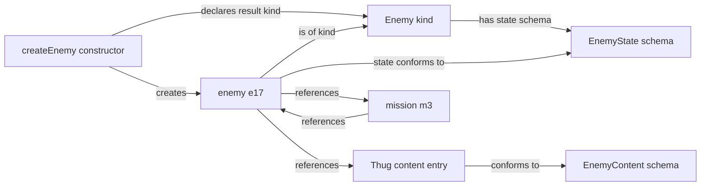

# Modeling Foundations

| Metadata    | Value                                                                                                                 |
| ----------- | --------------------------------------------------------------------------------------------------------------------- |
| Spec ID     | MODEL                                                                                                                 |
| Family      | Foundation                                                                                                            |
| Status      | Draft                                                                                                                 |
| Scope       | Modeling vocabulary, schemas/content entries/campaign instances, identity and references, and historical preservation |
| Conventions | [Specification conventions](../governance/spec-conventions.md)                                                        |
| Review      | Batch 1; proposed rules awaiting user review                                                                          |

# Purpose and boundaries

Define the conventions used to describe the game model. These concepts organize game facts; they are not an additional
set of in-world objects or a required implementation architecture.

**Draft proposal:** requirements were extracted from Domain Model and remain proposed contracts. This document owns
schema/content entry/campaign instance boundaries, campaign instance construction, identity and reference semantics,
and the distinction between current calculations and historical facts. It does not prescribe storage layout,
ID-generation algorithms, serialization, executable schema validation, implementation classes, or cache implementation.

# Relationships

- Used by [Domain Model](./domain-model.md)
- Used by [Engine Contract](./engine-contract.md)
- Used by [History and Persistence](./history-and-persistence.md)
- Used by [Initial Campaign Content](../content/initial-campaign.md)
- Used by [Numbers and Randomness](./numbers-and-randomness.md)
- Used by [Player Information](../interfaces/player-information.md)
- Used by [TypeScript Player API](../interfaces/typescript-api.md)

# Glossary

| Term                          | Definition                                                                                                                                                                                                                                    |
| ----------------------------- | --------------------------------------------------------------------------------------------------------------------------------------------------------------------------------------------------------------------------------------------- |
| Schema                        | A description of data structure and structural constraints. Schemas may reuse other schemas and describe reference fields with permitted targets. These declarations do not create the referenced objects.                                    |
| Content entry                 | Concrete game data supplied by a game build, immutable during gameplay and conforming to an applicable schema.                                                                                                                                |
| Campaign instance kind        | A named category of campaign instances sharing a common domain meaning and state contract. The state contract includes its state schema and applicable gameplay invariants.                                                                   |
| Campaign instance             | A particular occurrence of a declared campaign instance kind, with its own identity and campaign state.                                                                                                                                       |
| Campaign instance constructor | A rule that declares its input parameters and dependencies, identifies the campaign instance kind it creates, and establishes the new campaign instance's initial state. It need not be a language-level constructor or public API operation. |
| Instance ID                   | An identifier for a campaign instance, unique within a declared identity scope and stable during its lifetime under MODEL-002.                                                                                                                |
| Became historical             | A lifecycle transition that retains a campaign instance as history rather than deleting required facts or references.                                                                                                                         |
| Campaign state                | Data describing a particular campaign, for example, its campaign instances, resources, and retained history.                                                                                                                                  |
| Authoritative value           | A value treated as established truth rather than recomputed from other values.                                                                                                                                                                |
| Derived value                 | A value calculated deterministically from authoritative values and the current rules and content entries.                                                                                                                                     |
| Historical                    | Describes retained past state or events; does not by itself imply that gameplay rules cannot consult them.                                                                                                                                    |
| Player observation            | Information deliberately exposed by the engine to an ordinary player.                                                                                                                                                                         |
| Committed state               | Complete state before or after an accepted command, not intermediate battle/turn processing.                                                                                                                                                  |

# Concepts and contract

## Schemas, content, and campaign instances

Enemy is a campaign instance kind; EnemyState is the schema describing its state. A kind supplies domain meaning,
while its schema describes data structure. Conformance to EnemyState alone does not establish Enemy kind membership
or create a campaign occurrence: a temporary record can have the same fields without being an Enemy campaign instance.

Schema conformance and content reference are different relationships. A content entry conforms to its content schema.
A campaign instance's state conforms to the state schema for its campaign instance kind and may refer to one or more content
entries. The complete description of such a campaign instance combines its individual campaign state with the shared
content reached through those references. This composition requires neither inheritance nor copying content values into
each campaign instance.

A content entry used to initialize a campaign instance plays a template role, but Template is not a separate modeling
category. Some content entries do not play that role; for example, a named balance parameter can be content consumed by
a calculation without serving as a template for a campaign instance.

A schema can describe collections and reference fields, including the permitted campaign instance kinds or content
schemas of their targets. Such fields do not prescribe how the targets are created. Constructors determine initial
population and values; gameplay rules determine ownership, lifecycle, and ongoing invariants. Reusing a schema does not
require a separate category of reusable schemas.

A campaign instance constructor declares how its inputs and dependencies create an occurrence of its declared result
kind and establish initial values. The state schema and applicable gameplay invariants continue to govern later states.
A kind may have multiple constructors, and a constructor may use zero, one, or multiple content entries. Returning an
existing instance or restoring its earlier state does not itself construct a new occurrence. A constructor here is a
gameplay creation rule, independent of implementation allocation or deserialization.

## Identity and explicit IDs

Identity distinguishes a campaign occurrence through changes to its state. An explicit Instance ID is one way to
represent that identity. For example, the single agency in a particular campaign can be identified by that relationship
without a separate agency ID. MODEL-002 requires specifications to declare where explicit IDs are needed.

Content entries can also have IDs; their defining distinction is their role as immutable game-build data. Ordinary
campaign values, for example, a current health value, do not become content entries merely because they lack independent
identity. Neither a particular data shape nor the presence of an ID alone establishes a campaign instance.

## Authoritative versus derived state

Being a property of a game concept does not make a value derived. The glossary defines the distinction;
MODEL-005 governs classification independently of storage and player visibility.

Examples of the distinction (not a complete state inventory):

| Authoritative value    | Derived value           |
| ---------------------- | ----------------------- |
| Recorded acquisitions  | Total acquired quantity |
| Recorded measurements  | Their arithmetic mean   |
| Retained event records | Event count             |

These examples illustrate the glossary distinction without prescribing particular game concepts, records, or a
serialized schema.

## Historical values

A historical value is not necessarily a current derived value. An earlier measurement cannot be reconstructed from
its current replacement alone. MODEL-004 governs preservation; it does not require every intermediate calculation or
every possible chart to be retained.

# Requirements

**MODEL-001 — Schema, content, and campaign instance boundary.** Gameplay must not modify schemas or content entries.
Every content entry must conform to its applicable schema. Every campaign instance must belong to a declared campaign
instance kind throughout its lifetime, and its state must conform to that kind's state schema. Campaign instances that share content entries must not thereby
share mutable campaign instance state.

**MODEL-002 — Identity.** A specification using campaign instance kinds must declare which kinds require explicit
Instance IDs and which of those kinds share an identity scope. Required IDs must be unique within their declared scope
and stable during each campaign instance's lifetime. Campaign instance identity does not itself require a separate ID
field. Content references must identify their content schema and ID.
Relationships must use explicit references; rules must not parse display names or ID text to discover relationships.

Distinct occurrences within an identity scope must have distinct IDs in the same timeline. IDs are timeline-scoped:
a discarded future is not another live campaign. This identity convention does not choose an ID-generation algorithm
or a restoration procedure.

**MODEL-003 — References.** All committed-state campaign instance references must resolve to the required kind in the
same campaign; content references must resolve to an entry conforming to the required schema among content entries
supplied by the current game build. References to historical campaign instances, including those in terminal lifecycle states, must remain
resolvable. Storage can be compacted provided required facts remain available; this specification does not mandate
full snapshots forever.

**MODEL-004 — Historical fact preservation.** Preserve the original inputs or historical value when a rule/report needs
it. Required historical values must not be overwritten with current calculations. This does not require retaining
every intermediate calculation or every possible chart.

**MODEL-005 — Value classification.** Each specification using these concepts must declare which of its values are
authoritative and which are derived, using the glossary definitions. Caching a current calculation must not change its
classification as derived. Classification must be independent of player visibility: either kind of value may be hidden
from the player. Retaining a past calculation as a historical fact is governed by MODEL-004.

**MODEL-006 — Campaign instance construction.** Each campaign instance constructor must declare its input parameters
and dependencies and identify its result campaign instance kind. Every new occurrence it creates must belong to that
declared kind, with initial state conforming to the kind's state schema and all applicable committed-state invariants.
A constructor contract must distinguish initialization rules from structural constraints and gameplay invariants that
continue to apply after creation. Concrete constructor behavior belongs in the gameplay specification responsible for
that creation operation, as identified by the domain contract's ownership declarations.

## Evidence basis (informative)

[Game Design Brief](../../game-design-brief.md) supplies the deterministic continuation and history requirements.
Inspected game-ts revision: f1835a29af3678b4b7a4d17017b0ad737c3ec81a. The cited validation file was unmodified in the source
working tree when the original Domain Model draft was prepared.

**Proposed change:** [Invariant validation](https://github.com/konrad-jamrozik/game-ts/blob/f1835a29af3678b4b7a4d17017b0ad737c3ec81a/web/src/lib/model_utils/validateGameStateInvariants.ts)
derives some relationships from IDs. MODEL-002 requires explicit references.

# Edge cases and failure behavior

| Case                                                                       | Result / owner                                                                                                       |
| -------------------------------------------------------------------------- | -------------------------------------------------------------------------------------------------------------------- |
| Content entry or campaign instance does not conform to its schema          | Invalid data or state under MODEL-001                                                                                |
| Constructor omits an input, dependency, result kind, or initial-state rule | Incomplete constructor contract under MODEL-006                                                                      |
| Duplicate instance ID, missing reference, or wrong target kind             | Invalid state under MODEL-002/003; never infer a replacement by name                                                 |
| Campaign instance is historical, including terminal lifecycle states       | Required historical references still resolve under MODEL-003; storage may be compacted without losing required facts |
| A later occurrence belongs only to a discarded future                      | IDs are timeline-scoped under MODEL-002; committed references must resolve under MODEL-003                           |
| A current value differs from the retained original value                   | Retain the historical basis required by the result/report under MODEL-004                                            |

# Acceptance examples

The Enemy fixture below is deliberately simplified and exists solely to exercise MODEL-001 through MODEL-006. Its
schemas, fields, values, and construction choices are explicit test conditions, not production Enemy content or
gameplay rules. Domain Model and its refining mechanics retain ownership of production concepts and creation behavior.
All IDs are symbolic and impose no implementation format.

## Schemas, kind, and content

For this fixture, declare the following example schemas:

| Schema         | Required fields and constraints                                                                              |
| -------------- | ------------------------------------------------------------------------------------------------------------ |
| `EnemyContent` | Content ID; display name; positive integer base health                                                       |
| `EnemyState`   | Instance ID; EnemyContent reference; nonnegative integer current health; Mission campaign instance reference |
| `MissionState` | Instance ID; collection of Enemy campaign instance references                                                |

Declare Enemy as a campaign instance kind governed by `EnemyState`. Declare the Thug content entry as conforming to
`EnemyContent`, with content ID `thug`, display name `Thug`, and base health 10. Declare mission `m3` as an existing
campaign instance of the Mission kind, with state conforming to `MissionState` and initially no enemy references.
Enemy and Mission require explicit Instance IDs and share one identity scope within the fixture's campaign.

The fixture has two ongoing gameplay invariants: each enemy's current health must not exceed its referenced content's
base health, and mission/enemy references must agree about membership. These are distinct from the structural schemas
and from the constructor's initial-health choice. All required references must resolve under MODEL-003.

The diagram shows conceptual relationships, not inheritance, storage layout, or an implementation API. The complete
description of e17 combines its `EnemyState` values with the referenced Thug content entry; the Thug values need not be
copied into e17.

## Construction and independent state

For this fixture, declare the conceptual constructor
`createEnemy(campaign, content, mission) -> Enemy campaign instance`. Its parameters are the destination campaign, one
EnemyContent entry, and one Mission campaign instance. The supplied content must resolve in the current build and
conform to EnemyContent; the supplied mission must belong to the destination campaign. The constructor reads that
campaign's current instance IDs and mission membership, and updates its ID-allocation state and supplied mission's
enemy references. Its result is governed by the fixture schemas and committed-state invariants. It consumes no randomness.

For each call, the constructor allocates a fresh instance ID, records typed references to the supplied content entry and
mission, records the new enemy reference in the supplied mission, and initializes current health from the content entry's
base health. These initialization choices belong only to this fixture. Calling it twice with Thug and m3 produces e17
and e18, both with current health 10 and distinct IDs. Both conform to `EnemyState` and refer to the same Thug entry and
mission m3 (MODEL-001/002/003/006). Their IDs also differ from m3. Supplying Thug selects a concrete content entry;
it does not require a Thug-specific schema or campaign instance kind.

After damage changes e17's authoritative current health to 7, e18's current health and Thug's base health remain 10.
The shared content reference does not share mutable campaign instance state, and neither schema nor Thug changes
(MODEL-001). E17 remains an Enemy with the same identity and valid EnemyState. Its health no longer equals the
constructor's initial value but still satisfies the ongoing health invariant.

## Value classification

Declare e17's and e18's current health authoritative and their total current health derived. Initially the total is 20;
after e17 takes damage it is 17. Caching that total leaves it derived. Hiding e17's health and the total from the player
leaves both classifications unchanged (MODEL-005).

## Invalid identity, construction, and references

Each row independently changes the fixture and states the required result:

| Change                                                               | Violation                                                                                   |
| -------------------------------------------------------------------- | ------------------------------------------------------------------------------------------- |
| Give e18 instance ID e17                                             | MODEL-002                                                                                   |
| Give e18 instance ID m3                                              | MODEL-002                                                                                   |
| Point e17's content reference at nonexistent EnemyContent ID `brute` | MODEL-003                                                                                   |
| Point e17's mission reference at nonexistent Mission m4              | MODEL-003                                                                                   |
| Point e17's mission reference at Enemy e18                           | MODEL-003                                                                                   |
| Omit the schema from e17's content reference                         | MODEL-002                                                                                   |
| Construct e17 without recording its required mission field           | MODEL-001/006                                                                               |
| Initialize e17 with negative current health                          | MODEL-001/006                                                                               |
| Initialize e17 with current health 11 while Thug base health is 10   | Fixture health invariant; MODEL-006                                                         |
| Initialize e17 with health 7 instead of 10                           | Fixture initialization rule; MODEL-006; schema and ongoing health invariant still satisfied |

These variants distinguish structural failures, reference failures, and failures to follow construction rules.
As a separate fixture variant, choosing a different display name for Thug when preparing the build leaves explicit
relationships unchanged (MODEL-002); gameplay cannot rename the content entry under MODEL-001.

## Retained history

Retain e17's original health of 10 for a historical report required by this fixture.

- After e17's current health becomes 7, its retained original health is still 10 (MODEL-004).
- When e17 becomes historical, m3's required reference still resolves to e17 (MODEL-003).
- Compacting e17 is valid only if that reference and the original health of 10 remain available (MODEL-003/004).
- If e18 belongs only to a discarded future, it is not another live campaign instance. The retained timeline's
  references still resolve within that campaign (MODEL-002/003).

# Open decisions

MODEL-001 through MODEL-006 remain proposed rules awaiting review. A consuming specification owns its game-specific
schemas, campaign instance kinds, identity scopes, and concrete constructor behavior. This document defines the shared
modeling relationships without selecting production Enemy fields, constructor inputs, storage, or gameplay rules.
