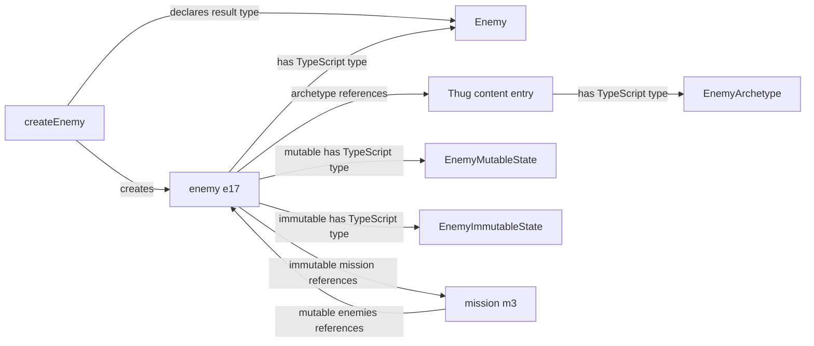

# Modeling Foundations

| Metadata    | Value                                                                                                                          |
| ----------- | ------------------------------------------------------------------------------------------------------------------------------ |
| Spec ID     | MODEL                                                                                                                          |
| Family      | Foundation                                                                                                                     |
| Status      | Draft                                                                                                                          |
| Scope       | Modeling vocabulary, TypeScript types/content entries/campaign instances, identity and references, and historical preservation |
| Conventions | [Specification conventions](../governance/spec-conventions.md)                                                                 |
| Review      | Batch 1; proposed rules awaiting user review                                                                                   |

# Purpose and boundaries

Define the conventions used to describe the game model. These concepts organize game facts; they are not an additional
set of in-world objects or a required implementation architecture.

**Draft proposal:** requirements were extracted from Domain Model and remain proposed contracts. This document owns
type/content entry/campaign instance boundaries, campaign instance construction, identity and reference semantics,
and the distinction between current calculations and historical facts. It does not prescribe storage layout,
ID-generation algorithms, serialization, a runtime validation library, implementation classes, or cache implementation.

# Relationships

- Used by [Domain Model](./domain-model.md)
- Used by [Engine Contract](./engine-contract.md)
- Used by [History and Persistence](./history-and-persistence.md)
- Used by [Initial Campaign Content](../content/initial-campaign.md)
- Used by [Numbers and Randomness](./numbers-and-randomness.md)
- Used by [Player Information](../interfaces/player-information.md)
- Used by [TypeScript Player API](../interfaces/typescript-api.md)

# Glossary

| Term                          | Definition                                                                                                                                                                                                                         |
| ----------------------------- | ---------------------------------------------------------------------------------------------------------------------------------------------------------------------------------------------------------------------------------- |
| Content entry                 | Concrete game data supplied by a game build and immutable during gameplay. It has a declared TypeScript type; archetypes and balance parameters are content entries.                                                               |
| Archetype                     | An immutable content entry describing shared characteristics and construction defaults for a category of campaign instances.                                                                                                       |
| MutableState                  | Occurrence-specific data whose properties are permitted to evolve under their declared gameplay rules.                                                                                                                             |
| ImmutableState                | Occurrence-specific data established during construction and preserved for the occurrence’s lifetime, always including its Instance ID.                                                                                            |
| Campaign instance             | A particular campaign occurrence of a declared TypeScript type, composed of an Archetype, MutableState, and ImmutableState containing its Instance ID.                                                                             |
| Campaign instance constructor | A rule that declares its input parameters and dependencies, identifies its result TypeScript type, and establishes the new campaign instance's initial state. It need not be a language-level constructor or public API operation. |
| Instance ID                   | An identifier for a campaign instance, unique within a declared identity scope and stable during its lifetime under [MODEL-002](#model-002--identity).                                                                             |
| Became historical             | A lifecycle transition that retains a campaign instance as history rather than deleting required facts or references.                                                                                                              |
| Campaign state                | Data describing a particular campaign, for example, its campaign instances, resources, and retained history.                                                                                                                       |
| Authoritative value           | A value treated as established truth rather than recomputed from other values.                                                                                                                                                     |
| Derived value                 | A value calculated deterministically from authoritative values and the current rules and content entries.                                                                                                                          |
| Historical                    | Describes retained past state or events; does not by itself imply that gameplay rules cannot consult them.                                                                                                                         |
| Player observation            | Information deliberately exposed by the engine to an ordinary player.                                                                                                                                                              |
| Committed state               | Complete state before or after an accepted command, not intermediate battle/turn processing.                                                                                                                                       |

# Concepts and contract

## Types and three-component campaign instances

TypeScript type aliases describe data structure, including reusable structures, collections, and reference fields.
They do not construct the referenced objects or establish domain validity. Matching a TypeScript shape alone does not
establish campaign membership, valid references, or valid health. Runtime constraints remain explicit prose rules.

Every campaign instance has exactly three conceptual components: Archetype, MutableState, and ImmutableState.
The instance's declared TypeScript type identifies the required structure of each component. Archetype supplies shared
immutable characteristics; MutableState holds occurrence-specific properties permitted to change; ImmutableState holds
occurrence-specific facts fixed at construction. Every MutableState property must support change under its declared
rules, but need not change in every run or remain changeable after a terminal lifecycle transition.

Both Archetype and ImmutableState are immutable during gameplay, including nested data. TypeScript `readonly`
communicates intent; it neither recursively makes all nested data readonly nor enforces runtime immutability.
The three components are a conceptual contract, not a prescribed storage layout. Components may be embedded or resolved
through references, provided resolution supplies the required component. Shared archetypes do not require inheritance
or copies of content into each occurrence, and gameplay cannot replace an occurrence's archetype.

A content entry used to initialize instances plays a template role. Archetype names the shared-content component,
not every possible content entry: a named balance parameter used in a calculation need not initialize any instance.
“Template” remains an explanatory role, not a separate formal category. “Definition” remains ordinary prose.

Constructors declare inputs, dependencies, a result TypeScript type, and how they establish initial values. Multiple
constructors may create instances of the same type. Every created instance requires an archetype, whether selected by
an input or resolved by a declared dependency; constructors can use additional content. Structure and ongoing gameplay
rules constrain later states independently of initialization. Collections and reference fields describe relationships;
creation and gameplay rules determine their population, ownership, and lifecycle.

## Identity and immutable facts

Every campaign instance has an explicit Instance ID in ImmutableState. ID cannot belong to MutableState because it
must remain stable; it cannot belong to Archetype because multiple occurrences can share an archetype but must have
distinct identities within their declared scope. ImmutableState may contain other fixed occurrence facts.

Content entries may also have IDs. They are distinguished by their role as immutable game-build data, not merely by
immutability or an identifier. Ordinary campaign values without independent identity are not thereby content entries,
and nested values or historical records do not automatically become campaign instances.

Lookup and history restoration return an existing occurrence rather than construct a new one. Undo may remove an
occurrence from the retained timeline or restore its prior MutableState; it does not authorize changing that occurrence's
ImmutableState or archetype. Redo restores the same identity and immutable facts. An evolving collection may contain
immutable historical records: changing collection membership does not permit rewriting retained elements.

## Authoritative versus derived state

Being a property of a game concept does not make a value derived. The glossary defines the distinction;
[MODEL-005](#model-005--value-classification) governs classification independently of storage and player visibility.

Examples of the distinction (not a complete state inventory):

| Authoritative value    | Derived value           |
| ---------------------- | ----------------------- |
| Recorded acquisitions  | Total acquired quantity |
| Recorded measurements  | Their arithmetic mean   |
| Retained event records | Event count             |

These examples illustrate the glossary distinction without prescribing particular game concepts, records, or a
serialized schema.

## Historical values

A historical value is not necessarily a current derived value. An earlier measurement cannot be reconstructed from
its current replacement alone. [MODEL-004](#model-004--historical-fact-preservation) governs preservation; it does not require every intermediate calculation or
every possible chart to be retained.

# Requirements

## MODEL-001 — Campaign instance composition

Every campaign instance must have exactly three conceptual components: an Archetype, MutableState, and ImmutableState,
with structures described by its declared TypeScript type. Every content entry must match its declared TypeScript type.
Gameplay must not modify content entries, replace an occurrence's archetype, or modify its ImmutableState, including
nested data. MutableState properties must be permitted to change under their declared gameplay rules. Instances sharing
an archetype must have independent occurrence-specific components; they must not thereby share mutable state.
For a reference held in ImmutableState, immutability fixes the referenced occurrence, not that occurrence's MutableState.
Nested value data owned by ImmutableState remains immutable; following a reference does not transfer ownership.
TypeScript structural compatibility alone does not establish a valid campaign occurrence or satisfy runtime invariants.

## MODEL-002 — Identity

Every campaign instance must have an Instance ID in ImmutableState. Each consuming specification must declare its
identity scopes. IDs must be unique within their declared scope and stable for each occurrence's lifetime.
Content references must identify the expected content TypeScript type and content ID.
Relationships must use explicit references; rules must not parse display names or ID text to discover relationships.
This specifies reference meaning, not a serialized discriminator field.

Distinct occurrences within an identity scope must have distinct IDs in the same timeline. IDs are timeline-scoped:
a discarded future is not another live campaign. Lookup and history restoration must preserve the identity of the
occurrence restored rather than allocate a new identity. This convention does not choose an ID-generation algorithm
or restoration procedure.

## MODEL-003 — References

All committed-state campaign instance references must resolve to an instance of the expected TypeScript type in the
same campaign; content references must resolve to an entry of the expected TypeScript type supplied by the current
game build. References to historical campaign instances, including terminal lifecycle states, must remain resolvable.
Storage can be compacted provided required facts remain available; this specification does not mandate full snapshots
forever. Structural compatibility alone is insufficient to prove reference validity.

## MODEL-004 — Historical fact preservation

Preserve the original inputs or historical value when a rule/report needs
it. Required historical values must not be overwritten with current calculations. This does not require retaining
every intermediate calculation or every possible chart.

## MODEL-005 — Value classification

Each specification using these concepts must declare which of its values are
authoritative and which are derived, using the glossary definitions. Caching a current calculation must not change its
classification as derived. Classification must be independent of player visibility: either kind of value may be hidden
from the player. Retaining a past calculation as a historical fact is governed by [MODEL-004](#model-004--historical-fact-preservation).

## MODEL-006 — Campaign instance construction

Each campaign instance constructor must declare its input parameters
and dependencies and identify its result TypeScript type. Every new occurrence must initialize all three required
components, receive a fresh Instance ID within its declared scope, and satisfy its declared structure and all applicable
committed-state invariants. Dependencies must include any content selection, ID-allocation state, or randomness used.
A constructor contract must distinguish initialization rules from structural constraints and gameplay invariants that
continue to apply after creation. Concrete constructor behavior belongs in the gameplay specification responsible for
that creation operation, as identified by the domain contract's ownership declarations.

## Evidence basis (informative)

[Game Design Brief](../../game-design-brief.md) supplies the deterministic continuation and history requirements.
Inspected game-ts revision: f1835a29af3678b4b7a4d17017b0ad737c3ec81a. The cited validation file was unmodified in the source
working tree when the original Domain Model draft was prepared.

**Proposed change:** [Invariant validation](https://github.com/konrad-jamrozik/game-ts/blob/f1835a29af3678b4b7a4d17017b0ad737c3ec81a/web/src/lib/model_utils/validateGameStateInvariants.ts)
derives some relationships from IDs. [MODEL-002](#model-002--identity) requires explicit references.

# Edge cases and failure behavior

| Case                                                                       | Result / owner                                                                                                                                 |
| -------------------------------------------------------------------------- | ---------------------------------------------------------------------------------------------------------------------------------------------- |
| Missing component, incorrect structure, or mutation of immutable data      | Invalid data or state under [MODEL-001](#model-001--campaign-instance-composition)                                                             |
| Constructor omits an input, dependency, result type, or initial-state rule | Incomplete constructor contract under [MODEL-006](#model-006--campaign-instance-construction)                                                  |
| Duplicate instance ID, missing reference, or wrong expected type           | Invalid state under [MODEL-002](#model-002--identity)/[MODEL-003](#model-003--references); never infer a replacement by name                   |
| Campaign instance is historical, including terminal lifecycle states       | Required historical references still resolve under [MODEL-003](#model-003--references); storage may be compacted without losing required facts |
| A later occurrence belongs only to a discarded future                      | IDs are timeline-scoped under [MODEL-002](#model-002--identity); committed references must resolve under [MODEL-003](#model-003--references)   |
| A current value differs from the retained original value                   | Retain the historical basis required by the result/report under [MODEL-004](#model-004--historical-fact-preservation)                          |

# Acceptance examples

The Enemy fixture below is deliberately simplified and exists solely to exercise [MODEL-001](#model-001--campaign-instance-composition), [MODEL-002](#model-002--identity), [MODEL-003](#model-003--references), [MODEL-004](#model-004--historical-fact-preservation), [MODEL-005](#model-005--value-classification), and [MODEL-006](#model-006--campaign-instance-construction). Its
types, fields, values, and construction choices are explicit test conditions, not production Enemy content or
gameplay rules. Domain Model and its refining mechanics retain ownership of production concepts and creation behavior.
All IDs are symbolic and impose no implementation format.

## Types and fixture entries

These type aliases are conceptual documentation, not production runtime declarations or public API signatures.
Object-valued fields below denote typed relationships; an implementation may represent them with resolving references.

```ts
type EnemyArchetype = {
  readonly contentId: string
  readonly name: string
  readonly baseHealth: number
}
type EnemyMutableState = { currentHealth: number }
type EnemyImmutableState = {
  readonly id: string
  readonly mission: Mission
}
type Enemy = {
  readonly archetype: EnemyArchetype
  readonly mutable: EnemyMutableState
  readonly immutable: EnemyImmutableState
}

type MissionArchetype = {
  readonly contentId: string
  readonly name: string
}
type MissionMutableState = { enemies: Enemy[] }
type MissionImmutableState = { readonly id: string }
type Mission = {
  readonly archetype: MissionArchetype
  readonly mutable: MissionMutableState
  readonly immutable: MissionImmutableState
}

type CampaignArchetype = { readonly contentId: string }
type CampaignMutableState = {
  missions: Mission[]
  nextEnemyNumber: number
}
type CampaignImmutableState = { readonly id: string }
type Campaign = {
  readonly archetype: CampaignArchetype
  readonly mutable: CampaignMutableState
  readonly immutable: CampaignImmutableState
}
```

The complete fixture content inventory is Thug (`EnemyArchetype`: contentId `thug`, name `Thug`, baseHealth 10),
Patrol (`MissionArchetype`: contentId `patrol`, name `Patrol`), and Sandbox
(`CampaignArchetype`: contentId `sandbox`). These entries resolve in the current fixture build.
Initially campaign c1 has Sandbox, mutable missions [m3] and nextEnemyNumber 17, and immutable ID c1.
Mission m3 has Patrol, mutable enemies [], and immutable ID m3. Campaign, Mission, and Enemy share one ID scope.
This standalone modeling fixture has no dependency on production Domain Model composition or agency rules.

Runtime constraints require positive integer base health and nonnegative integer current health. The ongoing health
invariant limits current health to the referenced archetype's base health. Mission/enemy references must agree about
membership and resolve in this campaign. Mission membership is fixed for each enemy in this fixture, so its mission
reference belongs to ImmutableState. Mission enemy membership can change through construction or history restoration;
immutable enemy facts do not make the referenced Mission's MutableState immutable. The reference itself cannot change.
The allocation counter is a positive integer advanced by this fixture's constructor.



An enemy's complete description combines its two occurrence-specific components with shared Thug content.
Supplying Thug selects an entry of EnemyArchetype, not a new Thug-specific type.

## Construction and independent state

The conceptual constructor `createEnemy(campaign, archetype, mission) -> Enemy` takes the destination Campaign,
one EnemyArchetype entry, and one Mission in that campaign. Its declared dependencies are current-build content
resolution, the campaign's current and retained instance IDs, its ID-allocation counter, and supplied mission membership.
It uses no randomness. These are fixture initialization rules, not production gameplay defaults.

For each call, choose the first unused symbolic enemy ID starting at the counter, then advance the counter beyond it.
Construct an Enemy whose archetype references the supplied entry, whose MutableState starts with currentHealth equal
to baseHealth, and whose ImmutableState contains the new ID and supplied mission reference. Add the enemy reference to
the mission's mutable enemies collection. Publish only a state satisfying all fixture invariants.
The readonly wrapper fields do not prevent declared changes to the contents of MutableState.

Calling twice with c1, Thug, and m3 creates e17 and e18, each with health 10 and independent occurrence-specific
components. Their IDs differ from each other, c1, and m3. Mission m3 references both, and the counter becomes 19
([MODEL-001](#model-001--campaign-instance-composition), [MODEL-002](#model-002--identity),
[MODEL-003](#model-003--references), [MODEL-006](#model-006--campaign-instance-construction)).

Damage changes e17.mutable.currentHealth from 10 to 7. E18's health and Thug's baseHealth remain 10; both enemies'
ImmutableState remains unchanged. E17 is still an Enemy with the same ID. Its health no longer equals its initial value
but remains within the ongoing bounds ([MODEL-001](#model-001--campaign-instance-composition)).

## Value classification

Declare e17's and e18's current health authoritative and their total current health derived. Initially the total is 20;
after e17 takes damage it is 17. Caching that total leaves it derived. Hiding e17's health and the total from the player
leaves both classifications unchanged ([MODEL-005](#model-005--value-classification)).

## Invalid identity, construction, and references

Each row independently changes the fixture and states the required result:

| Change                                                                                           | Violation                                                                                                                                    |
| ------------------------------------------------------------------------------------------------ | -------------------------------------------------------------------------------------------------------------------------------------------- |
| Omit any one of the three components                                                             | [MODEL-001](#model-001--campaign-instance-composition), [MODEL-006](#model-006--campaign-instance-construction)                              |
| Omit e17's Instance ID                                                                           | [MODEL-002](#model-002--identity), [MODEL-006](#model-006--campaign-instance-construction)                                                   |
| Use Patrol as e17's archetype                                                                    | [MODEL-001](#model-001--campaign-instance-composition), [MODEL-003](#model-003--references)                                                  |
| Change Thug's baseHealth or either enemy's ImmutableState, including its ID or mission reference | [MODEL-001](#model-001--campaign-instance-composition)                                                                                       |
| Give e18 instance ID e17                                                                         | [MODEL-002](#model-002--identity)                                                                                                            |
| Give e18 instance ID m3                                                                          | [MODEL-002](#model-002--identity)                                                                                                            |
| Point e17's archetype reference at nonexistent EnemyArchetype ID `brute`                         | [MODEL-003](#model-003--references)                                                                                                          |
| Point e17's mission reference at nonexistent Mission m4                                          | [MODEL-003](#model-003--references)                                                                                                          |
| Point e17's mission reference at Enemy e18                                                       | [MODEL-003](#model-003--references)                                                                                                          |
| Leave the expected type of e17's archetype reference unspecified                                 | [MODEL-002](#model-002--identity)                                                                                                            |
| Construct e17 without recording its required mission field                                       | [MODEL-001](#model-001--campaign-instance-composition)/[MODEL-006](#model-006--campaign-instance-construction)                               |
| Initialize e17 with negative or fractional current health                                        | Fixture runtime health constraint; [MODEL-006](#model-006--campaign-instance-construction); TypeScript number structure alone permits this   |
| Initialize e17 with current health 11 while Thug base health is 10                               | Fixture health invariant; [MODEL-006](#model-006--campaign-instance-construction)                                                            |
| Initialize e17 with health 7 instead of 10                                                       | Fixture initialization rule; [MODEL-006](#model-006--campaign-instance-construction); structure and ongoing health invariant still satisfied |

These variants distinguish structural failures, reference failures, and failures to follow construction rules.
As a separate fixture variant, choosing a different display name for Thug when preparing the build leaves explicit
relationships unchanged ([MODEL-002](#model-002--identity)); gameplay cannot rename the content entry under [MODEL-001](#model-001--campaign-instance-composition).

## Retained history

Retain e17's original health of 10 in a historical report required by this fixture. This report is a retained value,
not another campaign instance. It need not be reconstructed from current health or treated as mutable merely because
a report collection can grow.

- After e17's current health becomes 7, its retained original health is still 10 ([MODEL-004](#model-004--historical-fact-preservation)).
- When e17 becomes historical, m3's required reference still resolves to e17 ([MODEL-003](#model-003--references)).
- Compacting e17 is valid only if that reference and the original health of 10 remain available ([MODEL-003](#model-003--references)/[MODEL-004](#model-004--historical-fact-preservation)).
- Undoing damage restores e17's health to 10; redoing restores 7, with the same ID, mission reference, and archetype.
  Undoing e18's creation removes it and its reciprocal membership; redo restores that same occurrence and immutable facts
  ([MODEL-001](#model-001--campaign-instance-composition), [MODEL-002](#model-002--identity)).
- If e18 belongs only to a discarded future, it is not another live campaign instance. The retained timeline's
  references still resolve within that campaign ([MODEL-002](#model-002--identity)/[MODEL-003](#model-003--references)).

# Open decisions

[MODEL-001](#model-001--campaign-instance-composition), [MODEL-002](#model-002--identity), [MODEL-003](#model-003--references), [MODEL-004](#model-004--historical-fact-preservation), [MODEL-005](#model-005--value-classification), and [MODEL-006](#model-006--campaign-instance-construction) remain proposed rules awaiting review. A consuming specification owns its game-specific
TypeScript types, identity scopes, and concrete constructor behavior. This document defines the shared
modeling relationships without selecting production Enemy fields, constructor inputs, storage, or gameplay rules.
