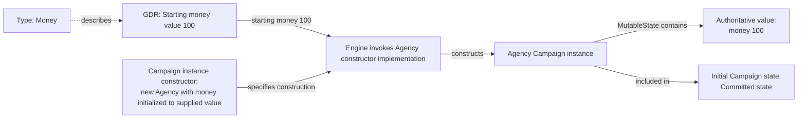
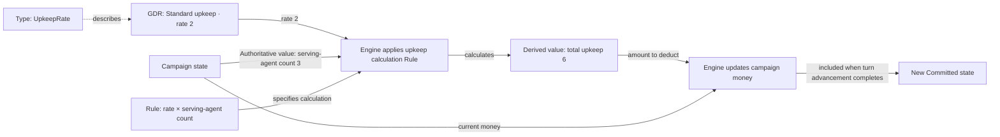
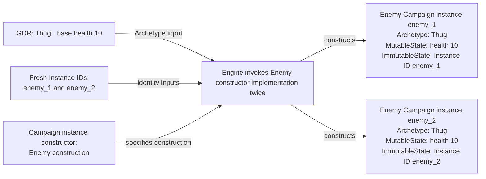
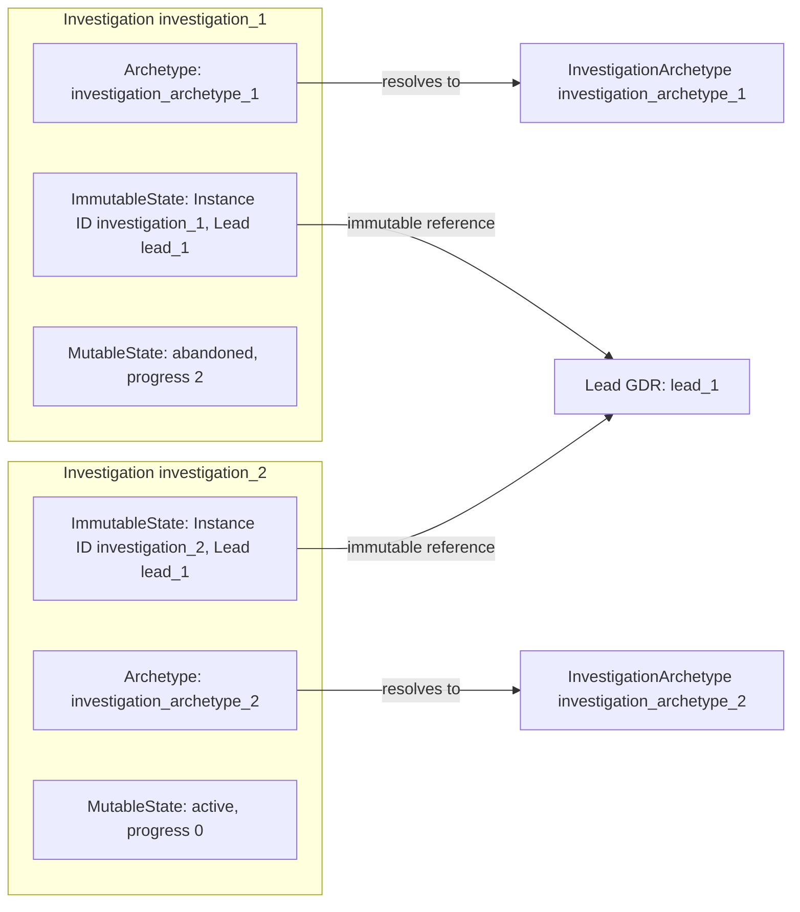

# Modeling Foundations

| Metadata    | Value                                                                                                                                            |
| ----------- | ------------------------------------------------------------------------------------------------------------------------------------------------ |
| Spec ID     | MODEL                                                                                                                                            |
| Family      | Foundation                                                                                                                                       |
| Status      | Draft                                                                                                                                            |
| Scope       | Types, campaigns, Game Data Records (GDRs), Campaign instance construction and composition, identity and references, and historical preservation |
| Conventions | [Specification conventions](../governance/spec-conventions.md)                                                                                   |
| Review      | Batch 1; proposed rules awaiting user review                                                                                                     |

# Purpose and boundaries

Modeling Foundations defines the common language and basic contracts used to describe the game's data and behavior.

- **Game Design Brief** supplies the intent and strategic direction that these foundations give a modeling vocabulary.
- **Domain Model** applies that vocabulary to concrete game concepts and their structural relationships.
- **Mechanics specifications** define the detailed gameplay behavior of those concepts.
- **Engine Contract** defines execution guarantees built on these foundations.
- **History and Persistence** defines how campaign state and historical facts are retained.
- **Initial Campaign Content** supplies concrete game data within the model.
- **Numbers and Randomness** defines numerical and random behavior within the model.
- **Player Information** defines which campaign facts players can observe.
- **TypeScript Player API** exposes the model through a concrete programming interface.

# Relationships

- Used by [Domain Model](./domain-model.md)
- Used by [Engine Contract](./engine-contract.md)
- Used by [History and Persistence](./history-and-persistence.md)
- Used by [Initial Campaign Content](../content/initial-campaign.md)
- Used by [Numbers and Randomness](./numbers-and-randomness.md)
- Used by [Player Information](../interfaces/player-information.md)
- Used by [TypeScript Player API](../interfaces/typescript-api.md)

# Glossary

The subsections expose conceptual layers: foundational concepts, data described by those concepts, roles of that data,
and the Campaign instances and operations built from them.

## Foundational concepts

Type describes data, Campaign establishes the playthrough context, and Rule describes calculations and permitted behavior.
Ruleset collects the Rules governing a Campaign.

| Term     | Definition                                                                                                                                                                              |
| -------- | --------------------------------------------------------------------------------------------------------------------------------------------------------------------------------------- |
| Type     | A named description of data structure and permitted values, including the Types of its constituent properties, collections, and references. Similar to a TypeScript `type` declaration. |
| Campaign | A particular playthrough with its own evolving Campaign state and retained history.                                                                                                     |
| Rule     | A declared statement governing a calculation or valid game behavior; for example, a formula or constraint. Further forms and any formal representation remain undecided.                |
| Ruleset  | The collection of Rules governing a Campaign.                                                                                                                                           |

## Data within a Campaign

These concepts build on Type and Campaign: GDRs supply immutable shared data, while Campaign state describes one playthrough.

| Term                   | Definition                                                                                                |
| ---------------------- | --------------------------------------------------------------------------------------------------------- |
| Game Data Record (GDR) | Concrete game data supplied by a game build, conforming to a declared Type and immutable during gameplay. |
| Campaign state         | Data describing one Campaign; for example, its Campaign instances, resources, and retained history.       |

## Campaign instances and their components

A Campaign instance has a declared Type and three components: Archetype, MutableState, and ImmutableState.
Archetype is the role of a GDR within this composition. Instance ID distinguishes individual Campaign instances.
A Campaign instance constructor describes construction and initialization of a Campaign instance. It is a separate concept from Rule and GDR.

| Term                          | Definition                                                                                                                                                                                                                                               |
| ----------------------------- | -------------------------------------------------------------------------------------------------------------------------------------------------------------------------------------------------------------------------------------------------------- |
| Campaign instance             | A particular occurrence within a campaign of a declared Type, composed of an Archetype, MutableState, and ImmutableState.                                                                                                                                |
| Archetype                     | A GDR supplying shared characteristics and construction defaults for Campaign instances constructed from it.                                                                                                                                             |
| MutableState                  | Campaign instance-specific data whose properties are permitted to evolve under their declared gameplay rules.                                                                                                                                            |
| ImmutableState                | Campaign instance-specific data established during construction and preserved for the Campaign instance's lifetime, always including its Instance ID.                                                                                                    |
| Instance ID                   | An identifier for a Campaign instance, unique within a declared identity scope and stable during its lifetime under [MODEL-002](#model-002--identity).                                                                                                   |
| Campaign instance constructor | A declared construction operation specifying its inputs and dependencies, the Type of the returned Campaign instance, and initialization of the new Campaign instance's components. It need not be a language-level constructor or public API operation. |

## Value classification, history, and observation

These concepts describe how values are established, retained, and exposed within the preceding model.

| Term                       | Definition                                                                                     |
| -------------------------- | ---------------------------------------------------------------------------------------------- |
| Authoritative value        | A value treated as established truth rather than recomputed from other values.                 |
| Derived value              | A value calculated deterministically from Authoritative values and the current rules and GDRs. |
| History                    | Retained data describing past Campaign state or events. Rules and reports may consult History. |
| Committed state            | Complete Campaign state before or after an accepted command, not intermediate processing.      |
| Player-visible information | Information deliberately exposed by the engine to an ordinary player.                          |

## Rejected terms and synonyms

- **Template:** not a modeling term or a synonym for GDR or Archetype. Use GDR when naming shared immutable data, and Archetype when naming its role in Campaign instance composition. Describe initialization directly.
- **Definition:** not a modeling category or a substitute for Type or GDR. Use Type for a named data description and GDR for concrete shared immutable data. The ordinary word remains valid when discussing a term’s definition.

# Concepts and contract

## Data, Rules, and execution

GDRs supply data, Rules specify calculations and permitted behavior, and Campaign instance constructors describe
construction and initialization. These are three distinct concepts; neither a GDR nor a Campaign instance constructor is a Rule.
The engine implementation reads GDRs, applies Rules, and invokes Campaign instance constructor implementations
to construct Campaign instances and update Campaign state. Execution statements about named functions refer to their implementations.

## Campaign creation and progression

When a player starts a new game, the engine creates a Campaign and constructs its initial Campaign state using
the player’s setup inputs, GDRs, and Ruleset.
The GDRs and starting configuration for the first playable campaign belong to
[Initial Campaign Content](../content/initial-campaign.md).

The Campaign progresses through player actions during the player turn and through “next turn” computation.
Each successful action or turn advancement produces a new Committed state. Intermediate processing remains internal to the engine.

To compute the next Committed state, the engine uses:

- **Player inputs:** The requested action and any supplied arguments.
- **Current Campaign state:** The campaign’s existing facts, including the state needed for randomness and identity allocation.
- **GDRs:** Shared, immutable game data.
- **Ruleset:** The Rules governing calculations and permitted game behavior.

The engine implementation ties these together while obeying the [Engine Contract](./engine-contract.md). Where required,
it constructs new Campaign instances using the appropriate Archetype and other declared inputs.
Supplying an Archetype is one possible GDR role.

## Roles of GDRs

GDRs can serve the following five roles. The roles can overlap; they do not define separate Types or required
implementation interfaces. The following sections illustrate these roles, beginning with initialization, then calculation, construction,
and references.

| Role                   | Relationship to Rules and Campaign state                                                                                | Example                                                                     |
| ---------------------- | ----------------------------------------------------------------------------------------------------------------------- | --------------------------------------------------------------------------- |
| Initialization source  | The engine passes a GDR’s values to a constructor implementation to initialize Campaign state.                          | The engine passes starting-money GDR value 100 to initialize Agency money.  |
| Calculation parameter  | The engine reads a GDR when applying a calculation Rule.                                                                | The engine reads the rate from the Standard upkeep GDR to calculate upkeep. |
| Archetype              | A GDR supplies shared characteristics and construction defaults used by a Campaign instance constructor implementation. | The engine constructs an Enemy using base health 10 from the Thug GDR.      |
| Referenced GDR         | A Campaign instance holds a reference to a GDR for a purpose other than supplying its Archetype.                        | An Investigation holds a reference to the Lead GDR it pursues.              |
| Key for campaign facts | Campaign state holds facts keyed by a GDR’s identity while the GDR remains immutable.                                   | The engine records completions against a Lead GDR’s identity.               |

## GDR role: initialization source

Consider an illustrative Agency construction with starting money:

| Element                | Modeling role                 | Meaning in this example                                                                                             |
| ---------------------- | ----------------------------- | ------------------------------------------------------------------------------------------------------------------- |
| Money                  | Type                          | Describes a nonnegative integer amount of money.                                                                    |
| Starting money         | GDR                           | Has Type Money and value 100.                                                                                       |
| Agency construction    | Campaign instance constructor | Specifies construction of an Agency Campaign instance with money in MutableState initialized to the supplied value. |
| Agency                 | Campaign instance             | The new Agency Campaign instance returned by the constructor implementation, with money 100 in MutableState.        |
| Agency money           | Authoritative value           | Initialized to 100 in the Agency Campaign instance’s MutableState.                                                  |
| Initial Campaign state | Committed state               | Contains the Agency Campaign instance when campaign creation completes.                                             |

During campaign creation, the engine reads 100 from the starting-money GDR and passes it to the Agency constructor
implementation. The implementation constructs an Agency Campaign instance and initializes its money in MutableState
to 100. The initial Campaign state contains that Agency Campaign instance.
The engine publishes the initial Committed state when campaign creation completes.


```mermaid
flowchart LR
    Type["Type: Money"] -.->|describes| GDR["GDR: Starting money · value 100"]
    GDR -->|starting money 100| Engine["Engine invokes Agency constructor implementation"]
    Constructor["Campaign instance constructor:<br/>new Agency with money initialized to supplied value"] -->|specifies construction| Engine
    Engine -->|constructs| Agency["Agency Campaign instance"]
    Agency -->|MutableState contains| Money["Authoritative value:<br/>money 100"]
    Agency -->|included in| State["Initial Campaign state:<br/>Committed state"]
```

If an expense later reduces Agency money to 90, the engine reads 90 from the Agency Campaign instance’s MutableState.
The starting-money GDR still contains the construction input of 100.

## GDR role: calculation parameter

Consider an illustrative upkeep calculation for agents serving in a campaign. Its complete local setup is:

| Element             | Modeling role       | Meaning in this example                                                     |
| ------------------- | ------------------- | --------------------------------------------------------------------------- |
| UpkeepRate          | Type                | Describes a nonnegative integer amount of money per serving agent per turn. |
| Standard upkeep     | GDR                 | Has Type UpkeepRate and value 2 money per serving agent per turn.           |
| Serving-agent count | Authoritative value | Value in Campaign state, currently 3.                                       |
| Upkeep calculation  | Rule                | Upkeep for one turn equals the rate multiplied by the serving-agent count.  |
| Total upkeep        | Derived value       | 2 × 3 = 6 money for this turn.                                              |

During "advance turn" computation, the engine reads the rate of 2 from the Standard upkeep GDR, which conforms to
Type UpkeepRate, and the serving-agent count of 3, an Authoritative value in Campaign state. The engine applies the
upkeep calculation Rule to these inputs, producing total upkeep of 6, a Derived value. The engine deducts 6 from the campaign's current money; the updated
money becomes part of the new Committed state, which is the result of turn advancement completion.


```mermaid
flowchart LR
    Type["Type: UpkeepRate"] -.->|describes| GDR["GDR: Standard upkeep · rate 2"]
    GDR -->|rate 2| Engine["Engine applies upkeep calculation Rule"]
    State["Campaign state"] -->|Authoritative value: serving-agent count 3| Engine
    Rule["Rule: rate × serving-agent count"] -->|specifies calculation| Engine
    Engine -->|calculates| Total["Derived value: total upkeep 6"]
    Total -->|amount to deduct| Update["Engine updates campaign money"]
    State -->|current money| Update
    Update -->|included when turn advancement completes| Committed["New Committed state"]
```

## GDR role: archetype

Consider an illustrative construction of two Enemy Campaign instances from the same Thug GDR:

| Element             | Modeling role                 | Meaning in this example                                                                                              |
| ------------------- | ----------------------------- | -------------------------------------------------------------------------------------------------------------------- |
| Enemy               | Type                          | Describes the constructed Enemy Campaign instances.                                                                  |
| EnemyArchetype      | Type                          | Describes the shared enemy characteristics and construction defaults.                                                |
| Thug                | GDR in the Archetype role     | Has Type EnemyArchetype and base health 10.                                                                          |
| Enemy construction  | Campaign instance constructor | Specifies construction of an Enemy Campaign instance using the supplied Archetype and a fresh Instance ID.           |
| enemy_1 and enemy_2 | Campaign instances            | Distinct Enemy Campaign instances sharing Thug as their Archetype, with independent MutableState and ImmutableState. |
| Current health      | Authoritative value           | Initialized to 10 in each Enemy Campaign instance’s MutableState.                                                    |

The engine passes the Thug GDR and a fresh Instance ID to the Enemy constructor implementation for each enemy.
The implementation returns an Enemy Campaign instance with Archetype set to Thug, current health initialized to 10
in MutableState, and its Instance ID in ImmutableState. The caller adds each Enemy Campaign instance to its owning Mission.
Both Enemy Campaign instances refer to the same GDR; damaging enemy_1 changes its health without changing enemy_2 or Thug.


```mermaid
flowchart LR
    Thug["GDR: Thug · base health 10"] -->|Archetype input| Engine["Engine invokes Enemy constructor implementation twice"]
    IDs["Fresh Instance IDs:<br/>enemy_1 and enemy_2"] -->|identity inputs| Engine
    Constructor["Campaign instance constructor:<br/>Enemy construction"] -->|specifies construction| Engine
    Engine -->|constructs| Enemy1["Enemy Campaign instance enemy_1<br/>Archetype: Thug<br/>MutableState: health 10<br/>ImmutableState: Instance ID enemy_1"]
    Engine -->|constructs| Enemy2["Enemy Campaign instance enemy_2<br/>Archetype: Thug<br/>MutableState: health 10<br/>ImmutableState: Instance ID enemy_2"]
```

TODO: continue review from this point. Stuff above was reviewed.

### MODEL-001 — Campaign instance composition

Every Campaign instance must have exactly three conceptual components: Archetype, MutableState, and ImmutableState,
with structures described by its declared Type. Every GDR must match its declared Type.

The components describe meaning, not storage. They can be embedded or resolved through references. Sharing an
archetype does not require inheritance or copies of GDRs, and Campaign instances must have independent Campaign instance-specific components; sharing an archetype must not cause them to share MutableState.
Gameplay must not modify GDRs, replace a Campaign instance's archetype, or modify its ImmutableState, including owned nested data. MutableState properties must be permitted to change under
their rules; they need not change in every playthrough or remain changeable after a terminal lifecycle transition.

Immutable references belong in ImmutableState; following a reference does not transfer ownership of the target’s data
([MODEL-003](#model-003--references)). Structural compatibility alone does not establish a valid Campaign instance or satisfy runtime invariants.

## MODEL-006 — Campaign instance construction

Each Campaign instance constructor must declare its input parameters and dependencies and identify the Type of the
returned Campaign instance. Every new Campaign instance must initialize all three components, receive a fresh Instance ID
within its declared scope, and satisfy its declared structure and initialization requirements. Dependencies must include any
GDR selection, Instance ID allocation state, or randomness actually used by the constructor.
A Campaign instance constructor must return the constructed Campaign instance; its caller establishes containment.

The illustrative Campaign instance constructor `constructEnemy(archetype, instanceId)` receives an EnemyArchetype
GDR and a fresh Instance ID and returns an Enemy. It fixes Archetype to the supplied GDR, records
the supplied Instance ID in ImmutableState, and initializes current health in MutableState to the GDR's base
health. All inputs are supplied directly; `constructEnemy` uses no randomness, performs no GDR lookup, and
does not allocate an Instance ID.

The caller supplies an Instance ID that is fresh within this example's campaign-wide scope and attaches the returned
Enemy to the owning Mission. In the following language-independent pseudocode, `mission` denotes a Mission already
contained in the top-level Campaign instance, and `thug` denotes the Thug GDR:

```text
enemy = constructEnemy(thug, freshInstanceId)
append enemy to mission.enemies
```

The caller changes the Mission's collection; `constructEnemy` only constructs and returns the Enemy. Before the
enclosing operation publishes Committed state, the caller must establish ownership and any required relationships.
That Committed state must satisfy all applicable invariants.
The Instance ID allocation mechanism remains unspecified. Multiple Campaign instance constructors can return Campaign instances of the
same Type, provided each declares its inputs, dependencies, and initialization requirements.

A constructor contract must distinguish initialization requirements from structural constraints and gameplay invariants that
continue to apply after creation. Concrete constructor behavior belongs in the gameplay specification responsible for
the creation operation; consuming specifications must identify those owners.

For this example, base health is a positive integer and current health must remain an integer between zero and base
health, inclusive. Construction starts enemy_1 and enemy_2 at 10. Damage changes enemy_1's health to 7; enemy_2's health and Thug's base
health remain 10. Both identities remain unchanged. Starting an enemy at 7 would satisfy the ongoing range but violate
the initialization requirement of `constructEnemy`; starting it at 11 would violate both.

## MODEL-002 — Identity

Every Campaign instance must have an Instance ID in ImmutableState, unique within its declared identity scope and stable
for its lifetime. Distinct Campaign instances in the same scope and timeline must have distinct IDs. The ID distinguishes
the individual Campaign instance, and the shared Thug GDR cannot supply a distinct identity for every enemy. In the example's
campaign-wide scope, enemy_2 cannot reuse enemy_1's Instance ID. Each consuming specification must declare its identity scopes explicitly.

GDR references must identify the expected GDR Type and GDR ID. Relationships must use
explicit references; rules must not parse display names or identifier text to discover relationships. This specifies
reference meaning, not a serialized discriminator field.

Instance IDs are timeline-scoped: a discarded future is not another live campaign. Lookup and history restoration must
preserve the restored Campaign instance’s identity rather than allocate a new one. This convention chooses neither an
ID generation algorithm nor a restoration procedure.

For example, undoing damage restores enemy_1's
health to 10; redoing it restores 7, with the same identity and immutable facts. Undoing a Campaign instance's creation
removes it and its references from that timeline; redo restores the same Campaign instance and fixed facts.

## MODEL-003 — References

All Committed state Campaign instance references must resolve to a Campaign instance of the expected Type in the same
campaign. GDR references must resolve to a GDR of the expected Type supplied by the current game build.
References to historical Campaign instances, including terminal lifecycle states, must remain resolvable. Storage may be
compacted provided required facts and references remain available; full snapshots need not be retained forever.

References identify particular GDRs or Campaign instances and their expected Types. Thug has a GDR
identity as an EnemyArchetype GDR; enemy_1 has an Instance ID as an Enemy Campaign instance. A reference to a missing GDR is
invalid, as is resolving an EnemyArchetype reference to GDRs of another Type merely because some fields match.
Structural compatibility alone does not prove reference validity.

For a reference stored in a Campaign instance, its placement depends on whether the reference itself can change.
An immutable reference must belong in ImmutableState: construction establishes its target, and gameplay cannot replace or clear
that reference. A mutable reference must belong in MutableState: gameplay rules may replace its target or clear the
reference when permitted. This classification is independent of whether the referenced data can change.

For example, an Investigation's immutable Lead reference belongs in the Investigation's ImmutableState. An illustrative
Agent's reference to the Mission to which the Agent is currently deployed belongs in the Agent's MutableState if
gameplay permits deployment changes. Changing that reference changes which Mission the Agent references; it does not
modify either Mission. This example establishes no deployment eligibility or timing rules.

For example, consider a variant `constructEnemy(archetype, instanceId, missionReference)` whose additional input is a
typed reference to a Mission mission_1 representing a task. The Campaign instance constructor initializes that immutable reference in enemy_1's
ImmutableState at construction. Mission follows the same three-component contract
and can have a mutable collection of participating enemies. Its membership can change while enemy_1's immutable Mission
reference continues to resolve to mission_1. The immutable reference does not prevent changes to mission_1's
MutableState; following a reference does not transfer ownership of the referenced Campaign instance's data.

Lead is an immutable GDR in these examples. Its immutability follows from being a GDR, not from
the Investigation's reference being immutable. Mutable campaign facts associated with a Lead belong in Campaign state,
as illustrated by the completion records in the next section; changing those facts does not replace the Lead reference.

Mutability of a reference does not depend on whether it is represented by an identifier. Ordinary nested values and retained records do not become
Campaign instances simply because they are stored, immutable, or associated with an identifier.

## Archetypes and other referenced GDRs

A Campaign instance can refer to GDRs for a purpose other than supplying its Archetype. Consider an illustrative Lead and an Investigation of that Lead. The complete comparison needed here is:

| Example concept        | Modeling role                                                                                                                                              | Question it answers                                                               |
| ---------------------- | ---------------------------------------------------------------------------------------------------------------------------------------------------------- | --------------------------------------------------------------------------------- |
| Lead                   | GDR representing a Lead to pursue.                                                                                                                         | Which Lead can be pursued?                                                        |
| Investigation          | Campaign instance for investigation of a given Lead, with its own Instance ID, progress in MutableState, and a immutable Lead reference in ImmutableState. | Which Investigation concerns that Lead, and how has it progressed?                |
| InvestigationArchetype | GDR used as an Investigation's Archetype, supplying shared characteristics and construction defaults independently of the referenced Lead.                 | What shared characteristics and construction defaults does the Investigation use? |

Suppose Lead lead_1 is referenced by Investigation investigation_1, constructed with InvestigationArchetype investigation_archetype_1. Its ImmutableState contains its
Instance ID and immutable Lead reference; its MutableState contains lifecycle initialized to active and progress initialized to 0. The archetype remains the separate shared
component. Adding the Lead reference does not create a fourth component or make lead_1 the Investigation's archetype.

For this example, investigation_1 reaches progress 2 and is abandoned. A new Investigation investigation_2 at lead_1 starts at progress 0 with its own Instance ID.
Use archetype investigation_archetype_2 for investigation_2 to show that the Investigation's Lead reference and Archetype are independent relationships. These
are symbolic GDRs without selected production fields or mechanics. The example assumes both combinations are
permitted; it does not define eligibility or concurrency rules.


```mermaid
flowchart LR
    lead_1["Lead GDR: lead_1"]
    investigation_archetype_1["InvestigationArchetype investigation_archetype_1"]
    investigation_archetype_2["InvestigationArchetype investigation_archetype_2"]
    subgraph investigation_1["Investigation investigation_1"]
        investigation_1_archetype["Archetype: investigation_archetype_1"]
        investigation_1_immutable_state["ImmutableState: Instance ID investigation_1, Lead lead_1"]
        investigation_1_mutable_state["MutableState: abandoned, progress 2"]
    end
    subgraph investigation_2["Investigation investigation_2"]
        investigation_2_archetype["Archetype: investigation_archetype_2"]
        investigation_2_immutable_state["ImmutableState: Instance ID investigation_2, Lead lead_1"]
        investigation_2_mutable_state["MutableState: active, progress 0"]
    end
    investigation_1_archetype -->|resolves to| investigation_archetype_1
    investigation_2_archetype -->|resolves to| investigation_archetype_2
    investigation_1_immutable_state -->|immutable reference| lead_1
    investigation_2_immutable_state -->|immutable reference| lead_1
```

Both Investigations can share lead_1 without sharing progress. Retargeting investigation_1 to another Lead or replacing investigation_archetype_1 after construction
would violate its fixed facts. Using lead_1 as its archetype would fail the expected InvestigationArchetype reference,
regardless of whether some fields match.

If investigation_2 later completes, Campaign state can retain a completion record associated with lead_1 and investigation_2. lead_1 remains unchanged;
the record belongs to the campaign. The number of completions for lead_1 can then be derived from those records. GDRs
can thus identify the subject of an activity and key campaign facts without becoming mutable itself.

## MODEL-005 — Value classification

An Authoritative value is treated as established truth. A Derived value is calculated from Authoritative values
and current rules and GDRs. This classification is separate from mutability. Shared base health and a
recorded Instance ID can be Authoritative values even though neither changes during gameplay.

Each specification using these concepts must declare which of its values are Authoritative values and which are Derived
values, using the glossary definitions. Caching a current calculation must not change its classification as a Derived value.
Classification must be independent of player visibility: either kind may be hidden from the player. Retaining a past
calculation as a historical fact follows [MODEL-004](#model-004--historical-fact-preservation).

In the enemy example, declare each enemy's current health an Authoritative value and their total current health a Derived value.
Initially the total is 20. After enemy_1 takes damage, it is 17. Caching the total does not make it an Authoritative value, and hiding
either the individual health or the total from the player does not change the classification.

Similarly, the recorded completion of investigation_2 is an Authoritative value recording a historical fact. The completion count for lead_1 is a Derived value:
it is 1 after investigation_2 completes, and investigation_1's abandonment does not add a completion. Facts associated with GDRs belong to
the campaign rather than being edits to those GDRs.

## MODEL-004 — Historical fact preservation

A past value cannot always be recovered from its current replacement. For example, a report that needs enemy_1's original
health must retain that value of 10 or the original inputs needed to reconstruct it. Current health of 7 is not a
replacement for that historical fact. When a rule or report needs the historical basis, the original inputs or historical
value must be preserved; required historical values must not be overwritten with current calculations. This does not
require retaining every intermediate calculation or every possible chart.

When a Campaign instance no longer participates in current gameplay, data required by rules, reports, or retained
references must remain in History rather than being deleted. For example, if enemy_1 no longer participates in a Mission,
a retained reference to enemy_1 must still resolve. Retention does not introduce a separate lifecycle state or transition
name or require moving data into a separate storage location. Consuming specifications must declare which lifecycle
changes require retention and which data must remain available. The Instance ID and relationships needed to resolve
retained references must be preserved under [MODEL-002](#model-002--identity) and [MODEL-003](#model-003--references).
An evolving collection can contain immutable historical records: adding a completion record does not permit rewriting
an earlier record.

# Edge cases and failure behavior

| Case                                                                                                                            | Result / owner                                                                                                                                         |
| ------------------------------------------------------------------------------------------------------------------------------- | ------------------------------------------------------------------------------------------------------------------------------------------------------ |
| Missing component, incorrect structure, or mutation of immutable data                                                           | Invalid data or Campaign state under [MODEL-001](#model-001--campaign-instance-composition).                                                           |
| Campaign instance constructor omits an input, dependency, Type of the returned Campaign instance, or initialization requirement | Incomplete Campaign instance constructor contract under [MODEL-006](#model-006--campaign-instance-construction).                                       |
| Duplicate Instance ID, missing reference, or wrong expected Type                                                                | Invalid Campaign state under [MODEL-002](#model-002--identity)/[MODEL-003](#model-003--references); never infer a replacement by name.                 |
| Campaign instance is historical, including terminal lifecycle states                                                            | Required historical references still resolve under [MODEL-003](#model-003--references); storage may be compacted without losing required facts.        |
| A later Campaign instance belongs only to a discarded future                                                                    | Instance IDs are timeline-scoped under [MODEL-002](#model-002--identity); committed references must resolve under [MODEL-003](#model-003--references). |
| A current value differs from the retained original value                                                                        | Retain the historical basis required by the result/report under [MODEL-004](#model-004--historical-fact-preservation).                                 |

# Open decisions

[MODEL-001](#model-001--campaign-instance-composition), [MODEL-002](#model-002--identity), [MODEL-003](#model-003--references), [MODEL-004](#model-004--historical-fact-preservation), [MODEL-005](#model-005--value-classification), and [MODEL-006](#model-006--campaign-instance-construction) remain proposed rules awaiting review.
Consuming specifications own their concrete game Types, identity scopes, Campaign instance constructor behavior, and gameplay rules.
The illustrations here do not settle those decisions or select production GDR fields and allowed combinations.

Further Rule forms and any formal representation remain undecided. The five GDR roles are explanatory, not a
new implementation taxonomy.
