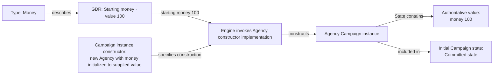
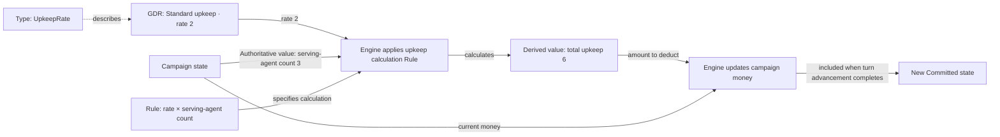
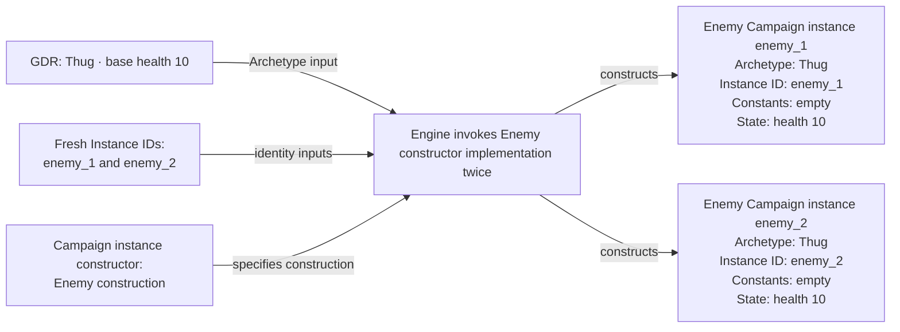
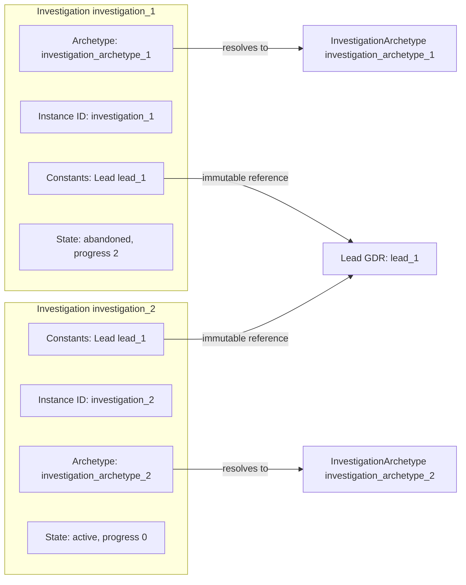
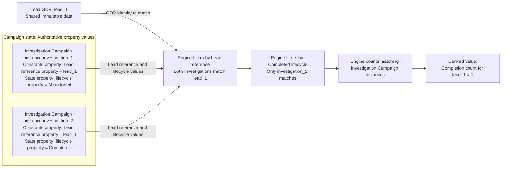

# Modeling Foundations

| Metadata             | Value                                                                                                      |
| -------------------- | ---------------------------------------------------------------------------------------------------------- |
| Spec ID              | MODEL                                                                                                      |
| Family               | Foundation                                                                                                 |
| Status               | Accepted                                                                                                   |
| Acceptance reference | Project owner approval in this task: "OK mark the mf as Accepted and update any other docs as appropriate" |
| Conventions          | [Specification conventions](../governance/spec-conventions.md)                                             |

# Purpose and boundaries

Modeling Foundations defines the common language and basic contracts used to describe the game's data and behavior.

- **Game Design Brief** supplies the intent and strategic direction that these foundations give a modeling vocabulary.
- **Domain Model** applies that vocabulary to concrete game concepts and their structural relationships.
- **Mechanics specifications** define the detailed gameplay behavior of those concepts.
- **Engine Contract** defines execution guarantees built on these foundations.
- **History and Persistence** defines how campaign state and historical facts are retained.
- **Initial Campaign Content** supplies concrete game data within the model.
- **Numbers and Randomness** defines numerical and random behavior within the model.
- **Player Information** defines which campaign facts players can observe.
- **TypeScript Player API** exposes the model through a concrete programming interface.

# Relationships

- Used by [Domain Model](./domain-model.md)
- Used by [Engine Contract](./engine-contract.md)
- Used by [History and Persistence](./history-and-persistence.md)
- Used by [Initial Campaign Content](../content/initial-campaign.md)
- Used by [Numbers and Randomness](./numbers-and-randomness.md)
- Used by [Player Information](../interfaces/player-information.md)
- Used by [TypeScript Player API](../interfaces/typescript-api.md)

# Glossary

The subsections expose conceptual layers: foundational concepts, data described by those concepts, roles of that data,
and the Campaign instances and operations built from them.

## Foundational concepts

Type describes data, Campaign establishes the playthrough context, and Rule describes calculations and permitted behavior.
Ruleset collects the Rules governing a Campaign.

| Term     | Definition                                                                                                                                                                                                 |
| -------- | ---------------------------------------------------------------------------------------------------------------------------------------------------------------------------------------------------------- |
| Type     | A named description of the structure and permitted values of data. A Type may be composed of other Types through properties, collections, unions, or references. Similar to a TypeScript type declaration. |
| Property | A named component of a structured Type, with an associated Type. Similar to a property in a TypeScript object type.                                                                                        |
| Campaign | A particular playthrough with its own evolving Campaign state and retained history.                                                                                                                        |
| Rule     | A declared statement governing a calculation or valid game behavior; for example, a formula or constraint.                                                                                                 |
| Ruleset  | The collection of Rules governing a Campaign.                                                                                                                                                              |

## Data within a Campaign

These concepts build on Type and Campaign: GDRs supply immutable shared data, while Campaign state describes one playthrough.

| Term                   | Definition                                                                                                                                                                                       |
| ---------------------- | ------------------------------------------------------------------------------------------------------------------------------------------------------------------------------------------------ |
| Game Data Record (GDR) | Concrete game data supplied by a game build, conforming to a declared Type and immutable during gameplay. A GDR is never instantiated; Campaign instances reference it as shared immutable data. |
| Campaign state         | Data describing one Campaign; for example, its Campaign instances, resources, and retained history.                                                                                              |

## Campaign instances and their components

A Campaign instance has a declared Type with four properties: Instance ID, an Archetype reference, Constants, and State.
Archetype is the role of a shared immutable GDR within this composition. Instance ID distinguishes individual Campaign instances.
Constants and State are specific to each Campaign instance; Constants contains its additional fixed facts, while State contains its changeable values.
A Campaign instance constructor creates and returns a new Campaign instance. It is a separate concept from Rule and GDR.

| Term                          | Definition                                                                                                                                                                                                                                                                                                 |
| ----------------------------- | ---------------------------------------------------------------------------------------------------------------------------------------------------------------------------------------------------------------------------------------------------------------------------------------------------------- |
| Campaign instance             | A particular occurrence within a Campaign of a declared Type, with Instance ID, an Archetype reference, Constants, and State.                                                                                                                                                                              |
| Archetype                     | A GDR referenced by a Campaign instance, supplying shared characteristics and construction defaults. It is shared immutable data, never instantiated; the Campaign instance’s Archetype reference is fixed during construction.                                                                            |
| State                         | Values owned by this Campaign instance that may change under gameplay rules. State is specific to this Campaign instance and is distinct from Campaign state, which describes the whole playthrough.                                                                                                       |
| Constants                     | Values owned by this Campaign instance that remain fixed for its lifetime. A reference stored in Constants has a fixed target; it does not require the target’s State to remain fixed.                                                                                                                     |
| Instance ID                   | An identifier for a Campaign instance, unique within a declared identity scope and stable during its lifetime under [Campaign instances](#campaign-instances).                                                                                                                                             |
| Campaign instance constructor | An operation that creates and returns a new Campaign instance. Its signature specifies input parameters and the return Type; its behavioral specification defines dependencies and initialization, which its implementation performs. It need not be a language-level constructor or public API operation. |

## Value classification, history, and visibility

These concepts describe how values are established, retained, and exposed within the preceding model.

| Term                       | Definition                                                                                                                                                                                                                                               |
| -------------------------- | -------------------------------------------------------------------------------------------------------------------------------------------------------------------------------------------------------------------------------------------------------- |
| Authoritative value        | A value treated as established truth rather than recomputed from other values.                                                                                                                                                                           |
| Derived value              | A value calculated deterministically from Authoritative values and the current rules and GDRs.                                                                                                                                                           |
| History                    | Retained data describing past Campaign state or events. Rules and reports may consult History.                                                                                                                                                           |
| Retained                   | Describes model data kept available for rules, reports, reference resolution, or restoration. Retained describes availability; History describes data about past Campaign state or events. Retention does not establish mutability or a lifecycle state. |
| Committed state            | Complete Campaign state before or after an accepted command, not intermediate processing.                                                                                                                                                                |
| Player-visible information | Information deliberately exposed by the engine to an ordinary player.                                                                                                                                                                                    |

## Rejected terms and synonyms

- **Field, member, key:** use Property for a named component of a structured Type. These terms are not synonyms used by the model; unrelated uses, such as a lookup key, retain their ordinary meaning.
- **Template:** not a modeling term or a synonym for GDR or Archetype. Use GDR when naming shared immutable data, and Archetype when naming its role in Campaign instance composition. Describe initialization directly.
- **Definition:** not a modeling category or a substitute for Type or GDR. Use Type for a named data description and GDR for concrete shared immutable data. The ordinary word remains valid when discussing a term’s definition.

# Concepts and contract

## Data, Rules, and execution

GDRs supply data, Rules specify calculations and permitted behavior, and Campaign instance constructors describe
construction and initialization. These are three distinct concepts; neither a GDR nor a Campaign instance constructor is a Rule.
The engine implementation reads GDRs, applies Rules, and invokes Campaign instance constructor implementations
to construct Campaign instances and update Campaign state. Execution statements about named functions refer to their implementations.

## Campaign creation and progression

When a player starts a new game, the engine creates a Campaign and constructs its initial Campaign state using
the player’s setup inputs, GDRs, and Ruleset.
The GDRs and starting configuration for the first playable campaign belong to
[Initial Campaign Content](../content/initial-campaign.md).

The Campaign progresses through player actions during the player turn and through “next turn” computation.
Each successful action or turn advancement produces a new Committed state. Intermediate processing remains internal to the engine.

To compute the next Committed state, the engine uses:

- **Player inputs:** The requested action and any supplied arguments.
- **Current Campaign state:** The campaign’s existing facts, including the state needed for randomness and identity allocation.
- **GDRs:** Shared, immutable game data.
- **Ruleset:** The Rules governing calculations and permitted game behavior.

The engine implementation ties these together while obeying the [Engine Contract](./engine-contract.md). Where required,
it constructs new Campaign instances using the appropriate Archetype and other declared inputs.
Supplying an Archetype is one possible GDR role.

## Campaign instances

### Campaign instance structure

A Campaign instance Type always has exactly four properties: Instance ID, an Archetype reference, Constants, and State.

### Campaign instance construction

Each Campaign instance constructor has declared input parameters and a return Type, which is of the constructed Campaign instance. Its specification defines its
dependencies and how the returned Campaign instance’s Instance ID, Archetype reference, Constants, and State are
initialized, including assignment of a fresh Instance ID. The implementation performs this initialization.
A Campaign instance constructor implementation typically depends on:

- One or more GDRs serving as Archetypes.
- A random generator.
- An ID generator.

### Campaign instance identity

Instance IDs are unique within their explicitly declared scope and stable for the Campaign instance’s lifetime.
Restoration, including undo/redo, preserves identity and immutable facts; uniqueness applies within the Campaign’s current timeline, excluding discarded futures.

## References

References identify a particular target and its expected Type. In Committed state, Campaign instance references must resolve
within the same Campaign; GDR references identify the GDR ID and must resolve against the current game build.
Required historical references remain resolvable. Relationships must not be inferred from display names or identifier text.

References that can change belong in State; fixed references belong in Constants. Instance ID and the Archetype reference
are separate immutable properties. Reference mutability is independent of the target’s mutability.

## Authoritative and Derived values

An Authoritative value is treated as established truth. A Derived value is calculated from Authoritative values
and current rules and GDRs. This classification is separate from mutability. Shared base health and a
recorded Instance ID can be Authoritative values even though neither changes during gameplay.

Each specification using these concepts must declare which of its values are Authoritative values and which are Derived
values, using the glossary definitions. Caching a current calculation must not change its classification as a Derived value.
Classification must be independent of player visibility: either kind may be hidden from the player. Retaining a past
calculation as a historical fact follows [Historical fact preservation](#historical-fact-preservation).

In the enemy example, declare each enemy's current health an Authoritative value and their total current health a Derived value.
Initially the total is 20. After enemy_1 takes damage, it is 17. Caching the total does not make it an Authoritative value, and hiding
either the individual health or the total from the player does not change the classification.

Each Investigation Campaign instance has a Lead reference property within its Constants property and a lifecycle property
within its State property. The values of these two properties are Authoritative values. The completion count for a
Lead is a Derived value: count the Investigation Campaign instances whose Lead reference property identifies
that Lead GDR and whose lifecycle property has the value Completed. The count for lead_1 is 1 after investigation_2 completes; investigation_1’s Abandoned lifecycle
excludes it. No separate completion record or stored Authoritative completion count is required.

## Historical fact preservation

A past value cannot always be recovered from its current replacement. For example, a report that needs enemy_1's original
health must retain that value of 10 or the original inputs needed to reconstruct it. Current health of 7 is not a
replacement for that historical fact. When a rule or report needs the historical basis, the original inputs or historical
value must be preserved; required historical values must not be overwritten with current calculations. This does not
require retaining every intermediate calculation or every possible chart.

When a Campaign instance no longer participates in current gameplay, data required by rules, reports, or retained
references must remain in History rather than being deleted. For example, if enemy_1 no longer participates in a Mission,
a retained reference to enemy_1 must still resolve. Retention does not introduce a separate lifecycle state or transition
name or require moving data into a separate storage location. Consuming specifications must declare which lifecycle
changes require retention and which data must remain available. The Instance ID and relationships needed to resolve
retained references must be preserved under [Campaign instances](#campaign-instances) and [References](#references).
An evolving collection can contain immutable historical records: adding a Battle result does not permit rewriting
an earlier retained Battle result.

## Roles of GDRs

GDRs can serve the following five roles. The roles can overlap; they do not define separate Types or required
implementation interfaces. The following sections illustrate each role.

| Role                   | Relationship to Rules and Campaign state                                                                                | Example                                                                     |
| ---------------------- | ----------------------------------------------------------------------------------------------------------------------- | --------------------------------------------------------------------------- |
| Initialization source  | The engine passes a GDR’s values to a constructor implementation to initialize Campaign state.                          | The engine passes starting-money GDR value 100 to initialize Agency money.  |
| Calculation parameter  | The engine reads a GDR when applying a calculation Rule.                                                                | The engine reads the rate from the Standard upkeep GDR to calculate upkeep. |
| Archetype              | A GDR supplies shared characteristics and construction defaults used by a Campaign instance constructor implementation. | The engine constructs an Enemy using base health 10 from the Thug GDR.      |
| Referenced GDR         | A Campaign instance holds a reference to a GDR for a purpose other than supplying its Archetype.                        | An Investigation holds a reference to the Lead GDR it pursues.              |
| Key for campaign facts | Campaign state holds facts keyed by a GDR’s identity while the GDR remains immutable.                                   | The engine records completions against a Lead GDR’s identity.               |

## GDR role: initialization source

Consider an illustrative Agency construction with starting money:

| Element                | Modeling role                 | Meaning in this example                                                                                      |
| ---------------------- | ----------------------------- | ------------------------------------------------------------------------------------------------------------ |
| Money                  | Type                          | Describes a nonnegative integer amount of money.                                                             |
| Starting money         | GDR                           | Has Type Money and value 100.                                                                                |
| Agency construction    | Campaign instance constructor | Specifies construction of an Agency Campaign instance with money in State initialized to the supplied value. |
| Agency                 | Campaign instance             | The new Agency Campaign instance returned by the constructor implementation, with money 100 in State.        |
| Agency money           | Authoritative value           | Initialized to 100 in the Agency Campaign instance’s State.                                                  |
| Initial Campaign state | Committed state               | Contains the Agency Campaign instance when campaign creation completes.                                      |

During campaign creation, the engine reads 100 from the starting-money GDR and passes it to the Agency constructor
implementation. The implementation constructs an Agency Campaign instance and initializes its money in State
to 100. The initial Campaign state contains that Agency Campaign instance.
The engine publishes the initial Committed state when campaign creation completes.

```mermaid
flowchart LR
    Type["Type: Money"] -.->|describes| GDR["GDR: Starting money · value 100"]
    GDR -->|starting money 100| Engine["Engine invokes Agency constructor implementation"]
    Constructor["Campaign instance constructor:<br/>new Agency with money initialized to supplied value"] -->|specifies construction| Engine
    Engine -->|constructs| Agency["Agency Campaign instance"]
    Agency -->|State contains| Money["Authoritative value:<br/>money 100"]
    Agency -->|included in| State["Initial Campaign state:<br/>Committed state"]
```

If an expense later reduces Agency money to 90, the engine reads 90 from the Agency Campaign instance’s State.
The starting-money GDR still contains the construction input of 100.

## GDR role: calculation parameter

Consider an illustrative upkeep calculation for agents serving in a campaign. Its complete local setup is:

| Element             | Modeling role       | Meaning in this example                                                     |
| ------------------- | ------------------- | --------------------------------------------------------------------------- |
| UpkeepRate          | Type                | Describes a nonnegative integer amount of money per serving agent per turn. |
| Standard upkeep     | GDR                 | Has Type UpkeepRate and value 2 money per serving agent per turn.           |
| Serving-agent count | Authoritative value | Value in Campaign state, currently 3.                                       |
| Upkeep calculation  | Rule                | Upkeep for one turn equals the rate multiplied by the serving-agent count.  |
| Total upkeep        | Derived value       | 2 × 3 = 6 money for this turn.                                              |

During "advance turn" computation, the engine reads the rate of 2 from the Standard upkeep GDR, which conforms to
Type UpkeepRate, and the serving-agent count of 3, an Authoritative value in Campaign state. The engine applies the
upkeep calculation Rule to these inputs, producing total upkeep of 6, a Derived value. The engine deducts 6 from the campaign's current money; the updated
money becomes part of the new Committed state, which is the result of turn advancement completion.

```mermaid
flowchart LR
    Type["Type: UpkeepRate"] -.->|describes| GDR["GDR: Standard upkeep · rate 2"]
    GDR -->|rate 2| Engine["Engine applies upkeep calculation Rule"]
    State["Campaign state"] -->|Authoritative value: serving-agent count 3| Engine
    Rule["Rule: rate × serving-agent count"] -->|specifies calculation| Engine
    Engine -->|calculates| Total["Derived value: total upkeep 6"]
    Total -->|amount to deduct| Update["Engine updates campaign money"]
    State -->|current money| Update
    Update -->|included when turn advancement completes| Committed["New Committed state"]
```

## GDR role: archetype

Consider an illustrative construction of two Enemy Campaign instances from the same Thug GDR:

| Element             | Modeling role                 | Meaning in this example                                                                                    |
| ------------------- | ----------------------------- | ---------------------------------------------------------------------------------------------------------- |
| Enemy               | Type                          | Describes the constructed Enemy Campaign instances.                                                        |
| EnemyArchetype      | Type                          | Describes the shared enemy characteristics and construction defaults.                                      |
| Thug                | GDR in the Archetype role     | Has Type EnemyArchetype and base health 10.                                                                |
| Enemy construction  | Campaign instance constructor | Specifies construction of an Enemy Campaign instance using the supplied Archetype and a fresh Instance ID. |
| enemy_1 and enemy_2 | Campaign instances            | Distinct Enemy Campaign instances sharing Thug as their Archetype, with independent State and Constants.   |
| Current health      | Authoritative value           | Initialized to 10 in each Enemy Campaign instance’s State.                                                 |

The engine passes the Thug GDR and a fresh Instance ID to the Enemy constructor implementation for each enemy.
The implementation returns an Enemy Campaign instance with Archetype set to Thug, current health initialized to 10
in State, and its Instance ID set to the supplied identifier. The caller adds each Enemy Campaign instance to its owning Mission.
Both Enemy Campaign instances refer to the same GDR; damaging enemy_1 changes its health without changing enemy_2 or Thug.

```mermaid
flowchart LR
    Thug["GDR: Thug · base health 10"] -->|Archetype input| Engine["Engine invokes Enemy constructor implementation twice"]
    IDs["Fresh Instance IDs:<br/>enemy_1 and enemy_2"] -->|identity inputs| Engine
    Constructor["Campaign instance constructor:<br/>Enemy construction"] -->|specifies construction| Engine
    Engine -->|constructs| Enemy1["Enemy Campaign instance enemy_1<br/>Archetype: Thug<br/>Instance ID: enemy_1<br/>Constants: empty<br/>State: health 10"]
    Engine -->|constructs| Enemy2["Enemy Campaign instance enemy_2<br/>Archetype: Thug<br/>Instance ID: enemy_2<br/>Constants: empty<br/>State: health 10"]
```

## GDR role: referenced GDR

In the Referenced GDR role, a GDR is referenced by a Campaign instance for a purpose other than supplying its Archetype.
Consider an illustrative Lead and an Investigation of that Lead. The complete comparison needed here is:

| Example concept        | Modeling role                                                                                                                                   | Question it answers                                                               |
| ---------------------- | ----------------------------------------------------------------------------------------------------------------------------------------------- | --------------------------------------------------------------------------------- |
| Lead                   | GDR in the Referenced GDR role, representing a Lead to pursue.                                                                                  | Which Lead can be pursued?                                                        |
| Investigation          | Campaign instance for investigation of a given Lead, with its own Instance ID, progress in State, and an immutable Lead reference in Constants. | Which Investigation concerns that Lead, and how has it progressed?                |
| InvestigationArchetype | GDR used as an Investigation's Archetype, supplying shared characteristics and construction defaults independently of the referenced Lead.      | What shared characteristics and construction defaults does the Investigation use? |

Suppose Lead lead_1 is referenced by Investigation investigation_1, constructed with InvestigationArchetype investigation_archetype_1. Its Instance ID is investigation_1; its Constants contains the
immutable Lead reference, and its State contains lifecycle initialized to active and progress initialized to 0. The archetype remains the separate shared
component. Adding the Lead reference does not create a fifth property or make lead_1 the Investigation's archetype.

For this example, investigation_1 reaches progress 2 and is abandoned. A new Investigation investigation_2 at lead_1 starts at progress 0 with its own Instance ID.
Use archetype investigation_archetype_2 for investigation_2 to show that the Investigation's Lead reference and Archetype are independent relationships. These
are symbolic GDRs without selected production properties or mechanics. The example assumes both combinations are
permitted; it does not define eligibility or concurrency rules.

```mermaid
flowchart LR
    lead_1["Lead GDR: lead_1"]
    investigation_archetype_1["InvestigationArchetype investigation_archetype_1"]
    investigation_archetype_2["InvestigationArchetype investigation_archetype_2"]
    subgraph investigation_1["Investigation investigation_1"]
        investigation_1_archetype["Archetype: investigation_archetype_1"]
        investigation_1_identity["Instance ID: investigation_1"]
        investigation_1_constants["Constants: Lead lead_1"]
        investigation_1_state["State: abandoned, progress 2"]
    end
    subgraph investigation_2["Investigation investigation_2"]
        investigation_2_archetype["Archetype: investigation_archetype_2"]
        investigation_2_identity["Instance ID: investigation_2"]
        investigation_2_constants["Constants: Lead lead_1"]
        investigation_2_state["State: active, progress 0"]
    end
    investigation_1_archetype -->|resolves to| investigation_archetype_1
    investigation_2_archetype -->|resolves to| investigation_archetype_2
    investigation_1_constants -->|immutable reference| lead_1
    investigation_2_constants -->|immutable reference| lead_1
```

Both Investigations can share lead_1 without sharing progress. Retargeting investigation_1 to another Lead or replacing investigation_archetype_1 after construction
would violate its fixed facts. Using lead_1 as its archetype would fail the expected InvestigationArchetype reference,
regardless of whether some properties match.

## GDR role: key for campaign facts

In the Key for campaign facts role, a GDR’s identity associates campaign-specific facts with that GDR. The facts belong to Campaign state;
the GDR remains shared and immutable.

Continuing the illustrative Investigation example, suppose investigation_2 completes after investigation_1 was abandoned.
Campaign state retains both Investigation Campaign instances, including the values of the Lead reference property
within each Campaign instance’s Constants property and the lifecycle property within its State property.

| Element                                                                        | Modeling role                          | Meaning in this example                                                                                                                                   |
| ------------------------------------------------------------------------------ | -------------------------------------- | --------------------------------------------------------------------------------------------------------------------------------------------------------- |
| lead_1                                                                         | GDR in the Key for campaign facts role | Its identity selects the Investigations concerning this Lead; the GDR remains unchanged.                                                                  |
| Properties of completed investigations that denote to which leads they pertain | Authoritative values                   | The Lead reference property within the Constants property of the Completed Investigation Campaign instance investigation_2 identifies lead_1.             |
| Completion count for lead_1                                                    | Derived value                          | Count Investigation Campaign instances whose Lead reference property identifies lead_1 and whose lifecycle property has value Completed. The result is 1. |

How to determine the Derived value of the completion count for the Lead GDR lead_1 from Authoritative values:

1. **Collect Investigations:** Start with all Investigation Campaign instances in the Campaign state.
2. **Filter by Lead reference:** For each Investigation Campaign instance, read the value of the Lead reference property within its Constants property. Keep only Campaign instances whose Lead reference identifies lead_1.
3. **Filter by Completed lifecycle:** For each remaining Investigation Campaign instance, read the value of the lifecycle property within its State property. Keep only Campaign instances whose lifecycle property has the value Completed.
4. **Count matching Investigations:** Count the remaining Investigation Campaign instances. The result is the Derived value of the completion count for lead_1. In this example, investigation_1 is excluded because its lifecycle property has the value Abandoned; investigation_2 is counted, so the result is 1.

The Lead reference and lifecycle property values read in steps 2 and 3 are Authoritative values. Caching the resulting
completion count does not change its classification as a Derived value.

```mermaid
flowchart LR
    Lead["Lead GDR: lead_1<br/>Shared immutable data"]
    subgraph CampaignState["Campaign state: Authoritative property values"]
        Investigation1["Investigation Campaign instance investigation_1<br/>Constants property: Lead reference property = lead_1<br/>State property: lifecycle property = Abandoned"]
        Investigation2["Investigation Campaign instance investigation_2<br/>Constants property: Lead reference property = lead_1<br/>State property: lifecycle property = Completed"]
    end
    Lead -->|GDR identity to match| SelectLead["Engine filters by Lead reference<br/>Both Investigations match lead_1"]
    Investigation1 -->|Lead reference and lifecycle values| SelectLead
    Investigation2 -->|Lead reference and lifecycle values| SelectLead
    SelectLead --> SelectCompleted["Engine filters by Completed lifecycle<br/>Only investigation_2 matches"]
    SelectCompleted --> Count["Engine counts matching Investigation Campaign instances"]
    Count --> Result["Derived value:<br/>Completion count for lead_1 = 1"]
```
